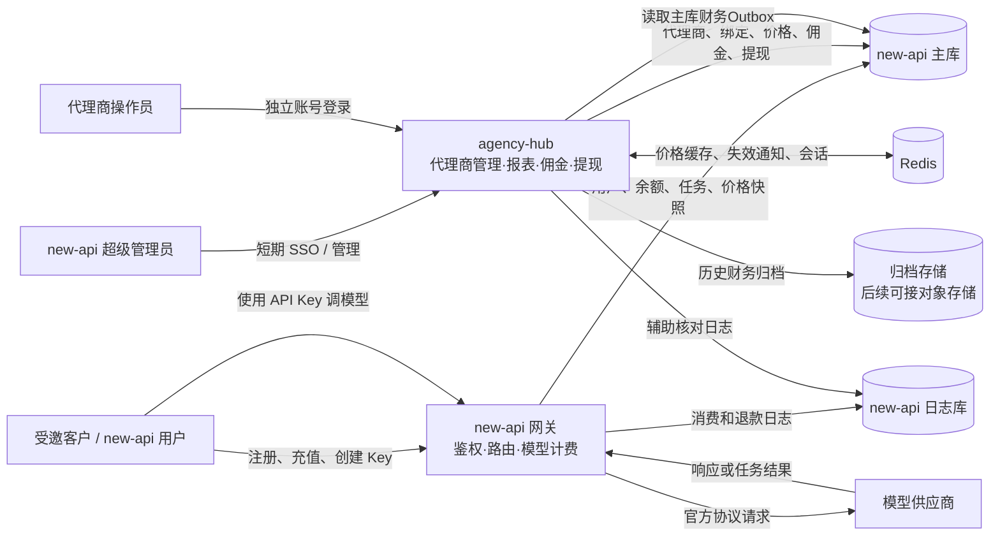
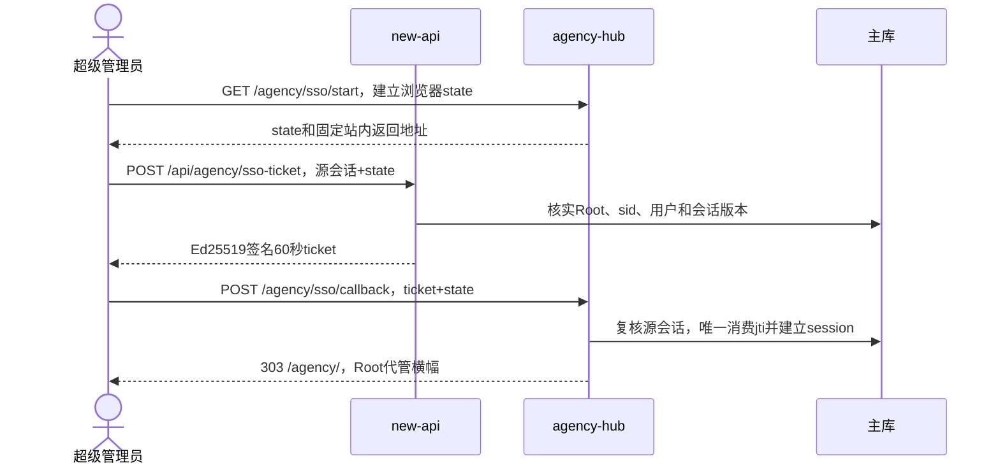
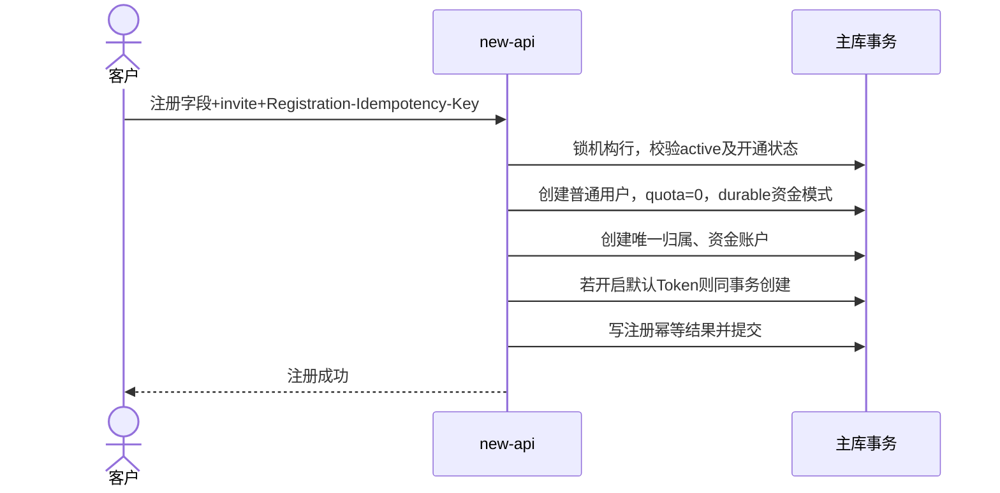
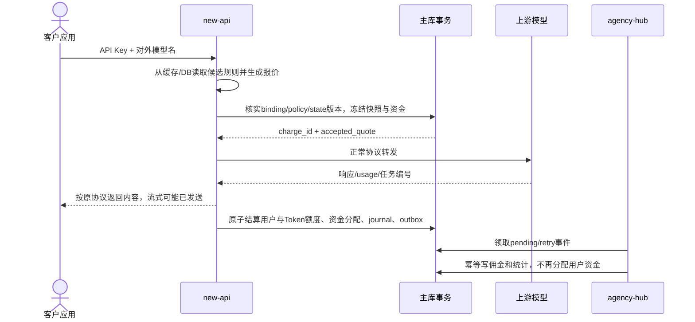
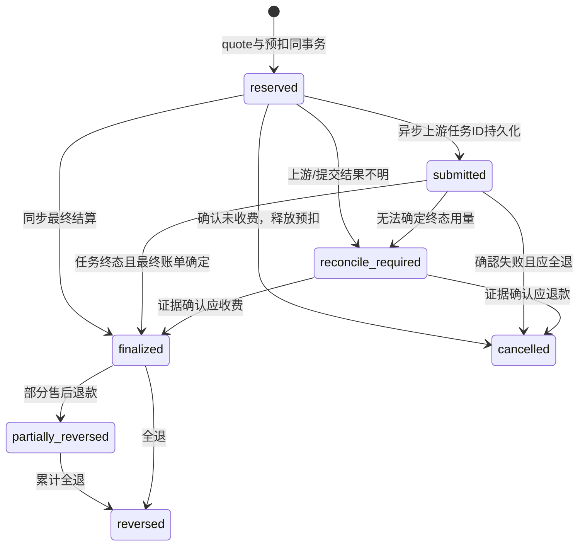
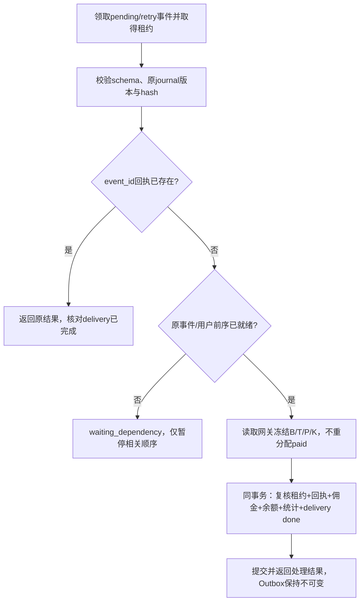
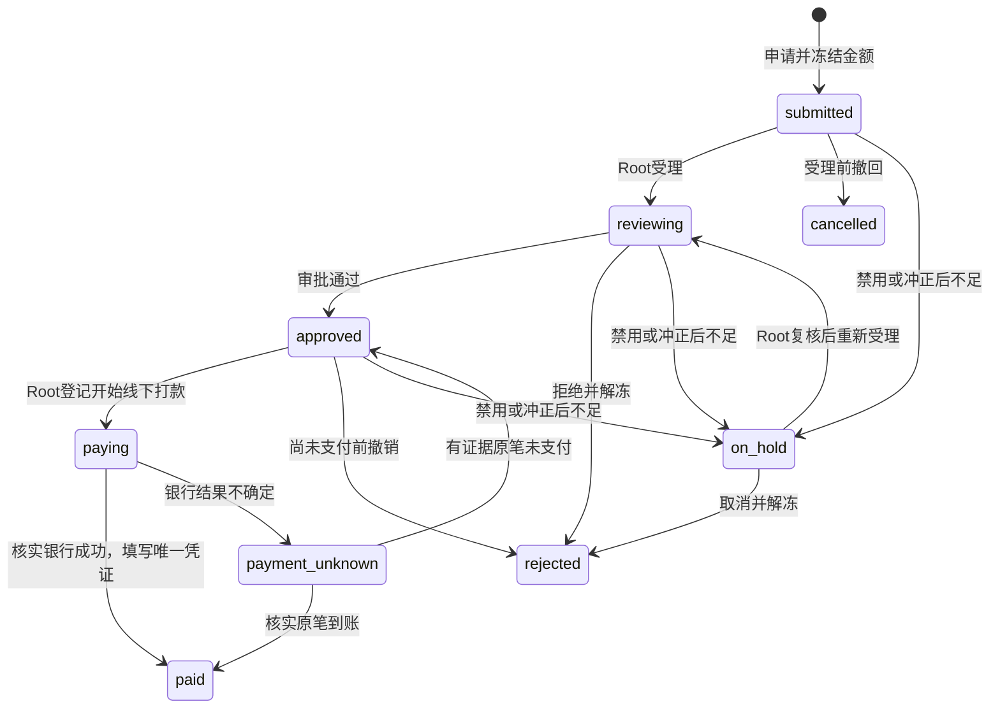
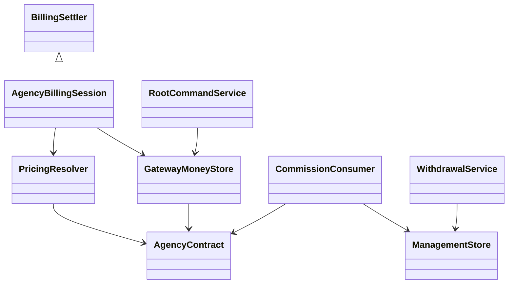

# 代理商旁路服务完整设计与实施规格

## 0. 文档状态

| 项目 | 内容 |
| --- | --- |
| 文档用途 | 作为产品确认、研发拆分、接口联调、测试验收和上线评审的共同基线 |
| 目标形态 | 独立部署的 `agency-hub` 旁路服务，与 new-api 共用必要的数据和缓存，但不进入模型转发链路 |
| 业务命名 | 页面统一使用“代理商 / 代理商中心”，代码统一使用 `agency`，表名前缀统一使用 `agency_hub_` |
| 对外入口 | `https://gateway.nexus-reach.com/agency/` |
| 时间口径 | 所有存储使用 Unix 时间戳；页面、CSV、统计边界统一按 `Asia/Shanghai` 展示和计算 |
| 币种口径 | 跟随 new-api 当前币种；每一笔财务事件保存币种和换算快照，历史记录不追溯重算 |
| 审查版本 | 2026-09-09，代码对照复核修订 |
| 当前结论 | 修订后可作为分阶段编码规格；计费接入、并发故障测试和容量验证是上线前置条件，尚未实现或实测 |

本文描述目标实现，沿用原稿“没有生产代理商数据”的前提；本轮未查询生产数据库，上线前必须只读核实，发现实际数据时先评估迁移，禁止直接清理。已有 new-api 用户、余额、渠道和任务必须保持兼容。修订理由及代码依据见第24节。

技术默认值是本设计选定的实现参数，不代表已经线上验证。付费资金优先、欠费不追发佣金、邀请页仅密码注册等细节应在开通规则中展示。文中的界面操作是待开发界面的规格，当前不一定已有这些按钮。

---

## 1. 业务目标

第一期交付以下闭环：

1. new-api 超级管理员创建、修改、启用和禁用代理商。
2. 每个代理商拥有一个独立账号，账号不等于 new-api 用户。
3. 超级管理员登录 new-api 后，可以通过一次性 SSO 直接进入代理商中心，并明确显示当前是超级管理员代管模式。
4. 每个代理商自动获得唯一、长期有效的邀请码和邀请注册链接。
5. 通过邀请链接注册的客户成为真实 new-api 用户，可自行创建和管理 API Key。
6. 客户永久绑定一个代理商；只有超级管理员可以转移，转移不影响历史佣金归属。
7. 超级管理员设置代理商的结算系数；代理商或超级管理员设置客户销售系数。
8. 定价只按“代理商默认值 + 指定对外模型例外”配置，不暴露渠道，也不建立第一期产品分类。
9. 客户模型调用由 new-api 正常计费；旁路服务根据最终结算结果和资金来源生成佣金。
10. 代理商可查看所属客户、模型调用用量、消费金额、充值记录、佣金余额、历史佣金和提现记录。
11. 提现由代理商提交，超级管理员人工审核并标记打款结果。
12. 代理商服务停机时，new-api 的模型调用、客户 API Key、在线充值均继续运行；恢复后自动补算佣金。

### 1.1 第一期明确不做

- 不允许代理商新增第二个操作员。
- 不允许代理商创建下级代理商或多级分佣。
- 不允许代理商修改客户余额、充值、退款、用户状态或 API Key。
- 不允许已有用户自行绑定代理商。
- 不提供代理商开放 API、CRM 或 ERP 对接。
- 不实现自动银行卡打款、发票、税务或实名验证。
- 不保存或展示模型请求提示词、模型回答、上游密钥、渠道名称、渠道编号、平台采购价或平台利润。
- 不为代理商注册客户发放初始免费额度。
- 不将订阅额度、赠送额度、补偿额度或活动额度计入第一期佣金。
- 不让网关在模型请求过程中同步调用旁路服务。

---

## 2. 核心概念和计算口径

### 2.1 为什么所有模型倍率为 1 仍然可以体现代理商销售系数

用户已确认各模型输入、输出、固定价或动态表达式已有独立报价。“倍率为1”是业务口径；传统 Token 模式的输入价可能编码在 ModelRatio 中，不能据此把所有底层 ModelRatio 强制改成1。表达式则自包含实际单价。

现有引擎计算标准费用Q，销售系数S替换本次最终group ratio，不再额外叠乘原分组折扣。结算系数C只用于代理商佣金：

```text
客户理论费用 = Q × S
代理商理论结算成本 = Q × C
理论佣金 = Q × (S - C)

basis = 原引擎未应用分组的收费组成、必要中间量化值及规则快照
B = ExistingCharge(basis, S, rounding_policy_id)  // 实际客户费用quota
T = ExistingCharge(basis, C, rounding_policy_id)  // 代理商结算成本quota
G = B - T
C=0时T明确为0，不套用收费路径的最小1 quota
```

不能统一四舍五入。当前文本等路径含截断和最少1 quota，表达式等路径使用round，任务有中间量化。S=1的结果必须与原路径一致。网关从同一引擎取得B/T，旁路只读取结果；禁止B/S倒推Q，禁止旁路另写一套模型公式。

系数保存整数BPS（10000=1x）。standard_quota_exact是decimal字符串，但并不足以描述所有路径，必须同时保存billing_basis/rounding_policy_id。模型工具费用按原路径是否应用group ratio确定，只乘一次；违规附加费单独归为noncommissionable，仍消耗资金。G<0、越界或快照错误进入对账异常，不用max(0,...)掩盖错误。免费Q=0明确收费及佣金为0。

单笔quota保留common/quota_math.go相应Strict/*Checked校验和审计；财务累计用独立int64 checked arithmetic，不能用单笔int32饱和器。所有数量、时长、系数等边界仍在报价前验证。

### 2.2 Token 模型示例

假设某模型配置：

- 输入价格：¥1 / 百万 Token
- 输出价格：¥4 / 百万 Token
- 输入 100,000 Token
- 输出 20,000 Token
- 业务额外倍率：1（不改承载输入单价的底层ModelRatio）
- 代理商结算系数 `C = 0.7500x`
- 代理商销售系数 `S = 0.9000x`

计算：

```text
Q = 100,000 / 1,000,000 × ¥1 + 20,000 / 1,000,000 × ¥4
  = ¥0.10 + ¥0.08
  = ¥0.18

客户支付       = ¥0.18 × 0.90 = ¥0.162
代理商结算成本 = ¥0.18 × 0.75 = ¥0.135
理论佣金       = ¥0.18 × (0.90 - 0.75) = ¥0.027
```

### 2.3 按次或视频模型示例

标准价格 `Q = ¥46`，结算系数 `0.7500x`，销售系数 `0.9000x`：

```text
客户支付       = ¥46 × 0.90 = ¥41.40
代理商结算成本 = ¥46 × 0.75 = ¥34.50
理论佣金       = ¥46 × 0.15 = ¥6.90
```

视频的时长、分辨率、是否包含参考视频等仍由现有模型价格或动态计费逻辑先计算成 `Q`。代理商模块不复制视频报价表，也不关心最终路由到哪个渠道。

### 2.4 仅付费余额产生佣金

资金归属在网关主库事务内确定，旁路只消费已冻结分配。资金账户按user_id归属，转移代理商不能重新初始化资金。

```text
users.quota = paid_available + nonpaid_available - debt_quota
```

冻结额度从available移出并单独保存journal allocation，不能被另一请求使用。付费优先，同类资金按到账money_seq、lot_id顺序：

1. 充值余额入账事务同时记录实际credited_quota、paid_quota、bonus_quota和source_topup_id。本金额度为paid，赠送/补偿为nonpaid，不能从Amount/Money猜单位。
2. 预扣先冻结paid、再冻结nonpaid；少扣时保留原冻结列表前面的实际消耗、反向释放余量；多扣按同样顺序追加。
3. 实际结算不足时保留原系统允许欠费的行为，超出可用资金记debt，不产生佣金。后续充值先还debt，剩余加入available，不追发旧欠费佣金。
4. 禁用代理商、失败但保留用量收费、违规费、余额买订阅、管理员扣款，只要真扣钱包就减少对应来源；计佣资格单独判断。
5. 纯订阅额度消费不动钱包。钱包购买订阅会减少资金、但不算模型佣金。

B为模型计佣口径客户费用，P为其中付费来源实际分配，G为理论佣金：

同一operation含多个收费组件时，先按总实际费用从lot取出已冻结/追加资金，再按组件费用占比分配paid：先floor，再按最大余数补足，余数相同按稳定component_id字典序；接着按组件尚未分配的费用占比分配nonpaid，剩余为debt。同类资金的具体lot按FIFO填入component_id升序的已算额度，保存完整矩阵，保证每组件合计等于实际费用且每lot不超分。不能三类分别独立round，也不按“先处理计佣组件”偏置来源。独立违规费/管理扣减有各自money_seq；免费组件分配0。

```text
B=0 → K=0
B>0 → K=RoundHalfAwayFromZero(G × P / B)
0<=P<=B，0<=K<=G
```

B=900、T=750、P=600，则G=150，K=100 quota。非计佣独立费用不混入分母。分配规则保存funding_rule_version=paid_first_v1；规则改变只影响新请求。

### 2.5 配置优先级

运行时只使用客户请求中的对外模型名 `origin_model_name`：

```text
指定代理商 + 精确 origin_model_name 的例外
            ↓ 未命中
代理商默认结算系数和默认销售系数
            ↓ 用户没有代理商绑定
new-api 原有分组倍率
```

模型映射后的上游模型名、渠道 ID、渠道类型和渠道名称均不参与代理商规则匹配。

第一期不采用“产品分类”还有一个直接原因：同一个模型可能同时具备文本、图片理解、工具调用和深度思考能力，新模型名称和能力变化也很快。若把财务规则绑定人工维护的产品分类，新增模型时容易漏配或错误继承。精确对外模型名是客户实际请求中已有、可审计的稳定合同键；默认规则则保证新增模型即使没有单独配置也有价格。未来可以增加仅用于筛选和批量填表的模型标签，但批量操作最终仍要展开成一组精确模型版本，不能在历史账单中依赖会变化的标签。

### 2.6 币种和佣金金额

在报价接受时独立捕获currency_config_version、quota_per_unit和有效汇率，不把旧价格政策中的汇率误当现值：

```text
commission_usd = K / quota_per_unit_snapshot
amount_micros = RoundHalfAwayFromZero(commission_usd × exchange_rate_snapshot × 1,000,000)
```

USD汇率1；CNY使用当时new-api有效显示汇率；CUSTOM需稳定币种代码；TOKENS只记quota，未配置现金币种前禁止银行卡提现。汇率必须为正且有限；已有余额时改变核心quota单位需要独立迁移，不属于改价。

余额桶唯一键(agency_id,currency_code)。同币种改汇率不建新桶，每笔金额按原汇率冻结后累加；改币种建新桶并保留旧桶，不跨币种相加。退款冲销原金额，不用当前汇率重算。

充值实际支付金额与到账quota折算金额分列展示。原充值折扣不改变模型S/C；试算必须展示充值优惠影响，避免把赠额视为付费本金。

---

## 3. 系统全貌



### 3.1 责任边界

| 能力 | new-api | agency-hub |
| --- | --- | --- |
| 用户注册、登录、充值、API Key | 权威系统 | 只读展示客户归属和充值结果 |
| 上游渠道、模型映射、请求转发 | 权威系统 | 不读取或展示渠道细节 |
| 模型标准价 `Q` | 权威系统 | 读取最终快照，不重复计算模型价格 |
| 销售系数运行时生效 | 网关中的窄集成点 | 维护版本化规则并发布缓存 |
| 代理商账号和权限 | 不存放代理商密码 | 权威系统 |
| 邀请码和用户归属 | 注册事务中调用共享小模块写绑定 | 权威系统和管理界面 |
| 消费、退款原始事实 | 权威系统 | 幂等消费并生成佣金账本 |
| 佣金和提现 | 不参与 | 权威系统 |

### 3.2 关键架构约束

1. 模型调用路径绝不向 `agency-hub` 发同步 HTTP 请求。
2. 网关仅从进程内缓存、Redis 或共享数据库读取代理商价格快照。
3. `agency-hub` 停机不影响模型 API；代理商后台和邀请注册可以暂时不可用。
4. 佣金采用最终一致性：模型响应不等待佣金入账，恢复后可按未完成事件和永久回执补算。
5. 所有历史费用使用请求开始时冻结的版本，不按当前配置重算。
6. 代理商被禁用后，已有客户继续使用禁用前最后一版销售价格，不能突然回退到平台默认价；但新请求不再产生代理商佣金，已有佣金和提现能力冻结。

---

## 4. 角色与权限

| 操作 | new-api 超级管理员 | 代理商操作员 | 受邀客户 |
| --- | :---: | :---: | :---: |
| 创建、编辑、启停代理商 | 是 | 否 | 否 |
| 重置代理商密码 | 是 | 修改自己的密码 | 否 |
| 设置结算系数 | 是 | 只读 | 否 |
| 设置销售系数 | 是 | 是 | 否 |
| 查看代理商审计 | 全部 | 仅本代理商 | 否 |
| 查看受邀客户 | 全部 | 仅本代理商 | 仅自己 |
| 查看客户提示词和回复 | 否 | 否 | 按 new-api 原功能 |
| 查看客户消费和充值 | 全部 | 仅本代理商且字段脱敏 | 仅自己 |
| 修改客户、Key 或余额状态 | 通过 new-api 原后台 | 否 | 管理自己的 Key |
| 申请提现 | 可代提交 | 是 | 否 |
| 审核和确认打款 | 是 | 否 | 否 |
| 转移客户代理商归属 | 是 | 否 | 否 |

第一期每个代理商最多一个状态为 `active` 的 `agency_admin`。数据库唯一约束和服务端校验必须同时保证，不能只靠前端隐藏按钮。

---

## 5. 身份、登录与 SSO

### 5.1 独立账号和临时密码

账号独立保存在agency_hub_operator_accounts，通过common.Password2Hash/ValidatePasswordAndHash处理密码。用户名规范化后唯一，一个机构一个账号，重置/恢复原行，不新建第二个操作员。

首次登录仅可me/change-password/logout。密码12～72字节（bcrypt上限）；登录按IP+账号限速，失败5次锁15分钟，不存在账号也执行同类哈希校验并返回统一错误。

临时密码仅用于本次交付，不进入审计、普通幂等响应和日志。为处理响应丢失，独立delivery_secret表允许把本次临时密码密文短存5分钟，只有创建/重置的Root同一幂等请求可再取；确认领取或过期删除密文，过期后需要重置。永久密码只保存哈希。短期交付使用独立密钥。

### 5.2 Root SSO

签票必须使用new-api浏览器Session，不能仅凭Root PAT/API Key。浏览器已有Bearer access token须由前端主动POST签票接口，不能靠裸302自动携带。



票据POST交付，不进URL；包含iss/aud/sub/sid/user_auth_version/session_version/state_hash/jti/iat/nbf/exp/kid，算法固定EdDSA。state与HttpOnly nonce Cookie绑定，防登录CSRF。return_path为固定站内白名单。签名私钥仅new-api持有，公钥按kid轮换，旧公钥保留至少票据最大寿命。

每个Root写请求及解密账户操作从主库验证源用户仍为启用Root、源Session有效且版本一致；读请求最多缓存5秒。源会话注销、降权或失效后不能继续写。验证不可用只影响管理操作，不影响模型API。

### 5.3 会话与高风险验证

Cookie独立命名，HttpOnly/Secure/SameSite=Lax/Path=/agency/，不设宽泛Domain。服务端只存Session token哈希，空闲30分钟、绝对8小时，同时不超过源Root会话寿命。

登录/SSO使用匿名nonce和Origin保护，不要求尚不存在的登录后CSRF。认证后写操作检查Session、CSRF、Origin和资源权限。禁用/重置同事务递增auth_version；管理写请求权威读取状态，普通读取最多缓存5秒。

第一期不强制MFA。“二次确认”是业务确认框；密码验证单独实现：new-api新增agency.verify证明接口，以当前密码或用户已有安全验证确认Root，签发绑定actor/sid/action/object/body_hash的一次性5分钟证明。旁路本地管理操作由hub消费；需要网关执行的资金/provisioning命令由gateway消费，hub只能预验，不能提前消费。两类proof使用不同audience，不能互换。普通代理商提现用自身当前密码。不能假定现有UniversalVerify已经支持agency scope，不能信任前端step_up=true。

代管上下文存Session，审计记录真实Root及目标机构，不冒充代理商。

---

## 6. 邀请、注册与归属

### 6.1 邀请码

新码使用crypto/rand生成10位Crockford Base32，全局唯一冲突重试；NX8K3P仅示例。一个机构一个长期码，禁用不可注册，恢复启用继续原码。

```text
https://gateway.nexus-reach.com/register?invite=NX8K3P
```

链接由PUBLIC_BASE_URL白名单生成，浏览器API使用相对路径，不直接信任任意Host/X-Forwarded-Host。公开GET /agency/api/v1/public/invitations/{code}仅返回显示名和可注册状态，限流且无客户/财务数据。

### 6.2 原子注册

POST /api/user/register新增可选invite，不接受客户端agency_id/group/quota/role/paid。invite与aff_code同传400；前端进入invite流程隔离旧localStorage的aff上下文。普通注册不变。



复用现有验证/哈希，新增InsertOptions同时控制Insert和FinishInsert的赠额/奖励/日志，不能先赠额再抵消。默认Token的限额不等于用户赠额。随机Key、密码哈希在持锁前准备，Token失败整体回滚，避免“失败但账号已存在”。

注册重试按随机幂等键返回同一已提交结果，不存密码明文。未验证联系方式标记unverified，不用于密码找回或自动合并。尊重全局RegisterEnabled/PasswordRegisterEnabled/EmailVerificationEnabled，不暗中改全局开关。

邀请页只提供密码注册，服务端也拒绝带agency invite上下文的OAuth注册，不能仅隐藏按钮；无invite的原OAuth不变。最终权威校验在主库，公开查询只是预览。旁路停机时预览可维护中，已有码仍可由主库验证后完成绑定注册。

### 6.3 转移和已有用户绑定

已受管用户转移：先读取候选旧/新机构ID，事务按agency_id升序锁两个机构，再锁用户绑定/资金账户并核实旧绑定未变化；不一致则回滚有界重试。目标必须启用且价格有效，源机构即使禁用仍允许Root转出。关闭旧绑定、创建新绑定、原子切换唯一active指针，提交即生效。旧journal沿用旧归属，新报价验证新归属，无“立即关旧、10秒后开新”空窗。资金按user_id保留，锁序与§8.4一致。

非受管已有用户例外绑定需provisioning屏障：短暂禁止该用户新资金请求，等待旧流式/Realtime/异步任务终态并排空所有实例该用户Batch增量，核对DB余额，事务建立opening_nonpaid=max(quota,0)、opening_debt=max(-quota,0)、opening_paid=0和durable标记，再开放。长任务未结束时显示阻塞原因并可取消，不盲等10秒。影响范围在操作前展示；其他用户不受影响。

旧代理商只见旧事件归属的消费/充值/佣金和当时脱敏档案，不再见转移后客户余额/联系方式/数据；新代理商只见新归属后的事件。充值按到账事务binding归属（另存订单创建归属），退款归原事件。用户改名/删除、Key删除不级联删除财务记录。

---

## 7. 定价规则与界面操作

### 7.1 配置字段

| 字段 | 谁设置 | 含义 | 示例 |
| --- | --- | --- | --- |
| 默认结算系数 | 超级管理员 | 未配置模型例外时，计算代理商结算成本 | `0.7500x` |
| 默认销售系数 | 代理商或超级管理员 | 未配置模型例外时，计算客户实际扣费 | `0.9000x` |
| 最低价差 | 超级管理员 | 强制 `S >= C + 最低价差` | `0.0500x` |
| 指定模型结算系数 | 超级管理员 | 精确匹配对外模型名时覆盖默认 C | `0.8500x` |
| 指定模型销售系数 | 代理商或超级管理员 | 精确匹配对外模型名时覆盖默认 S | `0.9500x` |
| 生效时间 | 系统 | 发布事务提交后，新接受报价使用新版本 | 显示发布时间和revision |

系统级边界：0<=C<=S<=sales_cap，默认sales_cap=3.0000；收费模型S>0且S>=C+spread。Q=0的免费模型自然为0费用，不用0系数代表缺少价格。Root可配置cap，代理商不可修改。

### 7.2 超级管理员配置步骤

1. 登录 new-api 超级管理员后台。
2. 在左侧点击“代理商管理”，系统自动进入 `/agency/`。
3. 点击“代理商” → “新建代理商”。
4. 填写：
   - 代理商名称：`华南示例代理商`
   - 状态：`启用`
   - 管理账号：`agency_huanan`
   - 默认结算系数：`0.7500`
   - 最低价差：`0.0500`
   - 默认销售系数：`0.9000`
5. 点击“价格试算”，系统展示基准费用 ¥100 时：客户扣 ¥90、代理商结算 ¥75、理论佣金 ¥15。
6. 点击“创建”。弹窗显示一次性临时密码、邀请码和邀请链接；复制后关闭。
7. 如需指定模型，进入该代理商详情 → “模型价格例外” → “新增例外”。
8. 搜索并选择对外模型 `doubao-seedance-2-5-260628`。模型列表来自 new-api 已公开模型，不显示渠道。
9. 填写模型结算系数 `0.8500`、模型销售系数 `0.9500`。
10. 点击“验证”：系统校验 `0.9500 >= 0.8500 + 0.0500`。
11. 点击“发布”。页面显示版本号、实际提交生效时间和受影响模型。

### 7.3 代理商配置销售系数步骤

1. 打开 `https://gateway.nexus-reach.com/agency/`，使用独立代理商账号登录。
2. 点击“销售价格”。页面显示超级管理员设置的结算系数和最低允许销售系数，但不显示渠道或采购价。
3. 在“默认销售系数”点击“编辑”，填写 `0.9000`。
4. 点击“价格试算”核对基准 ¥100 的客户价格和预计佣金。
5. 点击“保存并发布”。
6. 如某模型需要单独定价，点击“指定模型例外” → “新增”，选择对外模型并填写销售系数。
7. 若低于最低价差，页面和后端同时拒绝，并显示允许的最小值。

代理商修改销售系数后，对该代理商所有受邀客户统一生效。第一期没有单个客户的单独价格入口。

正式功能不要求运营人员为每个代理商手工创建 new-api 分组，也不要求维护全局 `GroupGroupRatio` JSON。客户可以继续处于普通 `default` 分组，运行时通过 `agency_hub_active_user_bindings` 识别归属，再把销售系数作为本次请求的最终计费倍率。客户 Token 即使选择了不同的可用路由分组，代理商销售系数也不变化；路由分组只决定可用渠道，不能绕过代理商价格。

登录后的模型定价页必须调用“当前用户有效价格”接口：代理商客户看到应用销售系数后的价格，普通用户看到现有分组价格。未登录的公开模型广场只能展示平台公开基准价，并明确提示实际价格以账号所属价格政策为准，避免宣传价与日志扣费不一致。

### 7.4 整包价格版本和原子发布

每次发布是不可变整包：默认C/S、spread/cap、所有模型例外、规则版本。机构行仅存current_policy_version_id/revision，消除重复默认值真相源。

模型C/S分别允许null表示继承，0是明确值。发布请求的model_overrides为完整列表替换，缺少的旧模型例外表示删除，前端必须展示diff。后端解析继承后校验全部默认与例外；Root改C导致任一S不足时422列出冲突，不暗中提高S。代理商使用独立销售DTO，拒绝成本、spread/cap字段。

精确模型名保留客户端原始大小写，最多191个Unicode字符/764 UTF-8字节，拒绝首尾空白和空名，不lowercase；索引用SHA-256原UTF-8字节并复核原名，兼容MySQL默认大小写不敏感collation。删除/重命名模型只停用当前选择，保留历史规则；新模型自动继承默认。

发布用expected_revision，事务写新整包、审计并CAS切换active指针，提交即成功；Redis仅作加速，不参与提交成功条件。发布事务必须校验机构active，disabled机构只允许试算/浏览器编辑未提交草稿，不得切换当前政策，Root同样受限。恢复启用沿用禁用前版本，仅恢复未来报价的计佣资格，不补发禁用期间佣金。回滚旧价格需复制为新revision。第一期不提供延迟发布，不承诺“10秒传播后全节点一起变更”。

网关先用缓存生成候选报价；接受报价的短事务核对binding_revision、policy_revision和agency_state_revision，匹配才冻结并扣款。不匹配退出重算、最多3次；表达式运算不持DB锁。发布/转移/禁用与报价以同一行锁或CAS合同排序，保证缓存漏通知不能扣旧价。

### 7.5 生效点和展示

全文“请求开始时”统一指首次成功接受报价、建立journal的事务点。模型重试、视频轮询沿用该版本。时间只展示/筛选，财务顺序按事务版本。

报价保存currency_config_version及标准价快照、usage语义、rounding_policy_id。试算显示基准/客户价/代理商结算价及每项参数；普通客户响应隐藏C及佣金。当前用户价格读取放在new-api本地接口，旁路停机不影响客户查看已发布价格。

---

## 8. 运行时计费集成

### 8.1 网关请求与响应边界



财务提交与HTTP输出不是同一个事务。流式内容甚至非流式响应可能已发送后结算才执行；不得承诺返回200就一定结算成功，也不能在已发送响应后追加不同协议的JSON错误。模型结果状态、HTTP交付状态、billing_status分别保存。正常路径尽早完成结算；失败进入可恢复状态，客户原协议不被破坏。

异步任务另有更严格边界：对外确认“任务已接收”前必须持久化public_task_id、provider_task_id及提交状态；佣金仍等待最终用量/账单对账，而不是提交成功。

### 8.2 必须接入的原代码边界

以下是接入清单，不是“每行只加一个回调就足够”的承诺：

| 边界 | 拟修改/核查位置 | 必须实现的行为 |
| --- | --- | --- |
| 报价和快照 | relay/helper/price.go、relay/common/relay_info.go、types价格结构、pkg/billingexpr | 同一billing_basis计算S/C，冻结原价/规则/舍入版本；不复制公式 |
| 钱包生命周期 | service/billing_session.go、service/quota.go、新增AgencyBillingSession | 预扣、增补预扣、差额0、最终结算、撤销都持久幂等 |
| Token额度 | model/token.go及资金入口 | Token额度与用户钱包同事务；unlimited只绕过剩余额度检查，仍按原行为remaining-=quota、used+=quota；已删除Token的历史结算不退款用户、不复活Token，留审计 |
| 余额缓存/批处理 | model/user.go、model/cache.go、model/utils.go及实际余额校验入口 | durable用户跳过异步余额队列，缓存过期不能用来最终判定余额不足/足够 |
| 文本/音频/工具 | service/text_quota.go、service/quota.go等 | 各收费组件与真实usage，计佣/非计佣拆分 |
| 视频及任务 | controller/relay.go、relay/relay_task.go、model/task.go、service/task_billing.go、model/task_billing_reconciliation.go | 提交持久化、成功后最终账单、差额0完成、幂等退款 |
| Realtime / 旧任务 | PreWssConsumeQuota、PostWssConsumeQuota、service/midjourney.go等 | 每段/每任务显式journal，不允许旁路旧扣费 |
| 在线充值 | model/topup.go各支付完成路径及creditTopUpQuota | 原支付事务传入来源和实际credited_quota，禁止另开事务补资金事件 |
| 其它增减额 | 签到、兑换码、赠送/aff、管理员改余额、余额购买订阅、违规费 | 所有真实钱包变化均分类并更新资金，非计佣也不能跳过 |
| 注册/绑定/SSO | Controller、Model、router及前端导航/注册页 | 原子注册、durable标记、源会话鉴权和Root票据 |

命名以实施时仓库为准，开工先对Increase/DecreaseUserQuota、PostConsumeQuota及直接users.quota更新做调用图盘点并保存清单。请求协议和渠道路由原则上不变，但若任务Adapter把解析与写HTTP响应耦合，允许在该响应边界做最小拆分；不能保证全部Adapter零修改。

### 8.3 请求内快照和收费结果契约

共享纯数据结构保存至少：

```text
PricingSnapshot
  schema_version, financial_charge_id, user_id, token_id
  agency_id, binding_id, binding_revision, agency_state_revision
  policy_version_id, policy_revision, origin_model_name, model_key
  settlement_bps, sales_bps, commission_eligible, eligibility_reason
  currency_config_version, currency_code, quota_per_unit, exchange_rate
  accepted_at_ms, funding_rule_version, pricing_engine_version

ChargeBasis
  billing_mode, rounding_policy_id, frozen_prices/ratios
  normalized_usage, task_specs, tool_components
  necessary_intermediate_quantization, expression_source/hash/version
  frozen_expression_dependencies（实际计价依赖的param/header值及时间输入）
  standard_quota_exact (仅辅助，不替代完整basis)

ChargeResult
  charged_total_quota, commissionable_charged_quota (B)
  settlement_cost_quota (T), theoretical_commission_quota (G)
  noncommissionable_quota, paid_allocated_quota (P), commission_quota (K)
  commission_amount_micros (M，网关finalize时按冻结汇率计算)
  reserve/delta/refund, funding_allocations, saturation_audit
```

底层完整basis可能有内部实现信息，存主库受限journal；表达式源码与实际依赖值必须足以在重启后重算，不能仅保存hash或依赖编译缓存/当前设置。只抽取实际表达式读取的最小标量，排除Authorization、Cookie等凭证及完整请求正文；若表达式直接依赖敏感内容，不支持该规则受管开通，需先改为不敏感的派生变量。对外及旁路投影使用白名单DTO，只保留对外报价和计佣必需数据。不序列化完整RelayInfo、任务原始响应、任意metadata或日志other。C、T、G仅Root/本代理商可看，普通客户只能看Q、S、实际费用及自己的usage。M在网关最终结算同事务保存，旁路只投影；即使消费者尚未处理原事件，网关也可按原M生成冲正。

### 8.4 专用计费会话与资金状态机

不能只新增AgencyWalletFunding：原BillingSession含delta=0早退、具体WalletFunding类型分支、Token独立扣减和异步Refund，会破坏原子性。新增AgencyBillingSession实现现有BillingSettler；工厂对durable用户返回该实现，调用方不做具体类型断言。



每个逻辑请求服务器生成一次financial_charge_id；上游渠道重试共用，不以retry_index产生新收费ID。每阶段唯一(charge_id,segment_no,revision,operation)，event_id在事务前生成后复用；客户端request_id仅检索。事务冲突重试不能再次请求上游。

reserve即使为0也建journal；durable钱包关闭信任额度绕过，按原估算预扣。reserve/finalize/cancel同步提交用户quota、Token额度/used、资金lot分配、journal revision和outbox；失败整体回滚。已提交结果不确定时先查唯一操作记录，不盲目重扣或退费。收费失败后不能仅凭consume log宣称已结算。

固定锁顺序：涉及机构状态/政策的操作按agency_id升序，再用户归属/资金账户按user_id、Token、journal/lot升序；提现只锁机构状态→同币种佣金余额→提现行。不在持锁期间调Redis、上游或计算表达式。GORM在model中复用lockForUpdate；SQLite用短写事务+CAS、有界busy重试；CAS冲突最多3次重新读，提交结果未知先查幂等状态。

用户财务模式billing_mode=agency_durable_v1写入稳定用户标记并持久化，独立于当前机构active状态。机构禁用、无绑定缓存、功能开关或用户转移均不能把已受管钱包切回旧批量路径。所有准入配额判断识别该标记并以主库事务为准；缓存仅加速，提交后失效/完整重建，失败由修复队列重试。原usage计数和日志可作为可重建投影，但用户/Token真实额度不能异步丢失。

纯订阅消费保留原订阅扣额规则，不混入paid钱包，仍产出零佣金usage事实；订阅不足回退钱包时先决定funding_source后走上述事务，同一段不可两边扣。钱包购买订阅是noncommissionable资金扣减。

### 8.5 路径覆盖与边界

| 路径 | 最终事实/快照 | 佣金规则 |
| --- | --- | --- |
| Chat/Responses/Anthropic/Gemini、流式和非流式 | 同一标准化usage、缓存读写和单价快照 | 相同计价语义及usage得到同费用；不能忽略协议真实差异 |
| 音频、Embedding、Rerank、图像、固定按次、表达式 | 原引擎收费组件及舍入策略 | S只在原group位置应用一次，Q=0严格0 |
| 视频（含Seedance各渠道） | 提交快照+最终用量/供应商对账 | submitted不入佣金；success且financial_final=true才入，金额未变化也必须finalize |
| Midjourney等旧任务入口 | 任务ID+持久journal，不得绕过 | 同上，按实际状态及收费判定 |
| Realtime | 一个charge_id，segment_no为服务端收费段序号 | 每段完整成功且结算后入账，关闭连接不重算全会话；失败尾段不计佣 |
| 失败/客户端中断但保留部分收费 | 保存failure与实际费用，照常消耗资金 | 无最终成功事实的收费不计佣，不伪装free |
| 免费/系统测试/违规费/管理扣减 | 明确flags与来源 | 零佣金，但真扣钱包就分配资金 |

Realtime每段持久化last_cumulative_usage；上游累计值仅算差量，不和增量模式混用，重复usage帧不得重复扣费。没有稳定上游段ID时使用本地持久段号及usage哈希辅助去重，重连新会话；不把相同token数误认为同一段。

异步提交前先创建journal和public_task_id，发送前记submit_attempt。解析上游ID后先持久再返回；超时而可能已创建的任务标reconcile_required，供应商支持幂等提交则复用同一键，否则不自动重新生成。已发上游但来不及保存ID的崩溃窗口无法凭本地设计消除，须保留trace并人工/供应商查询；不能猜测成功/失败。任务轮询、callback、人工重试共享同一个finalize CAS，终态后矛盾回调转对账，不覆盖终态。

### 8.6 全部钱包变更与业务来源

新增统一Model资金变更入口，接受现有tx和TypedFundingContext(source_kind, source_id, completion_source, idempotency_key, paid_quota, bonus_quota, actual_payment)，禁止托管用户绕过：

- 在线充值：Epay/Stripe/Creem/Waffo等分别把其已算出的credited_quota传入；Amount与Money在各渠道单位不一致，不能统一乘QuotaPerUnit。paid+bonus=credited，后台人工补单即使保留payment_provider也默认nonpaid。
- 签到/兑换码/邀请奖励/补偿/管理员加额：nonpaid；管理员设置绝对余额先锁定读旧值算delta，不能先覆盖再补流水。
- 管理减额、违规费、钱包买订阅、失败但收费：按照资金规则扣减，不计佣。
- 支付退款/拒付：绑定原topup/lot，按§9.3处理；同支付回调重放不重复入账。
- API退款/任务差额：绑定原charge/operation，不能误作为新赠额。

拓展creditTopUpQuota参数时必须覆盖所有调用者；钱包新增来源未传TypedFundingContext应拒绝该受管用户的资金操作并报告内部错误，不能默认paid。原非受管用户行为保持不变。

所有users/token字段加减先在int64中计算after，再校验数据库字段上下界，不仅检查本次charge。若多个在途请求最终补扣会使原int32字段越界，禁止SQL溢出、wrap或截断冒充已结算：保留实际usage/待结算operation和reconcile_required证据，标记该资金账户reconcile_blocked，停止该用户新资金消耗，等待有证据的修复；已提交的其它账不回滚、该异常不产佣金。主库也不可写时保留已有journal，恢复按§16核验未知用量，不能承诺自动精确找回未持久化的上游结果。

---

## 9. 佣金账本设计

### 9.1 入账条件

报价接受时有有效绑定、机构active，最终业务成功且钱包已结算，收费非免费/测试/违规费/管理调整，并有P>0。条件及排除原因都写入事件。禁用后的新请求仍沿用冻结政策收费但commission_eligible=false；禁用前接受的请求按旧快照计佣。禁用不修改客户用户/Key，不没收历史佣金，但禁止登录、邀请和提现。

无结算观察期：事件处理成功即进入可提现余额；排队/修复不是人为延迟结算。订阅、欠费和赠额不产生佣金。

### 9.2 消费器与幂等账本



重复投递允许，金融效果恰一次依靠数据库唯一键和原子事务。非计佣事件也写processed/skipped回执及usage投影。只在核验失败时等待/隔离，不能因免费跳过必要资金事实。

event_deliveries的claimed租约过期可重新领取；入账事务内锁定/条件验证当前lease_token及未过期，再同事务提交回执、账本、余额和done状态。不能先在事务外检查再写账；旧worker不得覆盖新lease状态。同一个用户money_seq相关的事件遵循顺序，前序异常隔离该用户，不让一个毒事件阻塞所有机构。主库分配已是权威，不依赖旁路先看到充值。

### 9.3 模型退款、充值退款与拒付

模型售后退款按原收费组件分别计算，以A=该组件charged_quota、P=原paid分配、K=原佣金quota、M=原金额micros为基准，最后汇总到事件；非计佣组件K/M=0，不因退违规费等而冲回其它模型佣金。所有金额针对累计退款R计算再减已处理值，不能每次独立round导致超退：

```text
new_restored_paid = Round(P × R / A) - prior_restored_paid
new_reversed_K   = Round(K × R / A) - prior_reversed_K
new_reversed_M   = Round(M × R / A) - prior_reversed_M
0 <= R <= A；A=0禁止正额退款；R=A时精确冲完原数
```

多组件先指定退款组件；未指定时将累计总退款按component_id稳定顺序进行“条件比例分摊”：当前组件累计退款=Round(待分累计退款×该组件原费用/尚未分配组件原费用总和)，扣除该值后递归下一组件，最后一项取余量。每个组件累计额单调不减且全退精确抵消；禁止每轮最大余数法重排导致某组件累计已退款反而减少。组件内先按上述公式求累计paid恢复，再以同样条件比例分配剩余nonpaid/debt；每类恢复额度按原lot分配顺序FIFO归还，保存已恢复累计，不能跨原allocation来源。

网关事务恢复原资金来源，先抵debt再入available，sidecar只写负佣金；取消预扣只释放冻结，不冲销尚未生成的佣金。部分退款用partially_reversed，全部才reversed。冲正使用原币种/原金额，绝不按现汇率或新代理商重新计算。

debt不是无法追溯的单一数字：每次欠费/拒付保存debt_lot与origin allocation，后续充值还债保存debt_repayment及实际paid/nonpaid来源。退款/取消需要抵销该笔债时，先抵尚未偿还部分；已经偿还的部分按偿还记录恢复其真实资金来源（仍可先抵其它未清债），不能把总debt减成负数或一律赠额。例如拒付后的冻结债100已被新充值100还清，再cancel原冻结，应退回新充值来源100，而不是恢复被拒付的旧paid。这个退款不追发原欠费模型佣金。

支付退款/拒付是另一类事件，引用原source_topup_id：

1. 未消费lot额度从available移除；被预扣冻结部分标记revoked，并即时将该部分计入debt、等量减少users.quota，后续释放不能再次可用。例充值100→预扣100→quota=0→拒付100，变为quota=-100/debt=100；随后finalize消耗该冻结时不重复加债，cancel释放该冻结时抵销这笔债但不恢复失效paid。用revoked_reserved_debt关联原allocation，防止两条路径各加一次债。
2. 已消费部分形成用户debt，并沿原lot allocation找到受影响计费，冲回对应已赚佣金。
3. 不重扣客户原模型费；debt表示已收回的充值本金，不是第二次模型消费。
4. 同一额度遇到模型退款和支付拒付时通过累计recovered/reversed字段与allocation唯一键防双冲；总冲佣金不超过原K/M。先拒付后模型退款应抵债，不恢复失效paid。
5. 支付渠道无退款回调时Root使用“资金冲正”接口，输入原订单、实际退款/拒付证据和累计额度，二次验证并审计；不凭自由填写负quota直接改账。

已提现的佣金冲正允许available为负，保留历史paid。每次冲正重新检查未支付提现单，必要时on_hold，不能只阻止“新申请”。

### 9.4 余额守恒

每(agency_id,currency_code)一行，金额int64 micros（1单位币种=1,000,000），累加/乘除溢出报错不wrap。字段：

```text
available_micros：可提现，允许负
locked_micros：待处理提现冻结，非负
total_earned_micros：累计正向佣金
total_reversed_micros：累计冲正绝对值
total_paid_micros：已实际打款累计
version：CAS
available + locked + total_paid = total_earned - total_reversed
```

提现精度按币种现金小数位校验，用户只能提交正数精确金额字符串，不自动向上凑整；不足分的小额保留余额。历史总佣金同时展示正向累计、已冲正、净累计，避免“总额”歧义。第一期手续费0；未来非0须扩展守恒式，不能先加配置就直接扣费。

---

## 10. 提现设计

### 10.1 状态机与防重复打款



提交：available-=amount、locked+=amount；取消/拒绝反向释放；paid：locked-=amount、total_paid+=amount。状态与余额/审计同事务，expected_version+Idempotency-Key；重复请求返回同结果，不重复移动金额。

冲正/禁用后将未支付候选单on_hold，保存previous_status与原因。进入paying前在同事务检查机构active、账户快照、冻结完整、可用余额非负、无未解决资金异常；不够则不能支付。paying/payment_unknown不可简单取消或自动重新打款，线下支付结果未知必须先核查银行。禁止两人同时处理同单，支付操作租约和状态CAS绑定Root。

mark-paid是记录已发生的外部事实，不是假装阻止已经完成的银行支付：若打款期间发生冲正，核实成功后仍如实记paid及负余额/异常；不能因余额负而隐藏已付款。银行凭证号按bank/channel/reference唯一（重复号仅允许返回同单结果），附件仅私有存储。人工现金打款无法由本系统实现端到端exactly-once，操作界面必须提示先查原笔，不重复执行。

### 10.2 收款账户

银行卡/对公：户名、银行、账号、开户行、备注、账户状态。账号和户名AES-256-GCM加密；独立Docker Secret密钥、随机nonce、key_id，AAD绑定agency/account/字段/schema，防跨行密文替换。列表后四位；完整解密仅Root经action绑定验证短暂展示并审计，不写浏览器持久存储。

修改账户创建新版本，提现单保存加密不可变账户快照和hash，修改/停用当前账户不静默改已申请单。更换收款人须撤销尚未支付单后重提；禁止修改paying/paid快照。密钥新写旧读轮换，历史提现密文也纳入备份和换钥。

最低金额/频率限制默认不启用，实际金额仍须>0且满足币种精度；手续费0，不实现实名/税务/自动打款。

---

## 11. 数据模型

本节字段是最低必需契约；实现须给出GORM定义、migration和索引测试。主键/金额/序号用int64，单次user/token quota守原int32边界；JSON API里int64 ID/序号/quota/micros统一十进制字符串，BPS/页大小等有界小数值用JSON number。时间列统一BIGINT Unix毫秒，日期键YYYY-MM-DD；JSON显示RFC3339带时区。TEXT存版本化JSON，禁止依赖数据库JSON运算。

### 11.1 机构、身份、归属和政策

| 表（均agency_hub_前缀） | 必需字段/约束 |
| --- | --- |
| agencies | id、code、display_name、status、invite_code、current_policy_version_id、price_revision、state_revision、version、创建人、禁用原因/时间；code/invite_code唯一 |
| operator_accounts | id、agency_id唯一、normalized_username唯一、password_hash、status、must_change_password、auth_version、failed_count、locked_until、last_login |
| sessions | token_hash唯一、actor_type/id、agency_id、source_sid、source_user/session_versions、auth_version、csrf_hash、last_seen、expires_at、revoked_at |
| sso_ticket_uses / verification_uses | jti唯一、actor、action、body_hash、expires_at、consumed_at；短期回收仅在token绝不再可接受后 |
| delivery_secrets | operation_id唯一、creator_root、ciphertext/key_id、expires_at、delivered_at；短期密码恢复交付专用 |
| user_bindings | id、user_id、agency_id、revision、invite_snapshot、created_source、effective_at_ms、ended_at_ms、Root/原因；永久历史 |
| active_user_bindings | user_id唯一主键、binding_id、revision、agency_id；事务原子切换 |
| price_policy_versions | id、agency_id、revision、完整default+overrides TEXT、hash、created_by_type/id、reason、created_at_ms；(agency_id,revision)唯一、发布后不可变 |
| price_policy_items | policy_version_id、scope、model_key、origin_model_name、nullable C/S、resolved C/S；(policy_version_id,scope,model_key)唯一，派生行同事务写 |
| idempotency_records | scope_hash唯一、actor/action、body_hash、resource_id、result_code、非敏感响应、expires_at；财务操作另由永久业务唯一键保护 |
| provisioning_jobs | user_id、expected_user_version、状态、阻塞任务、fencing_token、cancel_reason；已有用户绑定屏障 |

不再同时维护可写的“当前价格表”与单独默认C/S字段：机构只指向完整不可变版本；发布时版本/items/指针一次事务。模型名使用精确UTF-8 SHA-256 model_key，不依赖数据库大小写collation；同hash不同原名拒绝并报异常。

new-api users增加billing_mode和必要资金版本标记（或等效强一致模式列，不采用只查可失效的负缓存）；tokens无需暴露agency信息。新的用户模式迁移对原用户默认legacy。

### 11.2 网关财务权威表

| 表 | 必需字段/唯一性 |
| --- | --- |
| funding_accounts | user_id唯一、paid_available、nonpaid_available、debt_quota、money_seq、version、opening_snapshot、reconcile_blocked及原因；不归某代理商所有 |
| funding_lots | lot_id、user_id、source_kind/id、completion_source、paid/bonus初额、available/reserved/consumed/revoked及累计退款、money_seq、version |
| funding_debts / debt_repayments | debt_id、user_id、origin operation/allocation、debt_kind、original/outstanding/reversed quota；repayment_id、debt_id、funding_lot/source kind、quota、恢复累计、money_seq，永久追溯 |
| funding_allocations | charge_id、segment_no、component_id、lot_id、预扣/消耗/释放/冲回累计值、version；逻辑分配唯一 |
| funding_ledger | operation_id+entry_no唯一、user_id、money_seq、source/lot、available/reserved/debt的变化、balance_after、agency/binding_at_event、currency_snapshot |
| billing_journals | charge_id+segment_no唯一、user_id/token_id、task/public/provider关联、status、business_status、delivery_status、pricing_snapshot、billing_basis、reserve/B/T/G/P/K/M、refund累积、revision、version、last_error |
| billing_operations | (charge_id,segment_no,revision,operation)唯一、input_hash、committed_result、money_seq、event_count；外部重试同键不同参数冲突 |
| billing_outbox | event_id唯一、operation_id+event_index唯一、event_kind、user_id/money_seq、event_index/event_count、journal_revision、payload/hash/schema、created_at_ms；财务payload不可变 |
| event_deliveries | event_id唯一引用outbox；pending/claimed/retry/done/waiting_dependency、lease_owner/token/until、attempts、next_retry、last_error、processed_at；gateway在原财务事务插入pending，hub负责状态更新 |
| task_submission_attempts | charge_id、submit_no、public_task_id唯一、provider幂等key及任务ID、request_hash（非prompt）、status、证据trace、时间 |
| reconciliation_issues | issue_id、对象、difference、证据hash、open/resolved/ignored、操作者、修复事件；忽略不改原账 |

source_topup只引用来源，不用topups.Amount替代实际credited_quota。原充值入账同时写funding_ledger/outbox；不建立跨日志库事务。重要资金唯一键和操作回执永久保留，归档不删除防重证据。

### 11.3 旁路投影、佣金和提现

| 表 | 必需字段 |
| --- | --- |
| source_events | event_id唯一、source operation/journal revision、schema/hash、user/money_seq、processing_status、skip_reason、快照payload、时间 |
| usage_facts | event_id+component_id唯一、request/task/用户/事件归属、origin model/model_key、endpoint、status/脱敏error、输入/输出/缓存读写及其它用量、视频规格、Q/B/S/币种/价格引用、log_id可空 |
| topup_facts | source_operation_id唯一、订单脱敏引用、event agency/binding、真实支付金额/币种、credited/paid/bonus quota、completion_source、payment_status、退款累计 |
| commission_ledger | entry_id、event_id+component_id+entry_type唯一、original_entry_id、agency/binding/user/model、B/T/G/P/K、signed amount_micros/currency、价格及换算快照、occurred_at_ms |
| commission_balances | (agency_id,currency_code)唯一、§9.4字段及version |
| withdrawal_accounts / account_versions | agency、加密字段/key_id/last4、version、status；不可变账户版本 |
| withdrawals | request_no唯一、agency/currency/amount/status/version、账户快照hash/密文、reviewer、payment_reference、支付租约、previous_status/on_hold原因、时间 |
| withdrawal_transitions | (withdrawal_id,operation_id)唯一、before/after、余额变化、操作者/验证引用、证据和时间 |
| audit_logs | event_id唯一、actor实际身份、代管目标、action/object、request_id、脱敏before/after、reason、IP、时间 |
| daily_stats | stat_date、agency/binding/user/model_key/currency/billing_source、calls/usage/charged/commission/reversal；上述维度唯一，含统计修订号 |
| export_jobs / archive_manifests | actor及scope/filter快照、状态、权限版本、文件hash/行数、存储key、expires_at；归档含schema/分段范围 |
| worker_leases / sync_checkpoints | worker/shard、owner/token/until；checkpoint仅优化，不作为无遗漏证明 |

从finance facts保留所有需要的用量，不依赖会被关闭/清除的使用日志。系统错误探测等非财务详细日志不进入永久资金账，仅相关模型调用结果入usage事实；禁止prompt/回复/上游URL/channel字段进入代理商投影。

### 11.4 索引和跨数据库规则

必需查询索引：event_deliveries(status,next_retry_at,id)、outbox(user_id,money_seq,event_index)、journal(status,updated_at_ms)、funding_lot(user_id,money_seq,id)、usage/commission(agency_id,occurred_at_ms,id)、(agency_id,user_id,occurred_at_ms,id)、(agency_id,model_key,occurred_at_ms,id)、withdrawal(agency_id,status,id)。用户历史查询带binding/event归属，不能只join当前绑定。

唯一索引均短键/hash/数字，不在utf8mb4长TEXT上建联合索引，不依赖partial index、SKIP LOCKED、ON CONFLICT专属语法或JSON类型；GORM按方言选安全锁。MySQL5.7、PostgreSQL9.6、SQLite分别做迁移/并发验证；这些是兼容下限，不代表建议部署已停止维护的旧数据库版本。布尔业务默认值由创建逻辑设定，避免default:true反复DDL。

---

## 12. 内部事件契约

### 12.1 财务事件示例

以下为示意的完整核心字段：quota_per_unit=500000、汇率7.3；不代表线上当前配置。B=162000、T=135000、P=108000，K=18000，佣金0.2628 CNY。

```json
{
  "schema_version": "agency-billing-v1",
  "event_id": "evt_019f_demo_001",
  "event_type": "agency.billing_finalized",
  "financial_charge_id": "chg_019f_demo_001",
  "operation_id": "op_demo_finalize_1",
  "segment_no": 0,
  "journal_revision": 2,
  "money_seq": "52",
  "event_index": 0,
  "event_count": 1,
  "occurred_at": "2026-09-09T10:30:12.123+08:00",
  "request_id": "req_abc123",
  "task_id": null,
  "user_id": "1024",
  "token_id": "88",
  "origin_model_name": "Hunyuan/hy3",
  "endpoint": "/v1/chat/completions",
  "business_status": "success",
  "billing_status": "finalized",
  "financial_final": true,
  "billing_source": "wallet",
  "charged_total_quota": "162000",
  "commissionable_charged_quota": "162000",
  "settlement_cost_quota": "135000",
  "theoretical_commission_quota": "27000",
  "noncommissionable_quota": "0",
  "paid_allocated_quota": "108000",
  "commission_quota": "18000",
  "commission_amount_micros": "262800",
  "pricing_basis_ref": "basis_demo_001",
  "price_components": {"input_usd_per_million": "2", "output_usd_per_million": "8"},
  "rounding_policy_id": "legacy_text_truncate_min1_v1",
  "usage": {
    "input_tokens": "100000",
    "output_tokens": "20000",
    "cache_read_tokens": "0",
    "cache_write_tokens": "0"
  },
  "agency_pricing": {
    "agency_id": "12",
    "binding_id": "91",
    "policy_version_id": "37",
    "policy_revision": 3,
    "settlement_bps": 7500,
    "sales_bps": 9000,
    "commission_eligible": true,
    "currency_code": "CNY",
    "currency_config_version": "currency_demo_5",
    "quota_per_unit": "500000",
    "exchange_rate": "7.3"
  },
  "funding_allocation_ref": "alloc_demo_001",
  "flags": {
    "is_stream": true,
    "is_channel_test": false,
    "is_free_model": false,
    "is_async_task": false
  }
}
```

本例单价为输入USD2/M、输出USD8/M，因此Q=USD0.36→180000 quota、B=162000、T=135000；与§2.2的人民币价格例子独立。生产event同时带白名单收费组件和实际价格快照，不能依赖示例中ref对应的外部临时缓存。实际payload/hash持久化在主库；内部basis_ref可指向永久journal，不向代理商开放原始记录。

### 12.2 有序资金与补漏契约

money_seq在锁定用户资金账户的每次提交内递增，充值、预扣、结算、退款、其它余额变更统一排序。同秒并发不靠时间猜先后。一次操作多个事件用event_index，总序为(user_id,money_seq,event_index)；操作回执记录事件总数，消费者知道前序是否完整。

outbox不可变，领取/重试状态固定保存在event_deliveries；两行在网关财务事务内一起创建。不能永远只查id>cursor：低ID事务可能晚于高ID提交。持续扫描delivery的pending/retry及过期claimed；ID只排序、不得以高水位排除未完成行。入账同事务写永久回执和delivery done；archive后仍保留event_id/tombstone。租约CAS使用fencing token，最终财务提交须在同事务核实当前token及有效期，重试指数退避并封顶60秒；坏schema隔离相关用户并列入Root对账页，不能静默跳过财务依赖。

充值事实必须在原入账事务写出：payment provider、actual_money/currency、credited/paid/bonus quota、completion_source（verified_payment/manual/nonpaid）、原订单键。在线支付白名单只是校验，不能证明人工补单是paid；禁止10分钟重扫窗口当完整性保证。

### 12.3 冲正事件

```json
{
  "schema_version": "agency-billing-v1",
  "event_id": "evt_demo_reverse_1",
  "event_type": "agency.billing_reversed",
  "operation_id": "op_demo_reverse_1",
  "financial_charge_id": "chg_019f_demo_001",
  "original_event_id": "evt_019f_demo_001",
  "journal_revision": 3,
  "user_id": "1024",
  "money_seq": "53",
  "event_index": 0,
  "event_count": 1,
  "cumulative_reversed_charged_quota": "81000",
  "delta_reversed_charged_quota": "81000",
  "restored_paid_quota": "54000",
  "reversed_commission_quota": "9000",
  "reversed_amount_micros": "131400",
  "currency_code": "CNY",
  "reason_code": "approved_partial_service_refund",
  "occurred_at": "2026-09-09T10:35:00+08:00"
}
```

模型取消预扣用billing.cancelled；消费售后退款用billing.reversed；支付退款用funding.reversed。原引用、累计值、增量和hash必须一致，超退/同键变参409。未知事件版本隔离后升级消费者，不把解析失败当零佣金完成。

---

## 13. API 设计

### 13.1 通用契约和鉴权

以下是待实现API，不代表现已上线。旁路前缀/agency/api/v1；new-api宿主接口另列。所有认证后业务写请求要求CSRF、Idempotency-Key和资源鉴权；登录/退出/SSO使用自身一次性nonce协议，预览为无副作用POST不要求业务幂等键但仍检查CSRF。

幂等范围=actor_type/id+acting_agency+operation+key，保存规范化body_hash（排除CSRF/验证票据等传输凭证，不排除业务字段）。先鉴权再重放；同键不同正文409；处理中返回202+同operation_id，未知提交先查结果。普通幂等记录保留至少24小时，资金业务唯一键/原始操作永久保存；不得把明文密码/票据缓存到幂等响应。state mutation要求expected_version，价格专用expected_revision。

```json
{
  "success": false,
  "error": {
    "code": "price_revision_conflict",
    "message": "价格已被其他管理员修改，请刷新后重试",
    "details": {"current_revision": 4}
  },
  "request_id": "req_demo"
}
```

成功返回success/data/request_id。400格式、401未登录、403无权、404范围内无此对象（跨机构也404）、409版本/幂等冲突、422业务校验、429限流、503依赖不可用。422字段错误需字段路径和允许范围。稳定cursor分页（时间,id）；默认50、最大200，cursor签名且绑定筛选/操作者，不能换agency复用。所有body大小/模型例外条数有界：默认最大1000例外、1MiB正文；超限422。

### 13.2 宿主入口与SSO

| 服务 | 方法与完整Endpoint | 作用 |
| --- | --- | --- |
| new-api | GET /api/agency/sso | Root浏览器会话同源桥接页：隐藏iframe主动POST签票，票经postMessage回传hub（不落URL）；白名单AGENCY_SSO_ALLOWED_ORIGIN为空即禁用 |
| new-api | POST /api/agency/sso-ticket | 仅Root浏览器Session签票 |
| new-api | POST /api/agency/verify | action/body绑定的高风险验证证明 |
| new-api | GET /api/agency/effective-pricing?model=... | 当前客户有效价格；原new-api用户鉴权，响应不含C |
| new-api | POST /api/user/register | 现有接口扩展invite/注册幂等，不另造用户体系 |
| sidecar | GET /agency/sso/start | 建立nonce/state，固定站内重定向 |
| sidecar | POST /agency/sso/callback | 一次性票据交换，不用GET ticket参数 |
| sidecar | GET /agency/api/v1/public/invitations/{code} | 匿名预览邀请码 |
| sidecar | GET /agency/api/v1/auth/nonce | 登录CSRF nonce |
| sidecar | POST /agency/api/v1/auth/login | username/password/nonce，首次改密限制 |
| sidecar | GET /agency/api/v1/auth/me | 角色、机构、权限、must_change_password |
| sidecar | POST /agency/api/v1/auth/logout | 撤销当前会话 |
| sidecar | POST /agency/api/v1/auth/change-password | 改密并撤销其它Session |
| sidecar | POST /agency/api/v1/auth/verify | 代理商当前密码验证，签一次性操作证明 |

### 13.3 机构和归属管理

以下路径均相对旁路前缀，全部Root-only：

| 方法 | Endpoint | 作用 |
| --- | --- | --- |
| GET/POST | /root/agencies | 列表/创建机构+账号+初始整包政策+邀请码同事务 |
| GET/PATCH | /root/agencies/{id} | 详情/改基本信息，价格不在PATCH里改 |
| POST | /root/agencies/{id}/disable 或 /enable | expected_version、原因；禁用撤销Session并冻结提现 |
| POST | /root/agencies/{id}/reset-password | 高风险证明；短期delivery_id |
| POST | /root/agencies/{id}/enter | 设置明确代管上下文 |
| POST | /root/leave-agency | 退出代管，保持真实Root |
| POST | /root/users/{user_id}/bind | 发起provisioning job，202返回job_id |
| GET/POST | /root/provisioning/{job_id} 或 /{job_id}/cancel | 进度/安全取消 |
| POST | /root/users/{user_id}/transfer | target_agency_id、expected_binding_revision、原因及验证证明 |
| POST | /root/deliveries/{delivery_id}/ack | 确认领取临时密码，销毁交付密文 |

创建示例：

```json
{
  "display_name": "华南示例代理商",
  "operator_username": "agency_huanan",
  "pricing": {
    "default": {"settlement_bps": 7500, "sales_bps": 9000},
    "min_spread_bps": 500,
    "sales_cap_bps": 30000,
    "model_overrides": []
  },
  "status": "active"
}
```

响应data含agency_id（字符串）、code、10位invite_code、站点invite_url、operator_username、policy_version_id/revision、delivery_id、temporary_password。密码响应Cache-Control:no-store；详细一次性交付规则见§5.1，不能“只显示一次”同时放进永久幂等记录。

### 13.4 价格管理分离DTO

| 权限 | 方法与Endpoint | 说明 |
| --- | --- | --- |
| Root | GET /root/agencies/{id}/pricing | 当前完整政策 |
| Root | POST /root/agencies/{id}/pricing/preview 或 /publish | Root完整政策DTO |
| 代理商/代管 | GET /pricing | 本机构政策，C只读 |
| 代理商/代管 | POST /pricing/sales/preview 或 /publish | 只能提交销售DTO |
| 各自范围 | GET /pricing/history；Root带机构前缀 | 完整历史/diff |
| 各自范围 | GET /models?q=... | 公开对外模型名，不含渠道、Key或内部能力配置 |

Root发布：expected_revision、default C/S、min_spread_bps、sales_cap_bps、完整model_overrides、reason。代理商发布示例：

```json
{
  "expected_revision": 3,
  "default_sales_bps": 9000,
  "model_sales_overrides": [
    {
      "origin_model_name": "doubao-seedance-2-5-260628",
      "sales_bps": 9500
    }
  ],
  "reason": "2026年9月客户销售价格"
}
```

代理商DTO使用严格unknown-field检查，出现settlement_bps/spread/cap即422；后端在expected_revision所指整包中保留全部C，完整替换S例外。删除一个S例外恢复继承，不能顺带删除Root的C例外；null=继承。响应revision、单个policy_version_id、committed_at、diff；预览基准¥100试算不是上游可用性测试，也不消耗模型。

### 13.5 客户、用量、充值、统计和导出

| 方法 | Endpoint | 作用 |
| --- | --- | --- |
| GET | /customers、/customers/{user_id} | 当前归属脱敏客户；历史已转出记录单独只读 |
| GET | /customers/{user_id}/usage 或 /topups | 仅事件归属授权范围内的历史 |
| GET | /reports/summary | 按用户/对外模型/日期/币种统计 |
| POST | /exports | kind=usage/topups/commissions、筛选条件，202异步任务 |
| GET | /exports/{id} | queued/running/ready/failed/expired |
| GET | /exports/{id}/download | 当前Session与授权复核后下载，10分钟窗口 |
| GET | /commissions/summary 或 /ledger | 分币种余额和明细 |
| GET | /audit | 本机构脱敏审计（排除Root-only内部安全详情） |

自然日参数start_date/end_date都为YYYY-MM-DD，UI含首尾两天，服务端转换[start当日00:00+08:00,end次日00:00+08:00)。例9月1日至9月9日→[2026-08-31T16:00:00Z,2026-09-09T16:00:00Z)。精确时间用start_at/end_at（必须RFC3339带时区，半开），两套参数互斥，start<end。默认7天，明细最长366天，分页不得把统计金额当本页求和；历史长范围使用日汇总/归档导出。

用量包含输入/输出/cache read/cache write、计费模式相关数量/单位/规格、Q/S/B、币种、状态/标准化错误类别、请求ID；禁止提示词、回答、渠道、上游URL。所有消费包含计佣与不计佣，另给skip_reason；不只列赚钱的请求。

### 13.6 提现、资金冲正与运维

| 权限 | 方法与Endpoint | 作用 |
| --- | --- | --- |
| 本机构 | GET/POST /withdrawal-accounts | 账户列表/新建 |
| 本机构 | PATCH /withdrawal-accounts/{id}；POST /{id}/disable | 创建修改版本/停用，不覆盖历史提现 |
| 本机构 | GET/POST /withdrawals | 历史/申请（金额字符串+账户版本+验证证明） |
| 本机构 | POST /withdrawals/{id}/cancel | 受理前撤回 |
| Root | POST /root/withdrawals/{id}/transition | target_status、expected_version、reason、proof，状态机白名单 |
| Root | POST /root/withdrawals/{id}/mark-paid | expected_version、唯一银行凭证及证据；仅paying/unknown |
| Root | POST /root/withdrawal-accounts/{id}/reveal | action绑定验证后短期返回明文 |
| Root | POST /root/funding/reversals | 引原支付/额度/证据，执行网关共享资金事务，不任意写余额 |
| Root | GET /root/audit；/root/sync/status；/root/reconciliation/issues | 管理审计、积压、异常 |
| Root | POST /root/reconciliation/runs；/root/reconciliation/issues/{id}/resolve | 幂等任务与有证据修复，不覆盖原账 |

Root资金冲正通过new-api内部受控资金命令接口/队列提交，由网关Model事务执行；旁路DB账号无users.quota写权限。命令执行API只监听内部网络，mTLS+签名command_id/actor/action/body_hash/expiry，重复执行返回原结果；Root验证已完成仍需执行端检查现态及权限。不得让代理商触发此命令。

---

## 14. 页面设计

### 14.1 超级管理员页面

```text
代理商管理
├─ 运营总览
│  ├─ 代理商数 / 客户数 / 当月消费 / 当月佣金
│  └─ 待审核提现 / 同步积压 / 对账异常
├─ 代理商
│  ├─ 新建、编辑、启用、禁用
│  ├─ 登录账号重置
│  ├─ 邀请码和链接
│  └─ 进入代管模式
├─ 价格政策
│  ├─ 默认结算和销售系数
│  ├─ 指定模型例外
│  ├─ 价格试算
│  └─ 版本历史
├─ 客户与用量
├─ 充值记录
├─ 佣金账本
├─ 提现审核
├─ 同步与对账
└─ 审计日志
```

### 14.2 代理商页面

```text
代理商中心
├─ 总览：客户数、消费、可用佣金、累计佣金、待处理提现
├─ 邀请客户：邀请码、邀请链接、复制按钮
├─ 客户：账号、注册时间、状态、脱敏联系方式
├─ 使用明细：时间范围、模型、用户、成功状态、CSV
├─ 充值记录：时间、金额、状态、脱敏订单和支付信息
├─ 销售价格：默认销售系数、指定模型例外、试算、发布
├─ 佣金：余额、历史、模型和用户汇总、冲正
├─ 提现：收款账户、申请、历史状态
└─ 账号安全：修改密码、最近登录
```

所有空页面必须给出下一步操作，不显示只有“未找到数据”的死端。危险操作使用确认弹窗，并明确影响范围。

---

## 15. 缓存、吞吐与60 RPS设计

### 15.1 缓存不承担财务一致性

L1缓存不可变policy_version内容/模型解析结果，L2 Redis同样按版本存储（TTL10分钟）；当前归属/版本候选L1最多5秒，Pub/Sub只是加速失效。每次接受新报价仍在资金事务内核实权威binding/policy/state revision。L1命中只能省去完整政策解析，不能省掉这个版本检查。

新用户注册/旧用户provisioning/转移更新持久标记和版本；负缓存“无归属”不能覆盖durable标记。Redis不可用直接读DB，旁路不可用无影响；DB不能确认新报价就返回可重试503，不使用30分钟旧价格任意收费。已接受quote用其冻结版本继续执行，结算DB故障进入持久恢复，不降级旧钱包。

### 15.2 真实容量估算

60请求/秒=5,184,000请求/天。p为代理商流量比例，k为每请求永久财务事件数（预扣/调整/结算/退款等，通常>1），r为每事件含索引平均占用：

```text
daily_events = 60 × 86400 × p × k
daily_storage = daily_events × r + usage/资金lot/索引/审计额外空间
retained_storage = daily_storage × 保留天数 × 副本/备份系数
consumer_catchup_seconds = backlog / (processing_rate - incoming_event_rate)
```

不能把60RPS误作60event/s。p=1、k=2，仅事件就10,368,000/天；若r=1KiB约9.89GiB/天，不含其它表、备份和复制。所谓在线24个月可能数TB甚至更高，必须实测行宽并先批准容量预算/归档周期，不硬编码24个月为必达在线保留。

例输入60event/s、处理120event/s、积压100万→约4.63小时追平；输入120时处理120永远追不平。上线处理能力目标至少实际稳态输入的2倍，并设资源限速；峰值与补算同时可承载才能签收。

### 15.3 待实测目标和热点

- 60RPS持续1小时、120RPS突发5分钟；模拟真实混合计费并用本地确定性上游避免付费压测。
- L1解析自身P99目标<2ms；整体预扣/结算事务分别目标P99<50ms，新增网关内部耗时P99目标<20ms（不含上游），与无代理商基线同机器比较。任何一个未达须优化/调整容量后重新评审，不标“已经达到”。
- 主库至少按reserve+settle+并发充值/任务轮询测写吞吐；3倍短时突发作为容量余量，不能只写“120次数据库操作/秒”。
- 抓取批次500只表示取候选，不在一个资金事务里持500事件的锁。默认逐事件入账；可按同机构≤50条、≤50ms短事务批聚合，保留各事件唯一回执。
- 用户money_seq需串行，同一代理商政策行锁和佣金余额也是热点；压测包括全部60RPS落在同一用户/同一机构。索引、连接池、锁等待、事务重试、outbox年龄、磁盘/WAL/binlog增长均记录。
- Sidecar数据库连接池/CPU限额低于网关保留容量；共享DB仍存在资源耦合，“不在转发链路”不等于可无限补算。
- SQLite功能兼容，用于开发和低流量；生产本需求以受支持版本PostgreSQL/MySQL验收。

---

## 16. 故障恢复与对账

### 16.1 权威来源与可恢复边界

1. 主库journal/operation/funding_ledger/outbox是资金真相；同事务确保有扣费就有对应事实。
2. 主库Task与供应商reconciliation是业务终态证据，需与财务journal交叉核验。
3. 使用日志仅诊断辅助：可能关闭、写失败、在结算失败后仍写出，不能据此自动补扣/生成佣金。财务journal已明确提交且仅outbox缺失可按原operation_id幂等重建；未知扣费状态只建issue，不推断成功。

旁路停机：模型/Key/充值照常，财务事件累计；登录/报表暂不可用，邀请预览维护中但已有码可由网关主库注册。恢复后扫描未完成事件和expired lease，不只恢复高水位；先读永久回执判重再入账。

DB不可用：无法原子预扣的新受管请求拒绝；已向上游发出/响应已交付的请求保留未完成journal等待核验。网关崩溃与上游收费之间没有分布式事务，无法保证所有未知usage自动找回；reconcile_required必须有人工处理入口和证据字段，不以超时自动退款/计佣。已有长期reserved按任务平台合理期限提示，不用统一超时假定失败。

### 16.2 对账公式

每5分钟增量、每日北京时间02:30核对前一自然日；消费者进度可不同，对账需按同money_seq/operation截面而非拿实时余额与落后投影硬比：

- users.quota = paid_available + nonpaid_available - debt；预扣冻结另计。
- lot初额/后续恢复 = 可用+冻结+已消耗+已撤回（各状态累计按流转定义，不把消耗后退款同时计两项）。
- journal实际钱包扣费=已消费allocation+debt对应数；Token额度/used变化与同operation一致。
- 每个committed operation的event_count与outbox/永久回执逐项对应。
- 佣金available+locked+paid=earned-reversed，每币种独立。
- submitted/reviewing/approved/on_hold/paying/payment_unknown提现金额总和=locked。
- 单原charge累计退款<=原扣费，累计佣金冲正<=原K/M，支付拒付与模型退款分配无双重冲回。
- active_user_binding唯一，当前指针指向有效历史，版本对齐。
- usage事实与已结算journal对齐；日志差异单独报“辅助日志缺失/不一致”，不改钱。

只允许安全重放原操作、重建投影、补已证实遗漏事件；更改金额必须新补偿操作+原引用+Root验证和原因。ignored必须说明为何无需财务修复，不能让恒等式差异从健康报告消失。

### 16.3 备份、恢复与归档后重放

一致性备份必须涵盖同一主库的users/tokens/充值/任务和全部agency财务、回执、提现、版本表；单备份sidecar表不足。日志库只作辅助另备份；银行加密密钥、SSO密钥版本、归档manifest及私有存储也备份并做恢复演练。

恢复期间关闭新开通/提现/消费者并停止所有受管资金写入，包括网关请求、充值回调、管理员改余额和任务worker；实际恢复整个共享主库时必须停止该主库全部写入。充值回调按支付方协议返回可重试或先存入数据库之外的持久队列，不能写正在恢复的主库或在未持久化时假回成功。恢复主库同一时间点后先校验资金及回执。银行实际打款可能晚于备份，必须用银行凭证对账补记，完成前禁止提现和mark-paid重放；不能因恢复成approved又打一次。确认无歧义后先开网关受管资金操作、再消费者、最后提现。旧归档重放仍检查永久event_id/operation回执，绝不重新发佣金。

---

## 17. 数据保留、归档和CSV

账本、完整计价/用量事实、政策/归属/提现/审计永久保存，允许迁往其它存储。第一期若无归档设施就不删除历史；在线保留周期在容量验收后配置，不强制24个月。

归档按机构/月份/schema分段，Parquet或压缩CSV，manifest包含schema、行数、ID范围、时间范围、SHA-256和生成者。先上传→回读校验→事务登记manifest/检索索引→检查可删资格→分批删在线冗余明细。失败任意一步可重试，不得先删后传。

永久在线保留紧凑索引/幂等tombstone、原金额与累计冲正、资金lot分配关联、未完成journal/outbox/提现和所有可变余额；归档不能让售后找不到原扣费或导致重复入账。全量usage细节可归档，查询跨冷热数据按event_id去重；无归档可读证明不删除在线本体。

所有CSV统一异步export job，不再混用同步.csv流式接口。下载时再次核验当前操作者、机构状态、事件归属/导出scope，绑定Session，不是知道短链即可下载；短链/下载凭据默认10分钟失效，禁用/转移/降权后的权限按§6.3处理。文件在私有桶，响应no-store，导出任务默认24小时清理临时文件，不影响永久账。

CSV：UTF-8 BOM、RFC4180引号/换行转义；文本字段首字符为=、+、-、@、Tab、CR时加安全前缀并转义防Excel公式注入（金额是服务端规范数字列，保留真实负号）。时间注明Asia/Shanghai；金额十进制字符串+币种+quota列，int64 ID强制文本。每任务默认100万行，超限明确提示拆时间段，不能静默截断；根本无权的字段不进入文件。导出创建和下载都审计、限流、校验筛选，避免IDOR。

---

## 18. 安全与隐私

1. 代理商所有查询强制添加服务端 `agency_id` 范围，禁止接受前端传入的 agency_id 作为授权依据。
2. 超级管理员代管接口单独鉴权，普通代理商永远不能切换 agency_id。
3. 列表筛选和排序使用白名单，不拼接前端 SQL。
4. 银行账号加密，密码哈希，所有 Secret 使用 Docker Secret 或受控环境注入。
5. 邀请码只能用于注册归属，不是登录凭证；公开查询只返回代理商显示名和状态。
6. 注册、登录、CSV、密码重置、价格发布、转移客户和提现均限流。
7. CSV 导出使用短期任务下载地址并绑定操作者，默认 10 分钟失效。
8. 日志脱敏邮箱和手机，不记录 Cookie、密码、SSO ticket、银行卡明文和 API Key。
9. API Key 仍只在 new-api 创建时显示一次；代理商无权看到客户 Key 明文。
10. 审计日志保存前后值但对密码、银行账号和 Secret 统一写 `[REDACTED]`。
11. CORS 仅允许正式站点；点击劫持使用 CSP `frame-ancestors 'self'` 或完全禁止嵌入。
12. 数据库账号遵循最小权限；旁路服务不具备修改 channels 或 tokens.key 的权限。

---

## 19. 部署与安全回滚

```text
Internet → Caddy/Nginx:443
  /v1/*、/api/*、/register → new-api active slot
  /agency/* → agency-hub

new-api：
  共享主库财务事务 + Redis缓存 + 上游正常转发
  内部mTLS命令监听（不经公网反代）
agency-hub：
  主库读财务事实/写自身管理与佣金表
  可选日志库只读辅助 + Redis会话/限流 + 私有归档存储
```

数据库分权限：gateway可写users/tokens及权威资金表；hub仅只读必要白名单视图（用户ID/状态/会话版本、脱敏充值、财务事件），不授予users密码、tokens.key或完整journal basis的整表SELECT，写机构/价格/归属、佣金/提现/投影/消费回执。投递状态固定使用event_deliveries：gateway同事务创建pending，hub只写该表租约/状态，原outbox payload永不修改。migrate角色单独执行DDL，不复用生产运行账号；Root资金管理走§13.6内部通道。

MySQL/PostgreSQL生产通过最小权限账号/白名单视图实施上述边界；SQLite同一文件没有表/列级GRANT，仅能通过仓储接口进行逻辑隔离，定位为单信任域开发/低流量部署，不能声称具备同样数据库强制隔离。SQLite若要求等同安全边界，需经受控网关内部读API访问，不将数据库文件交给hub；不属于默认部署。

配置示例（未来新增，非现有env保证）：

```text
AGENCY_ONBOARDING_ENABLED=false
AGENCY_COMMISSION_PROCESSING_ENABLED=false
AGENCY_WITHDRAWALS_ENABLED=false
AGENCY_HUB_BASE_PATH=/agency
AGENCY_HUB_PUBLIC_BASE_URL=https://gateway.nexus-reach.com
AGENCY_HUB_TIMEZONE=Asia/Shanghai
AGENCY_HUB_SSO_PUBLIC_KEY_FILE=/run/secrets/agency_sso_public.pem
AGENCY_HUB_PLATFORM_BASE_URL=https://gateway.nexus-reach.com
AGENCY_HUB_COOKIE_SECURE=true
AGENCY_SSO_PRIVATE_KEY_FILE=/run/secrets/agency_sso_private.pem
AGENCY_SSO_KEY_ID=agency-sso-v1
AGENCY_SSO_ALLOWED_ORIGIN=https://agency.nexus-reach.com
AGENCY_HUB_BANK_KEY_FILE=/run/secrets/agency_bank_key
AGENCY_HUB_DELIVERY_KEY_FILE=/run/secrets/agency_delivery_key
AGENCY_HUB_PRICE_L1_TTL_SECONDS=5
AGENCY_HUB_EVENT_BATCH_SIZE=500
AGENCY_HUB_RECONCILE_INTERVAL_SECONDS=300
AGENCY_HUB_CSV_MAX_ROWS=1000000
```

不提供“关掉功能就把所有用户回退旧计费”的总开关：onboarding控制新开通；commission_processing只暂停投影；withdrawals只管提现；durable用户pricing_enforced永远由持久模式决定，不能运行时关掉。禁止环境误配跳过模型收费或改佣金归属。

第一期一台sidecar足够；消费器有租约/fencing，部署重叠不重复入账；后台连接池和CPU限制保护网关。健康检查分别给liveness、readiness、schema/capability、积压与对账信息；不另设计告警通知系统。

发布顺序：

1. 备份；单独migrate命令执行增量新表/可空字段/legacy默认值，migration版本锁+超时；startup仅检查agency schema。新增users模式列须与原model/main.go的AutoMigrate流程显式协调：先由受控migrate建列，再启动新gateway；不要把agency表自动注册进每个实例的启动DDL，也不能让旧AutoMigrate尝试删改已建列。
2. 部署所有网关Blue/Green及后台任务轮询/充值回调节点，均声明agency-durable-v1、pricing-snapshot-v1、outbox-v1能力。
3. 排空旧实例所有在途请求和任务执行权，旧二进制不得接收durable用户。旧slot停流量不等于其后台任务已停，必须通过租约/NODE_TYPE职责检查。
4. 部署hub，开只读预览、模拟账户和对账；确认两slot及worker兼容后逐个开通代理商。
5. 开消费者→核对台账→最后开提现。

回滚：优先回滚hub、暂停开通/佣金/提现，保留网关durable支持；可以回到“支持同一schema与能力”的前一网关版本。已有durable数据后不允许直接回到无此能力的老二进制；需先兼容补丁或停该类新请求/排空任务并设计专项迁移。任何回滚不得删账、回放真实银行转账或清除幂等回执。非受管用户保持原工作路径。

---

## 20. 上游合并影响与模块边界

### 20.1 修正改动规模判断

旁路后台本身可几乎全新增；可靠财务不能仅靠日志旁路。原“8～12个原文件、每处一个钩子、所有Adapter不动”的估计偏乐观，应撤回。按当前调用边界预计约20～35个原有文件可能需改动（含前端入口/注册/计费展示，非承诺上限），新增文件占多数；准确数量须Phase A调用图确认，不能用删掉资金路径覆盖来凑数量。

| 区域 | 合并冲突风险 | 收敛方式 |
| --- | --- | --- |
| 新agency-hub后台、管理UI、佣金、报表 | 低 | 独立目录/表/路由，不改旧页面主体 |
| 注册、SSO、导航 | 中 | 明确分支+事务原语，普通注册合同测试 |
| 报价/RelayInfo/任务快照 | 中 | 纯DTO与单扩展点，旧语义不变 |
| BillingSession/所有钱包变更/Token缓存/任务生命周期 | 中高 | 必须显式接入，冻结旧路径，受管新实现，有调用清单和路径测试 |
| 供应商协议 | 原则低，任务响应边界可能中 | 不散落代理商业务；必要时只拆解析/持久化/响应的标准边界 |

上游升级必须比较新增资金入口、舍入规则、任务提交/轮询、订阅回退和缓存/批处理；共享DTO迁移不代表其它地方不受影响。禁止在全局价格JSON塞代理商政策，禁止fork一套供应商报价公式。

### 20.2 新增代码布局和依赖方向

```text
cmd/agency-hub/                 serve / migrate / reconcile
pkg/agencycontract/            纯DTO、事件/schema、错误码、接口
pkg/agencypricing/             Resolver、不可变政策缓存、规则计算（仅依赖contract与仓储接口）
model/agency_*.go               GORM模型、共享事务/锁、funding/journal/outbox仓储
service/agency_billing*.go      AgencyBillingSession、预扣/结算/退款与旧工厂桥接
service/agency_command*.go      内部Root资金/provisioning命令
pkg/agencyhub/
  auth/ agency/ pricing/ customer/
  commission/ withdrawal/ reporting/ reconciliation/ audit/
agency-web/                    独立React19+i18n，Bun构建
deploy/agency-hub/              compose、mTLS/Secret、health、迁移脚本
```

依赖：common/contract → model实现仓储接口 → service组装pricing与billing；hub依赖contract/model而不被网关反向导入。model不得导入service或hub；pricing不得因查询方便反向引入产生循环；旧relay/common的BillingSettler由service实现。不把实现FundingSource且依赖service的类放入service也要import的pkg/agencypricing。

relaykit独立模块不引入root agency包，若触及其公用接口必须在relaykit中GOWORK=off go build ./...独立验证。没有必要为sidecar重新复制整个new-api Model层，但仓储访问由最小权限和显式方法约束。



### 20.3 实现约束

Model事务显式传tx；HTTP/Redis/银行调用不持锁。common JSON封装、decimal计算、单笔quota checked/strict安全和int64累计检查；所有余额/状态变更检查RowsAffected。三数据库迁移与并发测试必须真实跑，不能只SQL字符串断言。Bun+i18n覆盖独立前端，旧前端只导航/注册/价格展示等必要改动。禁止“只有一行hook”却内部异步写财务事实。

内部命令POST /internal/agency/v1/commands：command_id、action（funding.reverse/provisioning.start/provisioning.cancel）、actor/source_sid、object_id、expected_version、payload、issued_at/expiry、body_hash、hub服务签名及原始root_proof。响应202+command_id/status_url，最终结果永久幂等；GET /internal/agency/v1/commands/{id}受相同mTLS/actor范围约束。命令只接受固定动作及白名单字段，最大有效期5分钟；到期仅禁止新执行，不影响查询已提交结果。

root_proof只能由new-api签发（iss=new-api，aud=agency-gateway-command，Ed25519/固定EdDSA、kid白名单），绑定command_id/action/object_id/expected_version/业务payload哈希/actor/source_sid；hub不能凭其服务证书伪造Root授权。body_hash采用SHA-256，对严格DTO的规范JSON字节签名：字段名ASCII字典序、UTF-8无空白、整数规范十进制、金额为规范字符串、不允许重复键/NaN/未知字段，数组保留业务顺序；签发和执行共用agencycontract编码器与测试向量。hub签名另用其服务私钥保护整个命令信封，不能替代root_proof。

gateway在接受命令事务内核验原Root当前身份/源会话、proof签名/aud/到期/body_hash，并唯一消费jti绑定command_id；重复相同command查询已接受结果，不再次消费proof，不同command重放拒绝。异步执行前再次核验Root状态、资源版本及现态，撤权则cancelled。长provisioning在最终绑定提交前再核验；业务资金变化仍在主库原子事务完成，hub不提前消费gateway audience的proof。

---

## 21. 实施阶段与开通依赖

### Phase A：代码边界、契约与基础设施

先产出调用图：所有增减quota、Token、Batch、充值/订阅、Realtime/MJ/视频路径；冻结S=1黄金用例和每路径舍入策略，确定20～35文件估计的实际范围。建立contract、迁移、权限账号、财务幂等与跨数据库测试骨架。政策/SSO/后台UI可并行开发，但不能先开放邀请注册。

验收：无受管用户时原功能行为完全一致；非支持的计费路径有显式待办和阻断开通检查，不可悄悄走旧扣费。

### Phase B：完整资金基础与身份

实现durable模式、AgencyBillingSession、资金lot/预扣/Token事务、各来源充值/赠额/扣减、退款和outbox。并行实现独立账号、SSO、机构、整包价格政策及Root高风险验证。

验收：每种余额操作可恢复且守恒；delta0/trust/重试/删除Token/中断事务有真实合同测试。所有钱包入口覆盖后才允许下一阶段绑定用户。

### Phase C：注册、价格和所有模型路径

原子邀请注册、旧用户provisioning、转移、禁用；版本检查/快照、客户端有效价格、完整usage事实。文本/协议转换/音频/图片/表达式/视频/旧任务/Realtime逐路径接入，异步提交未知状态进入reconcile_required。

验收：受管用户不会被缺少钩子的路径绕过；未完成某路径时默认不开通生产代理商，而不是用“零佣金”掩盖缺账。

### Phase D：佣金、报表、退款对账

事件幂等、佣金/多币种、部分退款/拒付、充值记录、日聚合、消费者租约、Root恢复入口。已完成受管资金后可以影子方式与期望值比对，尚不开放提现。

验收：消费者停机/重复/乱序/低ID晚提交/毒事件都不重不漏；转移与退款历史归属正确。

### Phase E：提现、导出、容量和生产启用

收款账户加密/版本、提现人工状态机、CSV注入防护、归档索引/备份恢复、单用户/单机构热点压测、蓝绿兼容和回滚。更新逐步操作手册后按§19顺序上线。

并行建议：身份/管理UI组、网关计费/任务组、财务投影/报表组；共享contract/schema先评审，网关事务组负责唯一资金源，禁止另外两组各写一套公式。

---

## 22. 测试与上线门槛

### 22.1 计价和财务确定性测试

| 必测场景 | 明确断言 |
| --- | --- |
| 原用户+功能未开通；受管S=1 | 每路径quota/最少1/截断/round与原实现相同 |
| 输入/输出/缓存/工具、表达式/固定价、图像/视频规格 | 原价来源正确，S仅一次，T同basis计算，C=0时成本0 |
| Q=0、0用量、超大数量/时长、NaN/Inf/溢出 | 免费0、非法量在报价前拒绝、无负收费/正异常佣金，饱和审计保留 |
| 多在途补扣累计超过原字段范围 | 不wrap/截断为成功，待结算证据持久化并隔离该账户，零异常佣金 |
| 同机构两用户/同用户两Key并发 | paid不能重复分配，users/Token/funds/journal原子守恒 |
| 预扣100最终100/60/150、预扣0 | delta0仍finalize，多退少补与debt准确 |
| 赠额、签到、人工补单、真支付、订阅购买、违规费 | 所有余额变化可追踪；人工补单非paid，非计佣扣费仍减少paid |
| topup各供应商Amount/Money差异、回调重放 | 使用实际credited_quota；同订单只入一次；本金/赠额分开 |
| Model mapping、渠道重试、Token路由组变化 | origin model匹配、quote不重新取S，不重复建收费ID |
| 订阅优先/回退钱包 | 原订阅额度不变，无双扣；钱包fallback有唯一journal |
| Token无限额/禁用/删除后在途结算 | 已接受请求正确结算，不错误全退用户或复活Key |
| Realtime重复累计帧/多个成功段/失败尾段 | 增量正确，最终关闭不重复整会话入账 |
| 异步提交成功/请求超时/双轮询/账单金额不变 | 提交≠财务最终，task已确认必有持久ID，未知不盲目重建视频 |

黄金佣金用例B=900、T=750、P=600→K=100；半退R=450恢复P=300、冲K=50；拆成多次退与一次累计退结果相同。使用可制造分币舍入残差的极小金额用例，最终全退与原K/M精确抵消。

### 22.2 发布、身份和越权

- 改价缓存丢通知、DB提交与reserve并发、禁用与报价并发、转移与长视频并发：按事务接受点唯一归属/版本，不能10秒空窗或旧价。
- 全量Root政策修改；代理商伪造C/spread被拒；删除S例外不删C，默认值修改后所有继承校验；模型大小写与UTF8精确匹配跨DB一致。
- SSO单用/错aud/过期/state错/Root PAT代替Session/源会话撤销或降权：均按合同拒绝；高风险proof不可换action/body重放。
- 注册故障逐点回滚，无初额/aff奖励；默认Token失败不留半用户；同幂等重放无重复账号，OAuth带invite后端拒绝。
- 代理商A改对象ID、cursor、筛选、export job、银行账号ID不能看B；转移后新旧机构只能看到授权历史。
- 临时密码响应丢失可短期同Root恢复，过期需重置；审计/幂等表/错误日志无明文。
- CSV公式注入、换行引号、负金额、int64精度、时区结束日边界和下载时撤权测试。

### 22.3 故障恢复与提款

注入crash位置：事务前/后、扣钱包与Token之间、journal与outbox/delivery之间、已提交未返回、已发上游未收到ID、已收到ID未持久、消费者写佣金与delivery done之间（同事务应整体回滚）。断言不存在可见半事务、重复收费/佣金；未知上游证据进入待核验，不能强行断言已自动修复。

必须构造低ID事务晚提交、租约过期旧worker继续、重复事件/冲正先到、归档后重复投递。回执和journal修复是权威；关闭ConsumeLogEnabled或模拟日志失败后财务完整。

提现：并发申请不超余额；冲正后已approved单on_hold；禁用不能pay；paying时实际付款成功而冲正发生仍如实mark-paid；unknown不能重打；重复凭证/状态CAS冲突拒绝；恢复旧备份不能自动重打真实已付款。

### 22.4 性能与数据库

按§15目标实测持续60RPS/峰值120，至少分别覆盖单用户热点、单机构热点、多个机构混合；记录基线和新增延迟，不把上游模型延迟混入本地事务指标。按实测k和事件宽度验证积压100万后的追平时间、日存储增长及在线保留预算。SQLite/MySQL/PostgreSQL跑迁移/核心财务并发；生产数据库压力单独测。

旁路停30分钟恢复不影响模型和充值；Redis故障回源、不允许错误负缓存阻断受管账户；主库故障新请求安全失败、在途可核验；蓝绿旧worker不抢任务；备份及加密密钥恢复演练能复算精确余额。

### 22.5 Go/No-Go

所有原有财务入口有归属与测试，全部计费路径完成；原用户回归、并发/故障/安全/三DB、容量与归档预算、备份/回滚均通过，才可开通代理商。未验证的“预计支持”不算通过。不在本轮审查执行真实付费生成/支付/提款/生产操作。

---

## 23. 正式实现保证清单

研发PR、测试报告和上线审批逐项引用：

- [ ] agency命名、独立单账号，Root来自真实new-api Session；SSO和高风险验证抗重放。
- [ ] 邀请注册用户/零额度/归属/资金/默认Token同事务，无aff叠加。
- [ ] durable用户永不因禁用、缓存或开关回退旧计费；全部钱包变更含Token同事务。
- [ ] 默认+精确模型例外、C/S权限分离、整包发布、权威版本检查与转移无空窗。
- [ ] 冻结billing_basis、原舍入策略、C/S/币种/资金规则；不复制价格公式或B/S倒推。
- [ ] paid在网关预扣时分配，全部非计佣真扣费也减少来源，充值字段不猜单位。
- [ ] 实际线上调用的每一种计费协议/任务路径都有journal；delta0、Realtime、多阶段及未知上游有闭环。
- [ ] 扣费/退款/资金事实/outbox原子，money_seq排序，不用日志或递增ID游标作为财务真相。
- [ ] 佣金/微额/累计部分退款/拒付不双冲；int64累计与单笔quota防溢出分别实现。
- [ ] 负余额冻结既有待支付单；unknown先查证、银行实际付款如实记录，备份恢复防重打。
- [ ] 所有访问按事件归属/当前权限；不泄露渠道、请求内容、Key和完整账户；CSV防注入。
- [ ] 永久回执、资金关联和历史快照可检索；归档校验后才清理，不能使回放重新发佣金。
- [ ] 所有slot/后台节点能力兼容后才开通；回滚不降级durable资金语义。
- [ ] 60RPS与热点/积压/磁盘预算实测通过，三数据库兼容及故障恢复通过。
- [ ] 操作手册区分当前已实现与目标界面，收费/资金优先/退款和提现规则明确展示。

尚未设计告警通知渠道不阻碍本期，但积压、对账差异及未知支付必须在Root页面可查。以上不能以“后续再补”跳过上线条件。

## 24. 本次完整复核结论与修订记录

### 24.1 结论

原稿**尚未达到可以不再作架构判断就直接实现完整财务闭环的程度**：不仅是补几个字段，存在错账、漏账、越权和回滚降级风险。本次已修订关键事务/状态机/接口/表约束，达到**可以按Phase A开始分模块编码和联调的设计基线**。不等于代码已经实现、性能已达标或无任何未知风险。

尚须在编码前置阶段完成的是具体函数调用图和黄金计价fixture，不再把这些作为可省略的“实现细节”。已选定可落地默认值，无需为了开工再发一轮大规模业务问卷；若实际发现原代码未纳入的资金来源/上游无查询能力，记录差异并按本文安全策略处理，不临时猜业务规则。精确工时、文件数和数据库容量需Phase A/压测结果收敛。

### 24.2 高风险发现及修复

| 风险 | 原稿易错点 | 修订方案 | 当前代码对照入口 |
| --- | --- | --- | --- |
| P1错费 | 统一round及仅保存Q，可能改变已有Token/任务取整 | 完整basis+每路径舍入，S=1合同 | service/text_quota.go、service/quota.go、pkg/billingexpr/settle.go、relay/relay_task.go |
| P1半账 | 仅FundingSource钩子，不覆盖delta0/Token/信任旁路 | 专用BillingSession与持久资金模式 | service/billing_session.go |
| P1漏资金 | topup.Amount统一换算、只扫描paid，遗漏人工补单和其它扣减 | 原充值事务TypedFundingContext，所有资金入口纳管 | model/topup.go、checkin.go、redemption.go、subscription.go、controller/user.go、service/violation_fee.go |
| P1错佣金 | 消费器才分配paid，并发/转移/非计佣消费顺序不明 | 网关lot预扣分配，user-owned资金账户+money_seq | model/user.go、model/token.go、service/quota.go |
| P1漏事件 | 递增ID高水位、10分钟充值重扫、日志补钱 | pending/retry+租约+永久回执；journal权威 | model/log.go、service/text_quota.go及新outbox契约 |
| P1异步 | 返回任务后才插任务、提交当最终、重试可能多生成 | durable提交尝试，持久ID后确认，未知状态核验 | controller/relay.go、relay/relay_task.go、service/task_billing.go |
| P1退款 | 多次独立round、充值拒付与模型退款混淆 | 累计冲正、lot来源、原币种、防双冲 | model/task_billing_reconciliation.go及新财务状态机 |
| P1提款 | 已冻结提现仍可在退款后打款，银行结果未知可重试 | on_hold/paying/unknown和核查凭证 | 新提现状态机 |
| P1权限 | RootAuth不保证浏览器Session，验证scope/CSRF/临时密码未定义 | 源Session验证、action/body绑定proof、短期密文交付 | middleware/auth.go、service/auth_session.go及现有安全验证入口 |
| P1旧价 | 延迟发布、LKG旧价与即时转移存在竞态 | 原子整包+reserve时核实版本，不降级定价 | relay/helper/price.go及新政策仓储 |
| P1部署 | 总开关/旧slot可把已有受管用户退回旧钱包 | 分离开关、durable能力栅栏、兼容回滚 | 现有蓝绿/后台任务启动路径 |
| P2报表 | usage只引用可关闭日志、CSV同步异步冲突、币种维度缺失 | 完整白名单facts、异步导出/当前授权、分币种日汇总 | model/log.go及新报表表 |
| P2容量/合并 | 60RPS=60event/s、8～12文件承诺过低 | 显式事件放大/热点容量公式，约20～35文件待实测 | §15、§20 |

本轮交付只修改设计文档，未修改业务代码、未提交/推送/部署，也未执行收费API测试。
