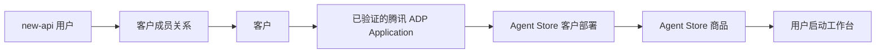

# Agent Store 与腾讯 ADP 智能工作台操作手册

> 适用环境：`https://gateway.nexus-reach.com`
>
> 当前生产版本：以系统信息页显示的 `v1.0.0-rc.21.claw.*` 为准
>
> 管理入口：`https://gateway.nexus-reach.com/workbench-admin`
>
> 客户入口：`https://gateway.nexus-reach.com/agent-store`

本手册说明如何把一个已经在腾讯 ADP 中开发并发布的 Application 配置到平台、加入固定月度套餐、上架到 Agent Store，并让被授权的 new-api 用户启动独立的智能工作台。文中的 Secret、AppKey 和密码均为占位符；不要把真实值写入文档、聊天、工单或命令历史。AppKey 只允许在 HTTPS 管理界面的专用密码输入框中提交一次。

## 1. 先理解四个对象



- **客户**：计费、成员、Application 和套餐的隔离边界，例如 `NEXUS-INTERNAL`。
- **Customer App**：客户授权给平台使用的一套腾讯 ADP Application 配置。AppKey 由管理界面一次性写入数据库加密保险库；界面只提示是否已经配置，不展示内部引用或指纹。AK/SK 继续由平台运维人员管理。
- **Agent Store 商品**：用户看到的名称、简介、头像、分类和标签。一个逻辑商品可以关联多个客户部署。
- **客户部署**：商品与某个客户的某个 Customer App 之间的绑定，独立管理验证状态、执行开关和使用授权。

商品中的“Agent”是产品展示名称，底层绑定的是腾讯 ADP **Application**，不要求所有应用都是 Claw 模式。

## 2. 角色和权限

| 角色 | 可以执行的操作 | 不能执行的操作 |
|---|---|---|
| new-api 超级管理员 | 客户、成员、凭据引用、App、套餐、Agent Store、审计和治理操作 | 查看明文 AppKey、SecretId、SecretKey |
| 客户 `owner` | 使用该客户已授权并已发布的 Agent；客户内最高业务角色 | 进入平台超级管理控制面 |
| 客户 `admin` | 使用按角色授权的 Agent | 修改平台级凭据和目录 |
| 客户 `member` | 使用按成员或套餐授权的 Agent | 管理其他成员 |
| 客户 `viewer` | 查看或使用明确允许的只读能力 | 获得未授权执行能力 |

所有管理写操作都要求：

1. new-api 超级管理员登录状态；
2. 同源管理会话和 CSRF 校验；
3. 15 分钟内完成过一次真实的密码、2FA 或 Passkey 重新认证。

如果写操作提示“需要最近管理员认证”，页面会跳回 `/workbench-admin?step_up=1`。输入当前管理员密码，或选择 2FA/Passkey；验证成功后会自动返回管理控制面。

## 3. 腾讯侧准备

每个准备上架的 Application 至少确认以下内容：

| 字段 | 获取位置 | 示例 |
|---|---|---|
| Region | 腾讯 ADP 应用所在地域 | `ap-guangzhou` |
| SpaceId | ADP 空间信息 | `default_space` |
| AppId | ADP Application 详情 | `2085927381516339648` |
| AppKey | ADP Application 调用配置 | 在 HTTPS 管理界面一次性输入；之后不回显 |
| SecretId / SecretKey | 腾讯云访问密钥管理 | 只放入服务器 Secret 文件 |
| 模板 AgentId | 仅动态 Claw Application 需要 | `4959df3a-1f38-4906-be51-c8e2cd65eab0` |

Application 必须已经发布且处于可运行状态。平台会通过腾讯官方接口读回 `AppMode`、发布状态、动态配置状态、应用名称、说明和头像；管理员不能手工声明这些可信字段。

### 3.1 AppMode 与运行模式

| 腾讯读回结果 | 平台运行模式 | 模板 AgentId | 说明 |
|---|---|---|---|
| AppMode 1 | `standard_v2` | 留空 | 标准应用，不复制用户 Agent |
| AppMode 2 | `multi_agent_v2` | 留空 | 多 Agent 应用，使用发布态入口 |
| AppMode 3 | `workflow_v2` | 留空 | 工作流应用 |
| AppMode 4，动态配置关闭 | `claw_static_v2` | 留空 | 静态 Claw，不复制用户 Agent |
| AppMode 4，动态配置开启 | `claw_dynamic_v2` | 必填 | 每个 `(客户成员, Application)` 维护独立用户 Agent |

不要为了通过表单给 AppMode 1/2/3 填写虚假 AgentId。平台会按腾讯读回结果选择运行策略；未知 AppMode 会拒绝验证。

## 4. 首次安装腾讯云访问密钥

本节只需由服务器运维执行一次。已经配置完成的客户可以直接跳到第 5 节。

### 4.1 命名规则

文件名必须是大写环境变量名，并以 `WORKBENCH_PROVIDER_` 开头。以 `NEXUS-INTERNAL` 为例：

```text
WORKBENCH_PROVIDER_NEXUS_INTERNAL_TENCENT_SECRET_ID
WORKBENCH_PROVIDER_NEXUS_INTERNAL_TENCENT_SECRET_KEY
```

对应的管理界面引用为：

```text
env://WORKBENCH_PROVIDER_NEXUS_INTERNAL_TENCENT_SECRET_ID
env://WORKBENCH_PROVIDER_NEXUS_INTERNAL_TENCENT_SECRET_KEY
```

### 4.2 安全写入文件

登录生产服务器后执行。下面的 `read -rsp` 不会把输入回显到终端，也不会把 Secret 写入命令历史：

```bash
cd /opt/new-api/deploy/claw-workbench
install -d -o 10001 -g 10001 -m 0700 secrets/provider

read -rsp 'Tencent SecretId: ' VALUE; printf '%s' "$VALUE" > secrets/provider/WORKBENCH_PROVIDER_NEXUS_INTERNAL_TENCENT_SECRET_ID; unset VALUE; echo
read -rsp 'Tencent SecretKey: ' VALUE; printf '%s' "$VALUE" > secrets/provider/WORKBENCH_PROVIDER_NEXUS_INTERNAL_TENCENT_SECRET_KEY; unset VALUE; echo

chown 10001:10001 secrets/provider/WORKBENCH_PROVIDER_NEXUS_INTERNAL_*
chmod 0600 secrets/provider/WORKBENCH_PROVIDER_NEXUS_INTERNAL_*
```

目录必须由容器 UID/GID `10001:10001` 拥有且权限为 `0700`；文件必须由 `10001:10001` 拥有且为 `0400` 或 `0600`。如果目录是 `root:root/0700`，即使文件本身正确，非 root 容器也无法读取。

### 4.3 计算指纹

指纹脚本只输出 SHA-256，不输出 Secret：

```bash
cd /opt/new-api/deploy/claw-workbench

python3 scripts/provider_fingerprint.py credential \
  WORKBENCH_PROVIDER_NEXUS_INTERNAL_TENCENT_SECRET_ID \
  WORKBENCH_PROVIDER_NEXUS_INTERNAL_TENCENT_SECRET_KEY

sh scripts/preflight.sh
```

记录凭据脚本输出的 `sha256:<64位小写十六进制>` 结果。SecretId 和 SecretKey 本身不能填写到浏览器；AppKey 则在第 8 节的专用密码输入框中提交。

## 5. 进入新版管理控制面

1. 登录 `https://gateway.nexus-reach.com` 的超级管理员账号。
2. 打开左侧菜单 **智能工作台管理**，或直接访问 `https://gateway.nexus-reach.com/workbench-admin`。
3. 首次进入会自动使用一次性票据建立短期管理会话。
4. 执行写操作时，如出现安全验证页，输入管理员密码或使用 2FA/Passkey。
5. 管理界面左侧应看到：概览、客户、套餐、凭据、用量、审计、治理、智能体商店。

不要直接访问 `/workbench/admin/` 来绕过入口，也不要把维护用 bootstrap token 放入浏览器。

## 6. 创建凭据配置

进入 **凭据** → **新建凭据配置**。

| 界面字段 | 示例 | 说明 |
|---|---|---|
| 作用域 | 客户 | 推荐每客户独立；平台作用域会被多个客户共享 |
| 客户 ID | `1` | `NEXUS-INTERNAL` 的内部客户 ID |
| 供应商环境 | `china_tencent_adp` | 本功能使用腾讯 ADP |
| 名称 | `nexus-internal-primary` | 便于管理员识别，不是腾讯名称 |
| SecretId 引用 | `env://WORKBENCH_PROVIDER_NEXUS_INTERNAL_TENCENT_SECRET_ID` | 只填引用 |
| SecretKey 引用 | `env://WORKBENCH_PROVIDER_NEXUS_INTERNAL_TENCENT_SECRET_KEY` | 只填引用 |
| SHA-256 指纹 | `sha256:<credential-fingerprint>` | 第 4.3 节第一条结果 |

创建成功后状态应为 `active`、指纹版本应为 `1`。如果提示指纹不匹配，先检查文件名、目录归属和是否误带换行，不要关闭完整性校验。

## 7. 创建客户并绑定 new-api 用户

### 7.1 创建客户

进入 **客户** → **新建客户**：

| 字段 | 示例 |
|---|---|
| 客户代码 | `NEXUS-INTERNAL` |
| 显示名称 | `REACH NEXUS` |
| 计费用户 ID | `1` |

客户代码会规范化为小写存储，例如 `nexus-internal`。计费用户 ID 指向 new-api 用户，但固定月度套餐账单由 Workbench 控制面维护，不按每次 Turn 从 new-api 余额自动扣款。

### 7.2 添加成员

进入客户详情 → **成员** → **添加成员**：

| 字段 | 示例 |
|---|---|
| new-api 用户 ID | `1` |
| 角色 | `owner` |

同一个 new-api 用户可以属于多个客户；用户进入 Agent Store 时只会看到当前有效客户、成员关系、套餐、部署和 entitlement 的交集。禁用成员会增加授权版本并撤销现有工作台授权。

## 8. 配置并验证 Customer App

进入客户详情 → **Application 配置** → **保存**。

### 8.1 动态 Claw 示例

| 字段 | 示例 |
|---|---|
| 预期行版本 | 新建时 `0`；修改时使用界面当前值 |
| 供应商环境 | `china_tencent_adp` |
| Region | `ap-guangzhou` |
| Space ID | `default_space` |
| App ID | `2085927381516339648` |
| 模板 Agent ID | `4959df3a-1f38-4906-be51-c8e2cd65eab0` |
| 凭据配置 ID | 选择 `nexus-internal-primary` |
| AppKey | 粘贴腾讯 ADP 提供的 AppKey；保存后立即清空且不回显 |
| 应用显示名称 | `REACH NEXUS Claw Workbench` |

如果配置的是 AppMode 1/2/3 或静态 Claw，模板 Agent ID 留空。

首次配置必须填写 AppKey。已经存在已验证配置时，该字段留空表示继续使用现有 AppKey；输入新值表示创建新的加密版本并替换。界面和管理 API 都不会返回明文、Secret 引用或指纹，普通超级管理员无需登录服务器。

### 8.2 推荐能力和限制

首次生产验证建议只打开已验收能力：

```text
能力：chat

customer_concurrency = 10
user_concurrency = 2
max_runtime_seconds = 300
max_reasoning_rounds = 20
max_output_tokens = 8192
web_search_per_turn = 0
max_file_bytes = 0
```

只有完成相应真实腾讯 E2E 和安全验收后，再打开 `files`、`web_search`、`tools`、`connectors`、`oauth`、`scheduled_tasks` 或 `sandbox`。界面隐藏不等于后端授权；实际能力取 App 配置、套餐、部署和运行时策略的交集。

### 8.3 验证和启用

1. 保存后会生成一个不可变的 pending config。
2. 点击 **验证**。
3. `配置版本` 使用界面自动显示的 pending config version，不要猜测。
4. 平台会调用腾讯接口验证 AppId、SpaceId、AppKey、AppMode、发布状态和条件化模板 Agent。
5. 验证成功后，再通过 **操作** → **启用** 激活 Customer App。

任何 Region、SpaceId、AppId、AppKey、凭据配置或模板 Agent 变化都会使旧验证失效，需要重新验证。仅修改 Agent Store 的展示名称、简介、标签或排序，不需要重新调用腾讯验证。

## 9. 创建固定月度套餐和有效周期

### 9.1 创建套餐版本

进入 **套餐** → **新建套餐**：

| 字段 | 示例 |
|---|---|
| 套餐代码 | `nexus-claw-basic` |
| 显示名称 | `REACH NEXUS Claw 基础套餐` |
| 月费（人民币） | `299.00` |
| 生效时间 | `2026-08-11 00:00`（北京时间） |
| 失效时间 | 留空，或填写合同到期时间 |
| 能力 | 至少 `chat` |
| 限制 | 不应高于 Customer App 对应限制 |

### 9.2 给客户创建套餐周期

进入客户详情 → **套餐周期** → **创建周期**：

| 字段 | 示例 |
|---|---|
| 套餐版本 | 选择刚创建的套餐版本 |
| 开始时间 | `2026-08-11 00:00` |
| 结束时间 | `2026-09-11 00:00` |

然后点击 **确认付款**：

| 字段 | 示例 |
|---|---|
| 套餐周期 | 选择待付款周期 |
| 付款证据引用 | `manual-bank-transfer-20260811-NEXUS-INTERNAL` |

当前计费模式是固定月度套餐：客户应收按已确认的套餐周期冻结；腾讯官网用量由管理员人工对账，作为内部成本证据，不自动改写客户账单，也不按每次对话扣 new-api 余额。

## 10. 创建第一个 Agent Store 商品

进入 **智能体商店** → **新建商品**。

### 10.1 推荐填写示例

| 字段 | 示例 | 规则 |
|---|---|---|
| Slug | `reach-nexus-claw` | 3–64 位小写字母、数字和连字符；创建后作为稳定 URL 标识 |
| 名称 | `REACH NEXUS 智能工作台` | 最多 160 字符 |
| 简介 | `基于腾讯 ADP 的企业智能助手，支持持续对话与任务处理。` | 最多 500 字符 |
| 详细说明 | `面向 REACH NEXUS 成员的内部智能工作台。首期开放对话能力。` | 最多 20,000 字符 |
| 头像 URL | `https://gateway.nexus-reach.com/static/llm-brand/logo.png` | 可留空；填写时必须是 HTTPS |
| 分类 | `办公助手` | 用于客户侧筛选 |
| 标签 | `claw, 企业助手, 腾讯adp` | 逗号分隔，会去重并规范化 |
| 排序 | `10` | 数值越小越靠前；团队应统一规则 |
| 推荐 | 勾选 | 在目录中显示为推荐商品 |
| 客户 | `REACH NEXUS (nexus-internal)` | 首个客户部署 |
| Customer App | `REACH NEXUS Claw Workbench | 2085927381516339648 | active` | 必须已有已验证配置 |

创建时执行开关固定为关闭，不能在浏览器中直接声明 AppMode、runtime profile、provider 状态或能力。

### 10.2 多客户复用同一商品

同一逻辑商品需要服务多个客户时，点击商品卡片中的 **添加客户部署**，选择新的客户和该客户自己的 Customer App。不要复制商品元数据；每个部署独立验证、授权、启停和审计。

## 11. 配置使用授权（Entitlement）

创建商品时授权列表为空，服务端会自动创建“整个部署客户可用”的默认授权。需要更细粒度限制时，在部署卡片点击 **管理部署** → **添加授权**。

| subject_type | subject_ref 示例 | 含义 |
|---|---|---|
| `customer` | `1` | 该部署所属客户 ID；不能填写其他客户 |
| `user` | `1` | 指定 new-api 用户 ID |
| `role` | `owner`、`admin`、`member`、`viewer` | 指定客户角色 |
| `plan` | `3` | 指定套餐**版本 ID**，不是套餐代码 |

`有效开始`、`有效结束` 按北京时间填写，可留空。结束时间必须晚于开始时间。多个授权是“任一匹配即可”，不是“全部同时满足”。

示例：只允许 new-api 用户 1 在 2026-08-11 至 2026-09-11 使用：

```text
类型：user
引用：1
有效开始：2026-08-11 00:00
有效结束：2026-09-11 00:00
```

## 12. 验证部署、开启执行并发布

严格按以下顺序操作：

1. 在商品的客户部署卡片点击 **验证**。
2. 等待状态从 `verifying` 变为 `verified`。
3. 检查读回的 AppMode、runtime profile、配置版本、腾讯应用名称和能力是否符合预期。
4. 当前生产只对已经完成真实验证的运行模式开启执行。首次 NEXUS 示例预期为 `AppMode 4 / claw_dynamic_v2`。
5. 点击 **启用**，把该部署的 `execution_enabled` 改为 true。
6. 点击商品级 **发布**。
7. 发布后商品状态应为 `published`，已验证部署状态应为 `active`。

如果先发布后开启执行也能保存，但在执行开关打开前，用户启动会被拒绝。推荐“验证 → 核对 → 开启执行 → 发布”，避免发布一个不可执行商品。

## 13. 客户如何使用 Agent Store

1. 用户登录 `https://gateway.nexus-reach.com`。
2. 左侧原 **Playground** 入口会显示为 **Agent Store/智能体商店**；旧 `/playground` 会跳转到 `/agent-store`。
3. 打开 `https://gateway.nexus-reach.com/agent-store`。
4. 可按分类和关键词搜索，点击商品查看完整说明。
5. 点击 **启动**。
6. 服务端重新检查用户、客户、成员角色、套餐、Customer App、部署、配置版本、授权版本和 entitlement。
7. 校验通过后签发 60 秒、单次使用、绑定浏览器会话和完整 App 快照的启动票据，并进入工作台。

浏览器不能在启动请求中覆盖 Customer ID、AppId、AppMode、AgentId、SpaceId 或 AppKey。用户刷新或重复使用旧启动票据会被拒绝，这是正常安全行为。

动态 Claw 模式下，每个用户的 Agent、Conversation、任务和历史记录彼此隔离；同一客户的不同用户不会共享对话记录。AppMode 1/2/3 和静态 Claw 不复制用户 Agent，但 Conversation 所有权和历史仍按规范化用户身份隔离。

## 14. 日常维护

### 14.1 修改商品文字、分类、标签或排序

点击商品 **编辑**。修改会创建新的不可变目录版本，不改变客户部署、entitlement、执行开关或腾讯 Application。保存后按当前状态重新发布新版本。

### 14.2 修改腾讯 App 配置

1. 在客户详情保存新的 App pending config。
2. 如果更换 credential profile，先发起 `app_credential_change` 双人审批。
3. 第二名管理员在 **治理** 页面批准并执行。
4. 验证新的 App config。
5. 重新验证所有引用该 App 的 Agent Store 部署。
6. 核对新的 runtime profile 后再开启执行。

不能只改服务器 Secret 文件而保留旧指纹。标准轮换流程是：写入新版本 Secret 文件 → 计算新指纹 → 暂存凭据轮换 → 双人审批 → 激活 → 更新 App config → 验证 → 淘汰旧版本。

### 14.3 下架、停用和归档

| 操作 | 影响 | 恢复方式 |
|---|---|---|
| 停止执行 | 仅关闭某个客户部署执行；商品仍可保留 | 部署状态仍有效时可再次启用 |
| 下架商品 | 从目录隐藏并禁止新启动；部署 `active` 回到 `verified` | 点击发布 |
| 停用单个部署 | 只影响该客户，撤销其活动授权，执行关闭 | 必须重新验证，再显式启用 |
| 停用商品 | 隐藏全部客户部署并撤销活动授权 | 不支持直接恢复；按治理流程重新建版本/部署 |
| 归档商品 | 只允许从 draft、rejected、unpublished 进入；作为终态保留审计 | 不恢复，创建新商品 |

紧急事故优先“停用单个部署”或“下架商品”，并填写清晰原因，例如：

```text
provider credential suspected compromised; incident INC-2026-0811
```

## 15. 状态判断速查

### 15.1 商品状态

```text
draft -> verifying -> verified -> published -> unpublished
  |          |           |                         |
  +------> rejected -----+----------------------> archived
published/unpublished/draft/rejected -> disabled（按允许的管理动作）
```

- `draft`：仅管理端可见。
- `verifying`：正在调用腾讯；5 分钟内不要重复点击。
- `rejected`：腾讯验证或安全校验失败。
- `verified`：至少一个部署已验证，可发布。
- `published`：满足授权交集的客户用户可见。
- `unpublished`：已下架，可重新发布。
- `disabled` / `archived`：终止或归档状态。

### 15.2 部署状态

- `draft`：未通过可信验证。
- `verified`：可信快照有效，但商品未发布或已下架。
- `active`：商品已发布，部署可参与目录和启动判断。
- `disabled`：该客户部署已停用，必须重新验证。

`execution_enabled=true` 仍不等于一定可启动；商品、部署、Customer App、成员、套餐和 entitlement 必须同时有效。

## 16. 管理 API 参考

推荐日常操作使用新版管理界面。以下 API 用于自动化和排障；所有管理写请求都必须使用同源管理员 Session、双提交 CSRF 和最近重新认证，静态 Bearer token 会被拒绝。

### 16.1 用户侧接口

| 方法 | Endpoint | 用途 |
|---|---|---|
| GET | `/api/workbench/agent-store/status` | 查询功能开关，响应 `{"success":true,"data":{"enabled":true}}` |
| GET | `/api/workbench/agent-store?category=&query=&cursor=` | 当前用户可见目录 |
| GET | `/api/workbench/agent-store/{slug}` | 当前用户可见商品详情 |
| POST | `/api/workbench/agent-store/{slug}/launch` | 启动，body 必须为空对象或空 body |

启动成功响应示例：

```json
{
  "success": true,
  "data": {
    "redirect_url": "/workbench/auth/sso?ticket=<one-time-ticket>",
    "expires_at": "2026-08-11T12:31:00Z"
  }
}
```

### 16.2 管理侧接口

| 方法 | Endpoint | 用途 |
|---|---|---|
| GET/POST | `/api/admin/workbench/agent-store/items` | 列表/创建商品 |
| GET/PATCH | `/api/admin/workbench/agent-store/items/{item_id}` | 详情/修改元数据 |
| POST | `/api/admin/workbench/agent-store/items/{item_id}/deployments` | 新增客户部署 |
| PATCH | `/api/admin/workbench/agent-store/items/{item_id}/deployments/{deployment_id}` | 更新执行开关和授权 |
| POST | `/api/admin/workbench/agent-store/items/{item_id}/deployments/{deployment_id}/verify` | 可信腾讯验证 |
| POST | `/api/admin/workbench/agent-store/items/{item_id}/deployments/{deployment_id}/disable` | 停用单个部署 |
| POST | `/api/admin/workbench/agent-store/items/{item_id}/publish` | 发布 |
| POST | `/api/admin/workbench/agent-store/items/{item_id}/unpublish` | 下架 |
| POST | `/api/admin/workbench/agent-store/items/{item_id}/disable` | 停用商品 |
| POST | `/api/admin/workbench/agent-store/items/{item_id}/archive` | 归档 |
| GET | `/api/admin/workbench/agent-store/items/{item_id}/audits` | 管理和启动审计 |

创建商品请求体示例：

```json
{
  "slug": "reach-nexus-claw",
  "display_name": "REACH NEXUS 智能工作台",
  "summary": "基于腾讯 ADP 的企业智能助手。",
  "description": "面向 REACH NEXUS 成员的内部智能工作台。",
  "avatar_url": "https://gateway.nexus-reach.com/static/llm-brand/logo.png",
  "category": "办公助手",
  "tags": ["claw", "企业助手", "腾讯adp"],
  "sort_order": 10,
  "featured": true,
  "deployment": {
    "customer_id": 1,
    "customer_app_id": 1,
    "execution_enabled": false
  },
  "entitlements": []
}
```

部署验证请求体示例：

```json
{
  "expected_version": 2,
  "expected_deployment_version": 1
}
```

更新授权和执行开关示例：

```json
{
  "expected_deployment_version": 2,
  "execution_enabled": true,
  "entitlements": [
    {
      "subject_type": "user",
      "subject_ref": "1",
      "valid_from": "2026-08-10T16:00:00Z",
      "valid_until": "2026-09-10T16:00:00Z"
    }
  ]
}
```

界面中的北京时间会转换为 ISO-8601 UTC；例如北京时间 `2026-08-11 00:00` 对应 `2026-08-10T16:00:00Z`。

## 17. 常见错误与处理

| 现象 | 常见原因 | 处理方法 |
|---|---|---|
| `/readyz` 提示 provider secret integrity not ready | Secret 目录不可搜索、文件 owner/mode 错、指纹版本旧或 Secret 被直接替换 | 检查目录 `10001:10001/0700`、文件 `10001:10001/0600`，运行 preflight；按轮换或受审计 re-enroll 流程处理 |
| 创建凭据时报 fingerprint mismatch | 文件内容与指纹不是同一版本，或文件带换行 | 重新在服务器计算指纹，不要在线哈希 |
| App 验证失败 | App 未发布、Space/AppKey 不匹配、动态 Claw 缺模板 Agent、AK/SK 无权限 | 回腾讯控制台核对后重新验证；不要伪造 AppMode |
| 商品停在 verifying | 正常验证尚未结束，或供应商调用中断 | 5 分钟内等待；超过 5 分钟可再次点击验证触发安全恢复 |
| 不能点击启用执行 | 部署未 verified/active，或 runtime profile 未识别 | 先验证并核对读回结果 |
| 发布时报 verified deployment required | 没有任何通过验证的客户部署 | 对至少一个部署执行验证 |
| 用户目录为空 | 未登录、成员/套餐/entitlement/部署任一无效，或商品未发布 | 按“成员 → 套餐 → App → 部署 → entitlement → 商品”顺序检查 |
| 用户点击启动返回 403/409 | 配置版本或授权版本变化、部署停用、票据过期或重复使用 | 刷新目录后重新启动；不要重放旧票据 |
| 管理写操作跳回安全验证 | 最近认证超过 15 分钟 | 使用密码、2FA 或 Passkey 完成 step-up |
| API 返回 row version changed | 另一个管理员已修改同一对象 | 刷新页面，核对最新状态后重做操作，不要覆盖版本号 |

## 18. 上线与变更检查清单

### 首次上架前

- [ ] 腾讯 Application 已发布且可运行。
- [ ] Region、SpaceId、AppId、条件化模板 Agent 已确认。
- [ ] AppKey 已通过 HTTPS 管理界面写入加密保险库；AK/SK 已由平台运维人员安全配置。
- [ ] Secret 目录和文件 owner/mode 正确，preflight 通过。
- [ ] credential profile 为 active、fingerprint version 为 1。
- [ ] 客户 active，new-api 用户成员关系 active。
- [ ] Customer App config verified，Customer App active。
- [ ] 套餐周期有效且付款已确认。
- [ ] Agent Store deployment verified，读回 AppMode/profile 正确。
- [ ] 只对已完成真实 E2E 的 profile 打开 execution。
- [ ] 商品 published，部署 active。
- [ ] 使用真实客户账号验证目录、启动、对话和历史隔离。
- [ ] 未授权用户看不到商品，公网 internal API 返回 404。

### 每次变更后

- [ ] 检查 Agent Store 管理审计和启动审计。
- [ ] 检查 `/api/workbench/agent-store/status` 仍为 enabled。
- [ ] 检查域名和公网 IP 的 `/api/status`。
- [ ] 运行部署 preflight。
- [ ] 创建并校验数据库备份，随后复制到加密、异机、受控存储。
- [ ] 保留旧 Blue/Green 镜像和数据库回滚证据，不执行 volume/image prune。

## 19. 当前 NEXUS-INTERNAL 首个商品建议

现有生产示例已经具备客户、用户 1、客户级腾讯凭据和已验证的动态 Claw Application。首次实际上架可直接从第 10 节开始，建议值如下：

```text
Slug: reach-nexus-claw
名称: REACH NEXUS 智能工作台
分类: 办公助手
标签: claw, 企业助手, 腾讯adp
排序: 10
推荐: 是
客户: REACH NEXUS (nexus-internal)
App: REACH NEXUS Claw Workbench
授权: 留空（默认整个客户），或 user / 1 做首轮小范围验收
```

建议先用 `user / 1` 做小范围验收，确认启动、对话、历史隔离和审计后，再把授权改为空列表，让服务端恢复默认客户级授权。
