# ADP Agent Store 与智能工作台替代 Playground：固定月度套餐实施设计

> 文档状态：可实施设计基线
> 适用项目：new-api（当前仓库）与独立维护的 [`jeffzha/adp-chat-client`](https://github.com/jeffzha/adp-chat-client) fork
> 商业模式：每客户独立授权的 ADP Application、固定月度套餐、人工核查腾讯用量
> 最后复核：2026-08-11
> 架构边界：项目负责人已确认“独立扩展域 + new-api 最薄桥接”为强制约束；不得在实施中自行放宽

## 1. 文档用途与最终决策

本文是后续完整实现智能工作台的执行基线。未来收到“按本文完整实现”时，应以本文的资源模型、接口、状态机、数据表、安全边界、测试门禁和部署顺序为准。

最终决策如下：

1. 产品侧继续统一呈现客户、成员、套餐、权限、入口、审计和启停能力；其中 new-api 核心只承担身份入口，其他控制面能力由独立 `claw-control` 扩展服务承载，不把完整 Claw 业务并入 new-api 上游核心进程。
2. 新版前端以 `/agent-store` 作为 ADP Application 商店入口，`/playground` 保持兼容跳转；用户启动应用后进入经过安全加固的 `adp-chat-client` fork，旧 Playground 永久保留在 `/playground/legacy` 作为回退。
3. 商店中的“Agent”是产品展示名，底层一条商品绑定一个腾讯 ADP Application。允许 `AppMode=1/2/3/4`；只有 `AppMode=4` 且应用开启用户动态配置时，才为客户内部每个 new-api 用户复制独立 Kind=1 User Agent。
4. new-api `users.id` 是唯一登录身份真值；工作台用户是按 `(customer_id,new_api_user_id)` 创建的不可独立登录影子账号。
5. 客户、App、影子账号、Agent、Conversation、Workspace 和文件形成不可跨越的所有权链。
6. 客户按固定月度套餐收费，不进行逐 Turn 预授权、Token 计价、工具计价或终态差额结算。
7. 首版由超级管理员确认付款并开通套餐；P1 只有在存在稳定固定扣款扩展接口或最小桥接 ADR 获批时，才可每月从指定 new-api 付款用户余额一次性扣除固定套餐费，但绝不按 Turn 扣费。
8. 腾讯 ADP/费用中心用量先由管理员人工查询和登记，只用于内部成本、毛利、异常和套餐升级分析，不反向修改已出具的客户固定月费账单。
9. 超级管理员配置客户 Application 的 Region、SpaceId、AppId、AppKey、条件化模板 Agent、凭据配置、套餐、能力和限制，并管理 Agent Store 草稿、验证、上架、下架、停用和归档。
10. 即使不逐请求计费，也必须限制并发、运行时间、推理轮数、输出 Token、工具次数、文件和高风险能力，防止上游成本失控。
11. 尽量通过新增独立服务和独立模块实现；不修改现有 relay/channel 和普通 Chat 计费链路。
12. new-api 核心只新增“工作台入口 + 一次性身份票据/状态校验”最小桥接；客户 App、固定套餐、人工成本核查、Claw 管理 API 和后台任务放入独立 `claw-control` 服务及其数据库。
13. 首版验收时，对 **new-api upstream 已存在手写业务源码文件** 的修改不得超过 10 个，直接修改总量原则上不得超过 100 行，且 new-api 侧至少 90% 的 Claw 功能代码必须是新增文件或独立服务代码；由构建器生成的 `routeTree.gen.ts` 与由 i18n 同步脚本生成的 locale 资源单独列入重放审计，不计入手写源码文件数，但仍必须执行 upstream 合并回归。ADP fork 的必要加固单独按第 18.5 节维护补丁清单，不纳入这两个 new-api 阈值。任一侧超出各自基线都必须先提交架构决策记录并由项目负责人明确批准。
14. 必须保留功能开关和 `/playground/legacy` 回退路径；关闭 Claw 功能后，new-api 原有登录、API 转发、渠道、计费、日志和旧 Playground 均应恢复为与未接入前一致的行为。
15. **可持续同步 upstream 是发布级约束，而不是事后优化。** 每次同步应先在不携带 Claw 业务改动的情况下完成 new-api upstream 合并，再重放最薄身份/入口桥接并执行边界门禁；预期冲突只允许集中在路由聚合、`/playground` 入口和生成式前端路由。`claw-control` 与 ADP fork 必须能够独立演进，不能为了减少部署组件而把其业务状态、后台任务或供应商调用迁回 new-api。若冲突扩散到用户生命周期、relay、渠道、模型映射、计费、quota 或使用日志语义，发布必须停止并先完成 ADR、替代方案及回退评审。

### 1.1 明确不做

- 不把腾讯 ADP 官网用量误称为逐请求客户账单。
- 不假设腾讯通用账单一定能按 AppId、UserId、ConversationId 或原始 ADP RequestId 拆分。
- 不把腾讯开给平台账号的上游账单直接当作平台开给客户的账单。
- 不实现逐 Turn `reserve/settle/refund/debt`、动态价格快照、人民币换 quota 或 T+1 客户调账。
- 不将 AK/SK、AppKey、OAuth token、内部签名密钥返回浏览器。
- 不允许浏览器选择或覆盖 customer_id、AppId、AppKey、SpaceId、AgentId。
- 不把 new-api 的价格分组当成客户隔离边界。
- 不把通用 `/adp/<Action>` 签名代理原样开放给客户。
- 不复用 new-api 主数据库作为 ADP 对话数据库；ADP 使用独立 PostgreSQL。
- 不在 new-api `users` 表增加 Claw 专用字段，不通过修改用户禁用、删除、登录或 API Key 核心流程传播 Claw 状态。
- 不修改现有 `/v1` 公共模型接口、渠道类型、模型映射、价格分组、quota、预扣费、结算、退款和使用日志语义。
- 不让 `claw-control` 或 ADP 直接读取、写入 new-api 用户数据库；身份只通过短期签名票据和受信任内部状态校验传递。

### 1.2 核心资源层级

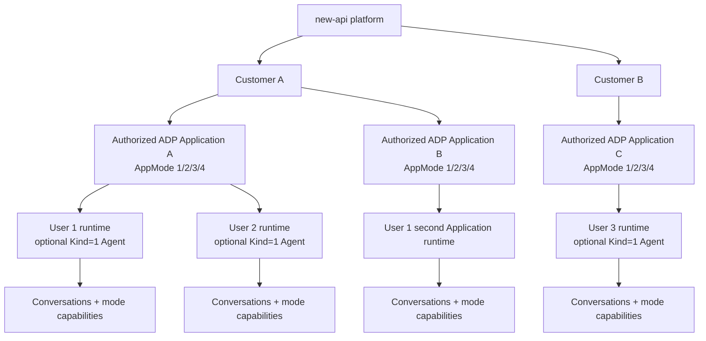

一个客户可以包含多个 new-api 用户和多个已授权 ADP Application；同一 new-api 用户可以同时属于多个客户，但同一 `(customer_id,new_api_user_id)` 只能有一条成员关系。每个客户分别产生 IdentityBinding、Canonical Subject 和 ADP shadow account，任何 ADP Account 都不得跨客户复用。现有 `slot=primary` 保留为兼容默认 App，不再限制客户只能拥有一个 App；Agent Store deployment/entitlement 决定可见 Application。多客户或多 App 选择只能由 claw-control 签发的一次性 selection/launch token 完成，浏览器提交的 customer/App 标识不具有可信作用域语义。

### 1.3 十二个实施模块

| 模块 | 目标 | 主要交付物 |
|---|---|---|
| 1. 客户与成员 | 建立真实租户边界 | customer/member 表、角色与成员解析 |
| 2. 客户 ADP App | 每客户独立授权的 Application、版本和生命周期 | App 配置、AppMode 验证、启停、密钥轮换 |
| 3. Agent Store 与工作台前端 | 用 Application 商店替换 Playground，并按模式进入运行界面 | 商店目录、同域顶层路由、桌面/移动线框、legacy 回退 |
| 4. 用户映射、SSO 与持续鉴权 | new-api User 是唯一身份源，ADP 只建影子账号 | identity binding、一次性 ticket、forward-auth、撤销 |
| 5. 每用户 Agent | App 内用户隔离 | ensure-agent、唯一映射、配置策略 |
| 6. 会话与任务 | Conversation/SSE/历史可靠 | 后台 Turn task、断线重连、终态 |
| 7. 文件与工具 | Workspace、产物和连接器安全 | 私有 COS、扫描、OAuth、能力开关 |
| 8. 固定月度套餐 | 固定金额、周期和账单 | plan/period/invoice、到期策略 |
| 9. 人工用量核查 | 腾讯成本人工登记 | usage audit、证据、毛利估算 |
| 10. 超级管理员 | 配置、验证、启停和审计 | 管理页、操作 API、状态机 |
| 11. 安全代理 | 防 IDOR、任意 Action 和秘密泄漏 | Action policy、字段覆盖、响应裁剪 |
| 12. 部署与可观测性 | 同域、蓝绿、告警和恢复 | Caddy、Compose、指标、回滚 |

### 1.4 Agent Store 扩展目标（2026-08-11 最终决策）

本节是对全文“一个客户只有一个 Claw App、`/playground` 直接进入工作台”假设的正式扩展；与后文旧描述冲突时，以本节为准。产品界面中的“Agent”对应腾讯 ADP 的 **Application**，不是可由浏览器选择的任意 AgentId。目录层允许腾讯公开的四种 Application 模式：

| AppMode | 产品模式 | 可上架 | 用户级 Agent | 首发运行能力 |
|---:|---|---:|---|---|
| 1 | 标准模式 | 是 | 不复制；使用发布态默认配置 | 对话、历史、引用及经模式验收的输入类型 |
| 2 | Agent / Multi-Agent 模式 | 是 | 不复制；使用发布态入口 Agent | 对话、历史、过程事件及经模式验收的输入类型 |
| 3 | 单工作流模式 | 是 | 不复制；使用发布态工作流 | 对话、历史、工作流事件；同步/异步能力分别验收 |
| 4 | Claw 模式 | 是 | 仅在动态配置开启时 `CopyAgentFromApp(Kind=1)` | 现有 Claw 对话；Workspace、文件、Sandbox、PTY 仍受各自门禁 |

`AppMode`、SpaceId、运行状态和发布状态必须来自 `DescribeApp` 的受信任读回，不能由管理员请求或浏览器字段决定；腾讯返回的应用名称、描述和头像作为 provider snapshot 在管理端展示与审计，商店卡片允许超级管理员另行维护版本化的展示名称、简介、说明和头像，但不得反向覆盖腾讯 Application。腾讯新版 `/adp/v2/chat` 使用已发布 Application 的 AppKey、ConversationId、VisitorId 和 Contents；AgentId 是可选字段。`CreateConversation.AgentId` 仅在 Claw 模式开启“允许在对话中动态修改配置”时使用。因此，删除 `AppMode=4` 校验而继续复用 Claw provisioning 是错误实现；必须按读回的模式选择运行策略。

官方合同基线：

- [ADP Application/Agent 概念与 `/adp/v2/chat`](https://cloud.tencent.com/document/product/1759/133868)
- [新版 HTTP SSE 合同](https://cloud.tencent.com/document/product/1759/129202)
- [CreateConversation 与条件化 AgentId](https://cloud.tencent.com/document/api/1759/132523)
- [AppMetadata/AppStatusInfo/AppMode](https://cloud.tencent.com/document/api/1759/132545)
- [CopyAgentFromApp](https://cloud.tencent.com/document/product/1759/133460)

#### 1.4.1 商品、客户部署与腾讯资源的关系

2026-08-12 产品决策改为“一个目录 Application 运行配置 + 动态客户使用范围”。平台可以让多个客户共用同一个已发布腾讯 Application/AppKey，但客户身份和业务数据必须继续隔离：

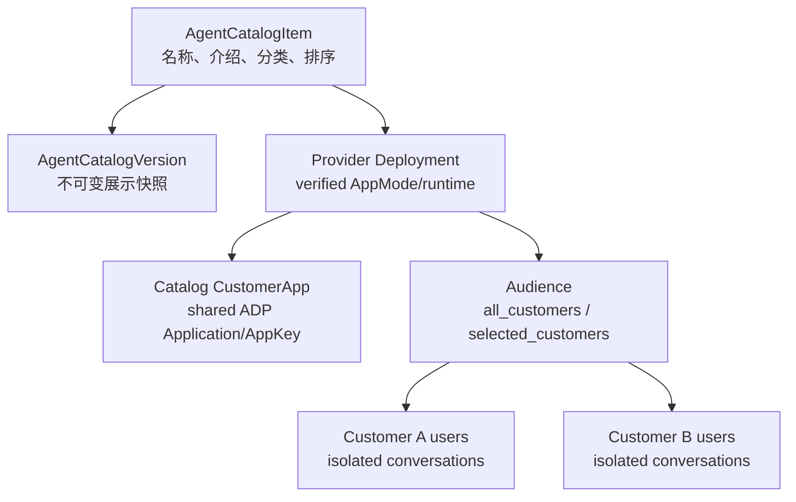

- `AgentCatalogItem` 是商店商品身份，不保存明文 AppKey。
- 每个新增商品由统一上架向导创建一个 server-owned catalog App 和一个 verified deployment；AppKey 只写入 provider vault。
- `all_customers` 动态授权所有当前和未来具有有效付费 Workbench 套餐的活跃客户；`selected_customers` 保存精确客户 allowlist。
- 共享 provider App 只共享腾讯 Application 定义和腾讯侧计费归属，不共享 CustomerID、IdentityBinding、shadow account、canonical VisitorId、Conversation、Turn、Workspace、文件、OAuth 或审计。SSO/AppContext 的 CustomerID 永远取当前登录主体，provider App profile 单独由服务端 launch nonce 绑定。
- catalog App 使用 `catalog:` slot，不进入普通客户 App 选择器；跨客户使用只能从 Agent Store entitlement + 一次性 launch token 进入，不能通过猜测 app_profile_id 访问。
- 统一发布事务同时激活 catalog App、刷新 verified AuthEpoch、启用 deployment 并发布目录版本，禁止出现两次“启用”操作和半完成状态。
- 浏览器只看到 opaque item id/slug、展示元数据、能力标签和启动状态；不得看到 customer_app_id、AppId、SpaceId、AppKey、AgentId、credential profile 或 provider RequestId。

#### 1.4.2 组件责任与低冲突约束

| 组件 | Agent Store 新职责 | 明确禁止 |
|---|---|---|
| new-api | 菜单文案、`/agent-store` 目录展示、`/playground` 兼容入口、现有 session-ticket；目录接口 404 时只执行 feature-off 兼容回退 | 新增目录业务表、读取 AppKey、决定 entitlement、修改 relay/计费/quota |
| claw-control | 商品、版本、客户部署、entitlement、验证、上架状态、启动票据、审计 | 保存明文 AppKey、创建 Conversation、执行 Turn |
| ADP fork | launch 后的智能工作台、按 AppMode 选择 runtime、Conversation/Turn/历史及 Claw 用户 Agent | 决定客户/套餐真值、接受浏览器 AppId/AppMode/AgentId |
| Tencent ADP | Application/发布态/Agent/Conversation/对话执行 | 决定平台商店可见性或客户套餐 |

new-api upstream 既有文件仍受 `10 files / 100 lines / 90% 新增` 门禁；Agent Store 业务不得迁入 new-api model/controller。`claw-control` 和 ADP fork 通过现有版本化 HMAC 合同扩展最小 DTO，必须兼容当前版和前一版。

#### 1.4.3 数据模型

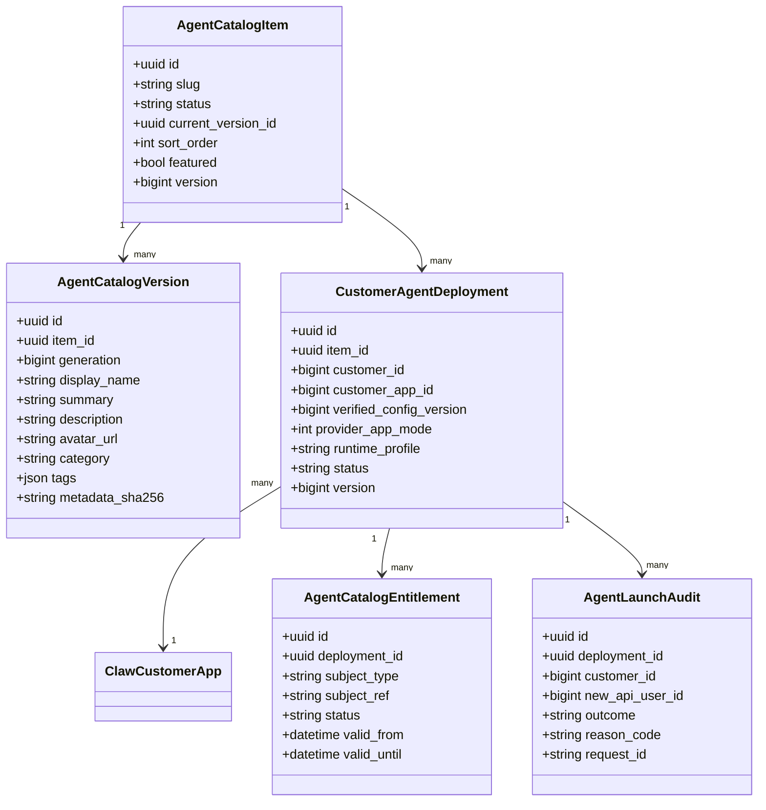

数据库字段继续使用跨 SQLite/MySQL/PostgreSQL 的普通类型；JSON 列按 claw-control 既有 TEXT+`jsonx` 合同保存。`slug` 全局唯一且发布后不可复用；删除采用归档，不物理复用历史 id。目录版本不可变，编辑已发布商品时创建新 draft version，发布时通过行锁和 expected version 原子切换 current version。

#### 1.4.4 生命周期与语义

商品展示生命周期和客户 Application 执行生命周期必须分离：

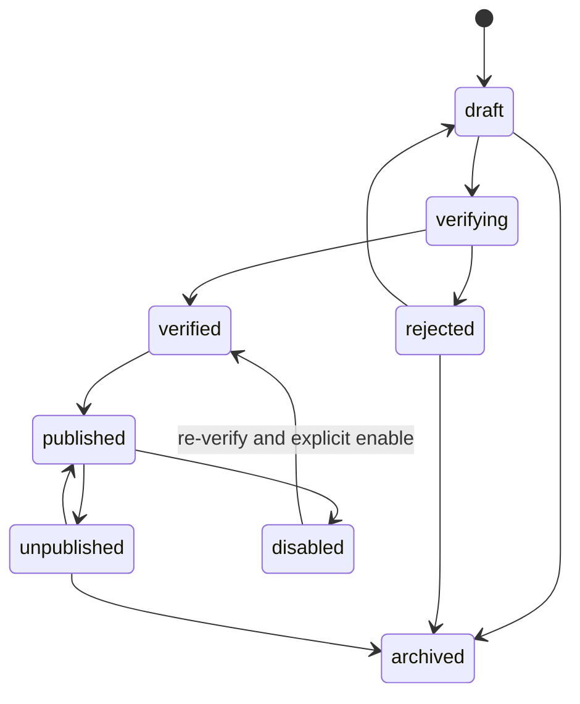

- `unpublished`：从商店隐藏并禁止新启动；已经创建的会话按 entitlement 策略继续，默认只允许历史读取，不允许创建新 Turn。
- `deployment suspended`：立即禁止新启动和新 Turn；provider 已接受的 Turn 继续隐藏 drain 到终态。
- `disabled`：隐藏商品、撤销 deployment 和浏览器会话、阻止新 Turn；不删除 Conversation/历史。
- `archived`：终态，只读保留目录版本、验证证据和审计；不得直接删除腾讯 Application。
- CustomerApp 被暂停、禁用、迁移或 config/auth epoch 改变时，deployment 即使仍标为 published 也必须 fail-closed；目录展示可返回“暂不可用”，但不能签发启动票据。

#### 1.4.5 管理员录入、验证与上架

管理员创建商品时分为展示配置和客户部署配置：

1. 展示配置：名称、短介绍、详细介绍、分类、标签、排序、推荐、可选头像覆盖。
2. 客户部署：客户、现有 CustomerApp 或新 App draft、Region、SpaceId、AppId、一次性写入的 AppKey、credential profile、套餐 capability/limits。管理界面不得显示内部 Secret 引用或指纹。
3. 模板 AgentId 是条件字段：
   - AppMode 4 且读回动态配置开启：必填并验证；
   - AppMode 4 且不使用动态配置：可选；
   - AppMode 1/2/3：不得作为启动所需字段。

验证必须由 claw-control 使用服务端凭据执行，至少完成：

1. `DescribeApp(Domain=2)` 读回 Metadata/Status/AppConfig/SecretInfo 所需字段；其中 provider 名称、说明和头像保存为只读验证快照，目录展示副本仍走独立版本和管理审计。
2. 精确确认 AppId、SpaceId、Region、AppKey canonical fingerprint、运行状态和发布态。
3. 接受且只接受 `AppMode in {1,2,3,4}`，保存 provider-derived mode；未知/null 值 fail-closed。
4. AppMode 4 动态模式用 `DescribeAgentDetail` 验证模板主 Agent 归属、状态和配置；其他模式不执行 `CopyAgentFromApp` 探测。
5. 根据 mode 和读回配置计算 `runtime_profile`、能力标签和受限功能，不接受管理员自行声明更多能力。
6. 保存脱敏 RequestId、响应字段 hash、配置 fingerprint 和验证时间；不保存 provider 原始响应或 Secret。
7. 只有验证证据仍绑定当前 CustomerApp config version、credential fingerprint 和 auth epoch 时才能发布。

管理员不能直接提交 `verified/published`、AppMode、运行状态、RequestId 或响应 hash。Region/Space/App/Secret/模板 Agent/credential 任何字段变化都使旧验证失效；仅修改展示文字、标签和排序不触发 provider 验证，但仍创建目录版本并保留审计。

管理端 API：

```http
GET    /api/admin/workbench/agent-store/items
POST   /api/admin/workbench/agent-store/items
GET    /api/admin/workbench/agent-store/items/{item_id}
PATCH  /api/admin/workbench/agent-store/items/{item_id}
POST   /api/admin/workbench/agent-store/items/{item_id}/verify
POST   /api/admin/workbench/agent-store/items/{item_id}/deployments
PATCH  /api/admin/workbench/agent-store/items/{item_id}/deployments/{deployment_id}
POST   /api/admin/workbench/agent-store/items/{item_id}/deployments/{deployment_id}/verify
POST   /api/admin/workbench/agent-store/items/{item_id}/deployments/{deployment_id}/disable
POST   /api/admin/workbench/agent-store/items/{item_id}/publish
POST   /api/admin/workbench/agent-store/items/{item_id}/unpublish
POST   /api/admin/workbench/agent-store/items/{item_id}/disable
POST   /api/admin/workbench/agent-store/items/{item_id}/archive
GET    /api/admin/workbench/agent-store/items/{item_id}/audits
```

所有写接口要求管理员 Session、CSRF、recent-auth、expected version 和审计。Provider 配置/Secret 变化继续遵守现有 BYOK 与双人审批边界，不能借“上架”绕过凭据变更审批。

#### 1.4.6 用户目录与启动合同

用户 API：

```http
GET  /api/workbench/agent-store?cursor={opaque}&category={value}&query={value}
GET  /api/workbench/agent-store/{slug}
POST /api/workbench/agent-store/{slug}/launch
```

- 列表查询从当前 claw-control Session 取得 customer/user/App 作用域，只返回 published、deployment active、entitlement active、套餐有效且当前用户有权使用的交集。
- 搜索和分类只作用于服务端裁剪后的目录；cursor 不透明并绑定查询摘要，禁止用 offset 推断隐藏商品数量。
- `launch` body 首版为空；不得接受 customer_id、AppId、AppMode、AgentId、SpaceId、AppKey 或 capability 覆盖。
- 浏览器第一次进入 `/agent-store` 且尚无 `claw_control_session` 时，目录 GET 返回 401；前端通过现有 `POST /api/workbench/session-ticket` 获取一次性入口票据，完整导航到 `/api/workbench/entry?ticket=...`。claw-control 消费票据后同时设置 HttpOnly `claw_control_session` 与 Path=`/agent-store` 的非 HttpOnly `claw_control_csrf`，再以 303 返回 `/agent-store`。前端不得把控制面 401 交给 new-api Axios 全局拦截器，以免把“缺少控制面 Session”误判为 new-api 登录失效。
- 服务端在行锁内重验 membership、plan、CustomerApp、deployment、catalog version、config version、auth epoch 和 entitlement，签发 60 秒单次 opaque launch token。
- launch token 绑定 browser session digest、customer、user、item、deployment、application profile/config、purpose 和 nonce；消费后沿用现有 selection/ADP SSO 票据链，不能变成通用 bearer token。

```mermaid
sequenceDiagram
  actor U as User
  participant S as Agent Store UI
  participant C as claw-control
  participant A as ADP fork
  participant T as Tencent ADP
  U->>S: 打开 /agent-store
  S->>C: GET catalog（尚无控制面 Session）
  C-->>S: 401
  S->>C: new-api session-ticket -> /api/workbench/entry
  C-->>S: Set-Cookie session + CSRF; 303 /agent-store
  S->>C: GET authorized catalog
  C-->>S: 裁剪后的 Agent cards
  U->>S: 点击开始使用
  S->>C: POST /{slug}/launch + CSRF
  C->>C: 重验 membership/plan/deployment/app/config/epoch
  C-->>S: one-time same-origin redirect
  S->>A: consume ADP SSO ticket
  A->>C: signed app-context resolve
  C-->>A: mode-derived immutable runtime profile
  alt AppMode=4 and dynamic Agent enabled
    A->>T: ensure CopyAgentFromApp(Kind=1)
    T-->>A: user ParentAgentId
  else AppMode=1/2/3 or non-dynamic Claw
    A->>A: no user Agent copy
  end
  A->>T: CreateConversation(Type=5, canonical UserId, optional AgentId)
  A-->>U: Workbench conversation
```

#### 1.4.7 AppMode 运行策略

ADP 内部新增稳定 `runtime_profile`，值只能由 provider-derived AppMode 与读回配置计算：

| runtime profile | Agent provisioning | Conversation | UI capability |
|---|---|---|---|
| `standard_v2` | 无 | Type=5、AppKey、canonical UserId，不传 AgentId | chat/history/references；隐藏 Claw 专属配置 |
| `multi_agent_v2` | 无用户复制 | 同上，使用应用发布态入口 Agent | chat/history/procedure；不开放任意 AgentId |
| `workflow_v2` | 无 | 同上；同步/异步按验证 capability | workflow events/options；隐藏 Claw Workspace |
| `claw_static_v2` | 无 | 同上，不传 AgentId | Claw chat；动态配置入口关闭 |
| `claw_dynamic_v2` | 每 `(binding,app)` 唯一 Kind=1 Agent | 同上并传服务端绑定 AgentId | 经门禁的动态配置；Sandbox/文件各自独立控制 |

所有模式共用 canonical VisitorId、Conversation 所有权、持久 Turn/SSE、断线续流、hidden drain、历史隔离和 provider evidence。能力差异使用服务端 capability 投影控制，不能只隐藏前端按钮。每个 runtime profile 在真实腾讯 Application 上完成最小 Turn、历史、错误、限流和撤权 E2E 前保持 `execution_enabled=false`；当前生产只放行已验收的 `claw_dynamic_v2` Chat 子集。

#### 1.4.8 前端信息架构与线框

桌面端：

```text
┌────────────────────────────────────────────────────────────────────┐
│ Agent Store                    [搜索 Agent]  [分类]      [我的会话] │
├────────────────────────────────────────────────────────────────────┤
│ 推荐                                                               │
│ ┌──────────────┐ ┌──────────────┐ ┌──────────────┐                 │
│ │ 图标  数据分析│ │ 图标  知识问答│ │ 图标  审批工作流│                 │
│ │ Claw         │ │ 标准模式      │ │ 单工作流      │                 │
│ │ 简短介绍……   │ │ 简短介绍……   │ │ 简短介绍……   │                 │
│ │ [查看] [使用]│ │ [查看] [使用]│ │ [查看] [使用]│                 │
│ └──────────────┘ └──────────────┘ └──────────────┘                 │
├────────────────────────────────────────────────────────────────────┤
│ 全部 Agent：分页/游标列表；不可用条目只显示受控状态，不泄漏原因细节 │
└────────────────────────────────────────────────────────────────────┘
```

管理员端：

```text
┌────────────────────────────────────────────────────────────────────┐
│ Agent Store 管理                                      [上架应用]   │
├────────────────────────────────────────────────────────────────────┤
│ 名称     客户范围   AppMode   验证       上架状态       操作        │
│ 数据分析 所有客户   Claw      verified   published     查看/下架   │
├────────────────────────────────────────────────────────────────────┤
│ 编辑抽屉：展示信息 | 客户 Application | 套餐权限 | 验证证据 | 审计 │
└────────────────────────────────────────────────────────────────────┘
```

`/agent-store` 路由按需懒加载，列表使用 React Query 去重；图片懒加载并限制允许的 HTTPS host，首版无法安全代理的头像使用本地默认图标。所有用户文案进入六语言 i18n，卡片、筛选、抽屉和对话框满足键盘导航、焦点管理与 WCAG 2.1 AA。

#### 1.4.9 迁移、回退与验收

1. 新增 `WORKBENCH_AGENT_STORE_ENABLED=false`，关闭时 `/playground` 沿用当前行为、`/agent-store` 返回 404，不影响 `/playground/legacy`。
2. 现有 `NEXUS-INTERNAL` App 以一个 mode=4 deployment 导入 draft；使用既有配置重新验证后才能作为首个商品发布，不复制或打印 Secret。
3. 发布顺序为数据库迁移 → claw-control API（feature off）→ ADP runtime profile（仅既有 Claw enabled）→ 新版前端 → Caddy → 目录 E2E → 开启商店入口。
4. `/playground` 只做 302/前端 typed redirect 到 `/agent-store`；已有 `/workbench` 会话、历史 URL 和旧 SSO 票据合同保持兼容。
5. 回滚仅关闭 Agent Store flag 并恢复 `/playground` 当前入口；不回滚数据库迁移、不删除目录或历史、不改变现有 Claw Application。

必须覆盖的测试：

- 数据库：三种数据库 migration、slug/版本/deployment/entitlement 唯一约束、行锁与 expected version。
- 验证：AppMode 1/2/3/4 接受；0/null/未知拒绝；模式由 provider readback 覆盖；非 Claw 不要求模板 Agent；动态 Claw 缺模板 Agent 拒绝。
- 管理：未验证不能发布，provider config 变化使验证失效，展示元数据修改生成新版本，CSRF/recent-auth/角色/审计完整。
- 用户：只看授权交集；跨客户/隐藏/过期 entitlement 均 404；launch token 单次、短时、绑定 Session 和完整 App 快照。
- 运行：五个 runtime profile 的请求字段闭集；模式 1/2/3 不调用 CopyAgent；动态 Claw 并发 ensure 只生成一个绑定；浏览器注入 AppMode/AppId/AgentId 无效。
- 前端：搜索/分类/空态/错误/不可用/键盘/移动端；菜单与 `/playground` 兼容跳转；flag off 和 legacy 回归。
- 真实腾讯 E2E：每个拟开放 AppMode 至少一个已发布 Application，验证 DescribeApp、CreateConversation、V2 SSE 完成、历史一致、撤权和上游错误裁剪。缺少某模式真实应用时，只能完成代码并保持该 runtime profile 关闭。

## 2. 官方语义、计费边界与设计假设

### 2.1 腾讯资源语义

| 资源 | 官方/目标作用域 | 本方案约束 |
|---|---|---|
| Space | 腾讯资源空间 | App 配置保存应用实际 SpaceId；内置 `default_space` 本身合法，但不得无条件假定所有 App 都使用它 |
| ADP Application | 商店商品的实际运行载体 | 每个客户部署绑定独立 App；AppMode 接受 1/2/3/4，配置完成、已发布且运行中 |
| AppKey | 对话端鉴权 | 超级管理员通过 HTTPS 管理界面一次性写入，claw-control 使用独立主密钥加密保存、验证、轮换和解析；内部 vault 引用和 fingerprint 不向管理界面或 API 响应投影。ADP 只通过签名内部接口临时接收运行所需明文并短期驻留内存，禁止落库、回显或记录日志 |
| Kind=0 Agent | 配置端模板 Agent | 仅在需要验证 Agent 配置的模式中使用，不直接绑定普通用户 |
| Kind=1 Agent | 用户级动态 Agent | 仅用于动态 Claw；每个客户成员、每个 App 唯一一个活动映射 |
| Conversation | 会话句柄；Claw 时同时关联 Workspace | 绑定 customer+app+user+可选 agent，API 接入 Type=5 |
| UserId/VisitorId | 腾讯终端身份 | 使用不可变 canonical subject，不使用用户名 |
| 长期记忆 | AppId + UserId 相关 | 客户之间因 App 不同而隔离，客户内部按 UserId 隔离 |

canonical subject 采用：

```text
napi:<environment>:customer:<customer_id>:user:<new_api_user_id>
```

用户名、邮箱或显示名变化不得改变该值。

官方语义还必须满足以下边界：

- 长期记忆是 App 级能力，不属于 Kind=1 Agent 配置。需要启用时由管理员通过 `ModifyApp` 设置 `Config.Mode.ClawAgentConfig.LongMemoryConfig.Enabled=true`，再发布 App；同一 App 内按稳定 UserId 隔离并跨 Conversation 共享。客户不能通过 `ModifyAgent` 单独开关长期记忆。若产品未来要求同一客户内按成员分别开关，必须使用不同 App 或经腾讯确认的其他 App 级隔离方案，不能只隐藏前端按钮。
- `ModifyAgent` 由 `UpdateMask.Paths` 控制局部更新，未进入 UpdateMask 的 AgentSpec 字段保持不变。官方只明确证明 `SkillList` 采用完整替换语义（空数组表示清空）；因此 Skill 安装/卸载必须先读取当前完整集合、合并本地授权目标、提交 `UpdateMask.Paths=["SkillList"]`，再读回核对。公开合同没有同等证明 `ToolList`/`PluginList` 的完整替换、空数组解绑、元素 patch 或 CAS 语义，在获得正式合同和并发验证前，其 provider 绑定/执行必须保持关闭，不能类推 Skill 行为。
- API 接入创建 Conversation 使用 `Type=5`。Create/Describe/List/MessageList 等接收 Type 的 Conversation 云 API 必须保持 Type、AppKey 和 UserId 一致；`POST /adp/v2/chat` 请求本身没有 Type，只携带既有 ConversationId，并使用同一个 canonical VisitorId 和服务端解析的 AgentId。
- 官方新版 SSE 的 `FirstTokenCost`、`TotalCost` 是耗时字段，不是人民币或 PU 金额；Token、Procedure、缓存等 SSE 数据只能作为遥测和人工成本核查辅助，不能改变固定月费客户账单。

### 2.2 腾讯计费能力边界

截至本文复核日期，ADP API 列表没有公开的 Claw 专用逐请求账单或对账 Action。对话和历史结构可能提供 Token、Procedure、Elapsed 等运行数据，但这些字段不是腾讯最终账单金额。

官方价格页若出现“缓存”栏，当前只应按官方给出的通用缓存项保存证据，不能自行解释成 cache read、cache write 或两套价格；新版 SSE 也没有可据此结算的缓存 Token 字段。腾讯公开的 PU/模型单价只进入内部成本参考和人工核查，不生成逐 Turn 客户费用，客户应收仍以固定月度套餐快照为准。

截至 2026-08-09，官方计费概述列示 Claw 运行任务时长为 `12.5 PU/分钟（0.0125 元/分钟）`、智能工作台为 `25 PU/分钟（0.025 元/分钟）`，每轮不足一分钟按一分钟计，模型、Skill、连接器、工具等另行计费。该口径是平台采购成本估算种子，必须在上线时重新核价并经人工费用证据确认；本方案不据此向客户逐 Turn 出账。

腾讯真实上游费用来自费用中心，例如：

- `DescribeBillSummaryByProduct`
- `DescribeBillDetail`
- `DescribeCostDetail`
- `DescribeBillDownloadUrl`
- `DescribeBillAdjustInfo`

这些接口属于 `billing.tencentcloudapi.com`，不是 `adp.tencentcloudapi.com`。费用中心返回的顶层 RequestId 是本次账单查询的 RequestId，不是原始 ADP 对话 RequestId。只有实测确认明细能按 AppId 或等价资源稳定拆分后，人工登记才能标为 `app_exact`；否则只能标为 `account_only` 或 `estimated_allocation`。

### 2.3 固定月费与用量的关系

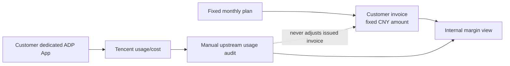

客户应收真值是有效套餐周期中冻结的固定金额。腾讯用量登记是内部成本证据，不能自动生成按量补扣、退款或修改已经出具的客户账单。

## 3. 总体技术架构

### 3.1 组件架构

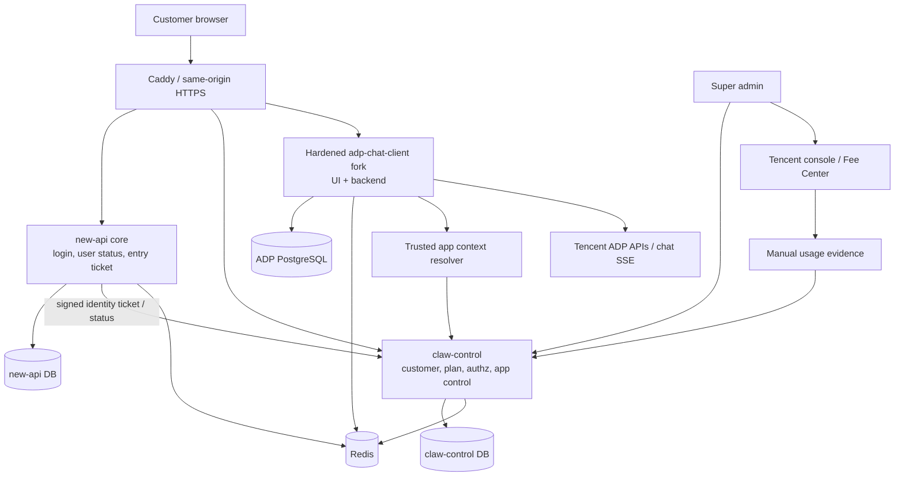

### 3.2 架构责任

| 组件 | 负责 | 不负责 |
|---|---|---|
| new-api core | 唯一用户身份、登录状态、工作台入口、短期签名票据和用户状态校验 | 不保存 Claw App/套餐/会话，不执行 Claw 计费或任务 |
| claw-control | 客户与成员、固定套餐、App 配置、启停、权限、审计、人工成本登记 | 不保存 new-api 密码/API Key，不直接读写 new-api 用户库，不执行 Conversation/Turn |
| ADP fork | 工作台 UI、Agent、Conversation、SSE、文件、工具 | 不决定客户身份、套餐或 App 归属 |
| Tencent ADP | App/Agent/Conversation/Claw 执行 | 不替 new-api 出客户套餐账单 |
| 腾讯费用中心 | 平台账号上游账单和成本 | 不保证按客户/Turn 拆分 |
| ADP PostgreSQL | 会话、任务、事件、文件元数据、outbox | 不保存 new-api 客户套餐真值 |
| Redis | 权限/配置缓存、session 撤销、多实例协调 | 不作为客户/App/套餐事实来源 |

本文后续若使用“平台控制面”或“工作台管理 API”，物理实现均指独立 `claw-control`。只有读取当前登录用户、签发短期入口断言和校验 new-api 用户状态的最小身份桥接属于 new-api 核心进程。本文所有 customer/member/identity binding/App/plan/invoice/usage audit/admin audit 数据都写入 `claw-control DB`；原有 user/session/token 数据才属于 new-api DB。两者之间没有跨库外键、共享数据库账号或直接 SQL。

### 3.2.1 事实源、镜像、执行快照与运行时 Secret

跨组件数据必须明确属于以下一种语义，不能因为“本地也保存了一份”而改变所有权：

| 类型 | 定义 | 允许行为 | 禁止行为 |
|---|---|---|---|
| 事实源 | 由职责表指定的 owning component 独占创建、修改、归档和删除 | 对外提供版本化、最小化的读取/命令接口 | 其他组件通过共享库、跨库 SQL 或后台脚本反向修改 |
| 镜像 | 只保存 opaque identifier、父子链、scope/version、状态和审计关联 | 用于 ownership、鉴权、去重和可追踪性 | 保存 prompt、消息正文、文件 locator、Token、OAuth 凭据、Secret 或完整 provider 响应；反向驱动事实源状态 |
| 执行快照 | ADP 为离线任务保存的不可变 capability/limit/plan 投影，并绑定 hash、auth epoch、App/config version | 在每次执行前与当前 authz 一起重验，帮助证明提交时采用的限制 | 续费、改套餐、出账单、判断最新付款状态或自行放宽能力 |
| 运行时 Secret | owning component 经签名内部接口按需提供的短期明文 | 仅在受信任进程内存中建立短期 provider client，并按版本/epoch 失效 | 落库、进入浏览器/日志/错误/APM、写入持久缓存，或把短期使用解释为所有权转移 |

new-api 是登录用户事实源；claw-control 是 Customer、Membership、App、Credential、套餐、付款、发票、治理和管理证据事实源；ADP 是 shadow account、Agent、Conversation、Turn、Workspace、客户文件、用户 OAuth/Connector、定时任务运行和 sandbox 事实源。`claw_resource_bindings` 仅是标识镜像，`PlanSnapshotJson` 仅是执行快照。claw-control 解析的 AppKey/SecretId/SecretKey 只能通过受认证 `app-context` 短期传给 ADP，并按 `(application_id,config_version,auth_epoch)` 约束内存缓存。

### 3.3 端到端主流程

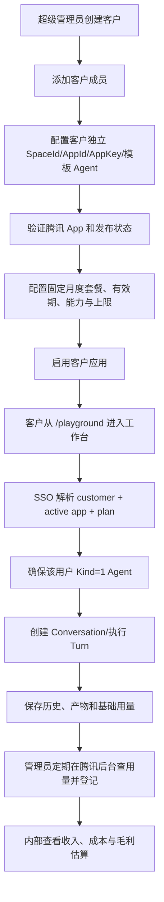

### 3.4 关键接口总览

| 边界 | 接口 | 用途 |
|---|---|---|
| new-api core | `POST /api/workbench/session-ticket`、`POST /api/admin/workbench/session-ticket`、`POST /api/admin/workbench/step-up-ticket` | 从当前 new-api Web Session 复核用户；再用专用服务 HMAC 请求 claw-control 签发短期 opaque entry ticket。管理员入口必须再次校验平台超级管理员；step-up 密码仅在 new-api 校验，或消费现有 2FA/Passkey 安全验证结果 |
| new-api core internal | `POST /api/internal/workbench/identity-status` | 只返回用户存在/启用状态和身份版本，不返回密码、API Key、余额或分组 |
| claw-control public | `GET /api/workbench/entry` | 验证并单次消费 new-api 入口断言，解析成员关系，建立 control session 后转入 ADP SSO |
| claw-control public | `GET /api/workbench/config` | 基于 control session 返回当前用户的工作台状态、套餐摘要、公开限制 |
| claw-control public | `GET /api/workbench/plan` | 基于 control session 返回当前客户套餐、有效期和可见能力 |
| claw-control admin | `GET /api/workbench/entry` | 按 entry ticket 的受信任 `surface` 单次消费；`admin` 建立独立管理员 control session，`workbench` 建立普通 control session并再签发独立 ADP SSO ticket |
| claw-control admin | `/api/admin/workbench/customers/*` | 客户与成员管理 |
| claw-control admin | `/api/admin/workbench/apps/*` | App 配置、验证、启停、轮换 |
| claw-control admin | `/api/admin/workbench/plans/*` | 套餐目录、周期与账单 |
| claw-control admin | `/api/admin/workbench/usage-audits/*` | 人工用量/成本登记和证据 |
| claw-control internal | `POST /api/internal/workbench/tickets/consume` | ADP 携带服务签名、URL ticket 与 HttpOnly browser binding，原子消费 claw-control 签发的 ADP SSO ticket；不是消费 new-api Cookie/JWT |
| claw-control internal | `POST /api/internal/workbench/identities/confirm` | ADP 回报 shadow account 映射，claw-control 幂等确认 binding |
| claw-control internal | `POST /api/internal/workbench/authz` | Caddy/ADP 持续鉴权 |
| claw-control internal | `POST /api/internal/workbench/app-context` | ADP 获取受信任客户 App 上下文 |
| claw-control internal | `POST /api/internal/workbench/resources/bind` | 镜像 Agent/Conversation 所有权 |
| ADP same-origin | `/workbench/api/conversations/*` | 本人会话和历史 |
| ADP same-origin | `/workbench/api/turns/*` | 任务创建、状态、事件、取消意图 |
| ADP same-origin | `/workbench/api/files/*` | 文件上传、扫描、授权下载 |

三条内部服务链路（new-api→claw-control、ADP→claw-control、claw-control→new-api）统一要求 `X-Workbench-Contract-Version: 1`。版本值被纳入请求和响应 HMAC canonical，缺失、不受支持或响应版本不一致均 fail-closed；不能通过代理补写未签名版本头。未来 v2 服务端必须先同时接受 v1/v2，完成调用方迁移和弃用窗口后才可停止 v1，且不得借共享 DTO 源码包绕过独立兼容性测试。

## 4. 模块一：客户与成员

### 4.1 职责

- 建立与价格分组无关的客户主体。
- 将 new-api 用户映射到一个或多个活动客户；每个客户内的成员与 IdentityBinding 独立，进入工作台时由 claw-control 用一次性 selection token 确定唯一当前上下文。
- 支持 `owner/admin/member/viewer` 客户角色，但只有平台超级管理员能修改 ADP App、套餐和启停。
- 所有运行请求从 claw-control/ADP 已签发的服务端会话和受信任 binding 解析 customer_id，拒绝客户端传入或覆盖 customer_id。

### 4.2 类图

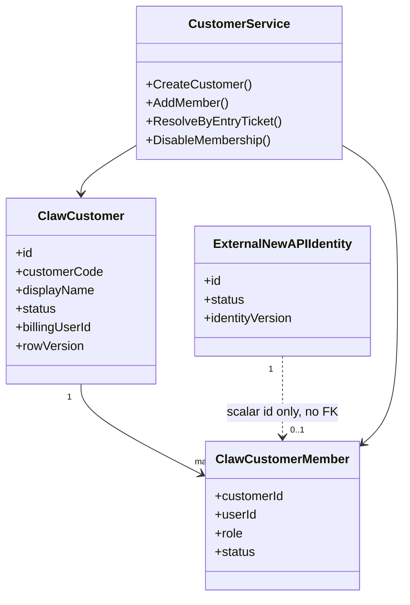

### 4.3 成员解析流程

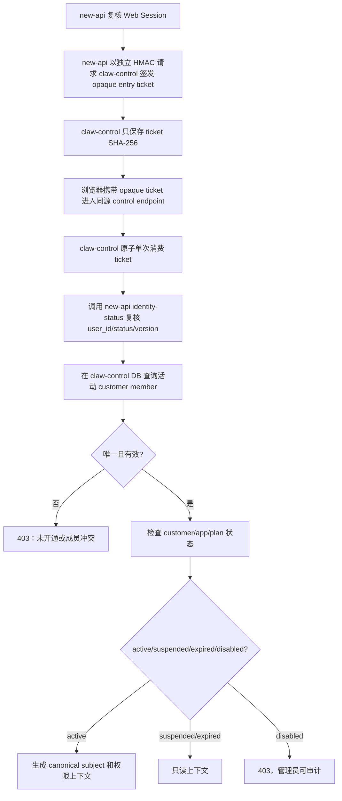

### 4.4 管理员分配成员时序

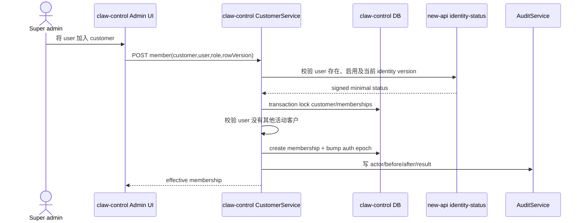

### 4.5 关键约束

- `customer_code` 不可变且唯一。
- 对 `(customer_id,new_api_user_id)` 建唯一成员语义；`membership_slot` 使用 `customer:<customer_id>`，并由跨数据库均可用的唯一约束防止同一用户在同一客户重复建成员。不得使用全局 `user_id` 唯一约束阻止合法的多客户 membership。
- 同一用户被同一客户停用后重新加入时，必须在事务内锁定并复用原 membership 行，恢复 `membership_slot=customer:<customer_id>`，递增且同步 membership/identity 的 `auth_epoch`，并复用或补建该客户作用域内的 IdentityBinding；不得通过删除历史行或新建重复 membership 绕过唯一约束。已有 canonical subject、ADP Account 绑定和资源历史必须保持不变。
- 删除客户使用软删除/归档；已有 Conversation、文件和用量证据不能级联物理删除。
- 用户从客户 A 迁移到 B 必须先禁用 A 成员关系、关闭活跃 Turn、创建新 canonical subject；旧历史继续属于 A。

## 5. 模块二：客户独立 ADP App 与生命周期

### 5.1 配置模型

每个客户可以配置多个 Application；`slot=primary` 只保留为旧入口兼容默认值，Agent Store 通过 deployment/entitlement 选择实际 App。App 配置分为公开元数据、受控标识和 Secret：

| 类型 | 字段 |
|---|---|
| 公开 | display_name、provider_environment、能力摘要 |
| 受控 | SpaceId、AppId、template AgentId、Region、endpoint profile |
| Secret | AppKey、credential profile、加密版本 |
| 生命周期 | status、config_version、verified_at、enabled_at、disabled_at |
| 限制 | max concurrency、runtime、reasoning round、output token、tool/file limits |

### 5.2 类图

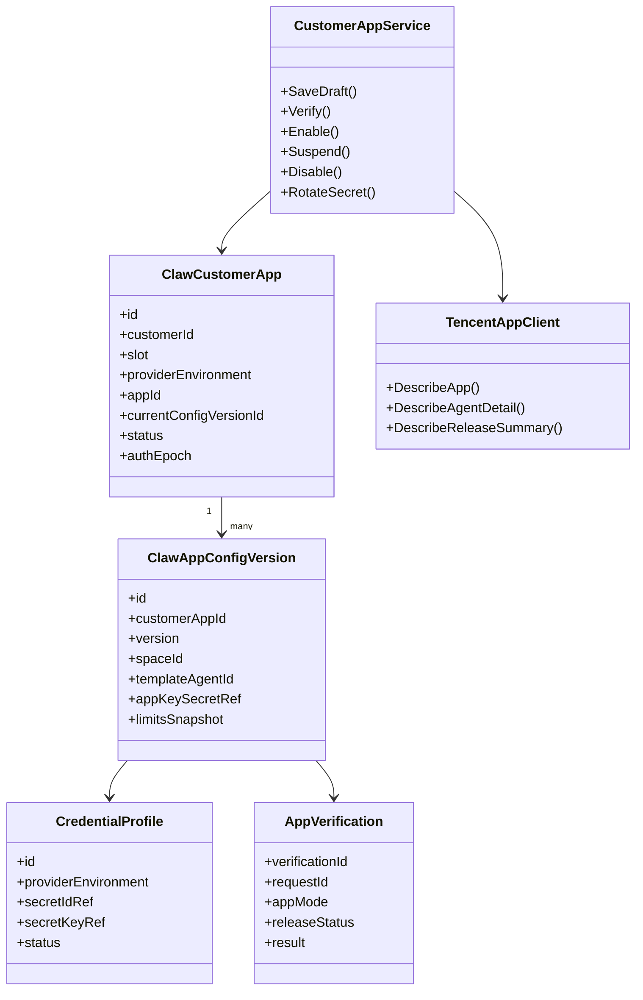

### 5.3 App 状态机

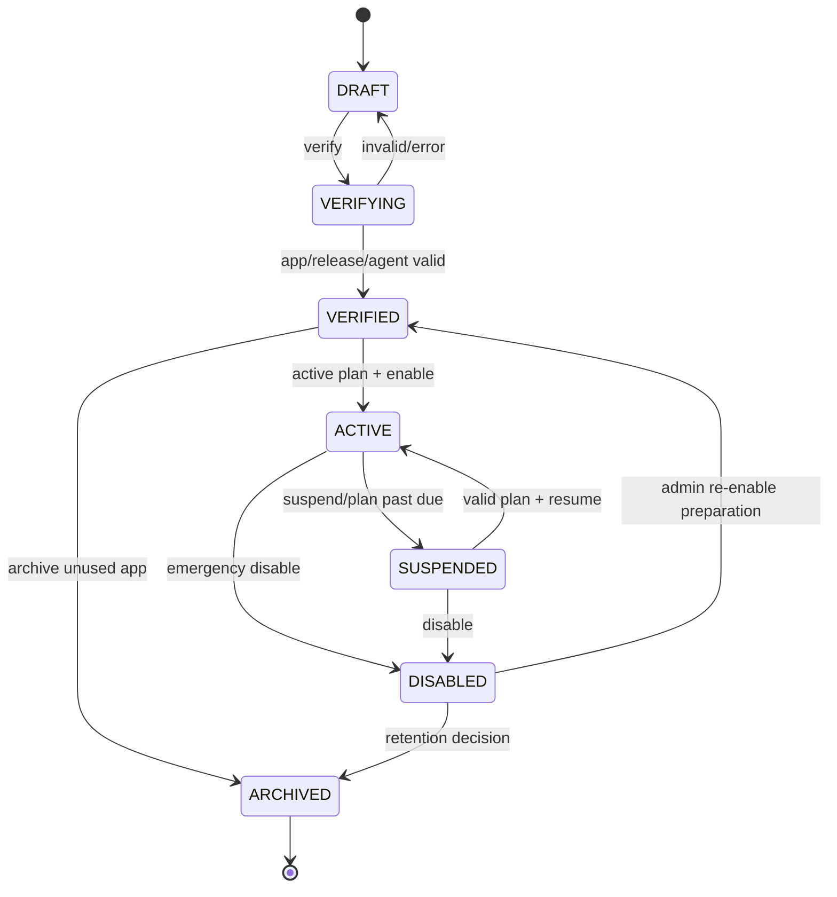

状态语义：

| 状态 | 新 Turn | 历史/下载 | 管理员 |
|---|---:|---:|---:|
| DRAFT/VERIFYING/VERIFIED | 否 | 否 | 可配置/验证 |
| ACTIVE | 是 | 是 | 可管理 |
| SUSPENDED | 否 | 是 | 可恢复 |
| DISABLED | 否 | 否 | 可审计/导出 |
| ARCHIVED | 否 | 否 | 只读留存 |

### 5.4 启用流程

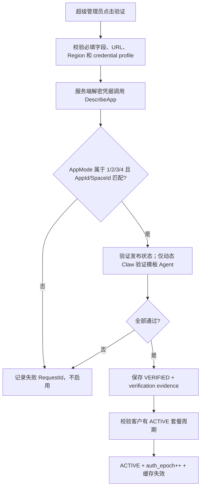

验证动作默认不发送真实对话，避免无意产生上游费用。可选“执行最小测试任务”必须二次确认，并将测试任务标为平台测试而不是客户使用。

### 5.5 运行时解析时序

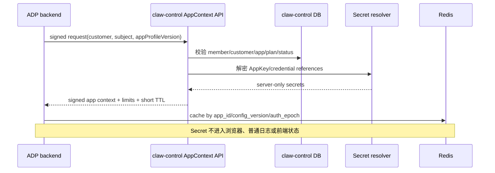

### 5.6 配置修改和 App 迁移

- AppKey 轮换：同一 AppId 创建新 config_version，验证成功后原子切换；旧版本短暂保留只为在途请求，不再签发新上下文。
- AppId 首次验证后在稳定 App 行不可修改。迁移时创建新的客户 App 行和临时 `migration:<id>` slot，验证并完成成员 Agent 重建后，在同一事务把旧行 slot 改为 `archived:<id>`、新行切为 `primary`；旧历史继续指向旧 App 只读资源。
- 迁移目标验证成功的同一事务创建 generation-versioned rebuild job，并冻结当时全部 active identity binding、目标 App profile/config/credential fingerprint 和 member-set fingerprint。ADP Blue/Green 通过现有 v2 HMAC 内部契约竞争领取 member lease；每个 member 必须在目标 App 执行 `CopyAgentFromApp(Kind=1)`、再以 `DescribeAgentDetail` 精确回读 AgentId，最后只回报 sanitized Agent SHA-256，不回报或持久化 provider 原文与凭据。
- `app_id_migration` 审批请求和 execute 切流事务都必须重新锁定最新 job generation、目标 App/config/profile、全部当前 active binding 和成功 readback；成员新增/禁用、配置或 credential profile 任一变化都 fail-closed。成员集合正常变化由带 target/job expected_version 的 replan 生成新 generation，旧 job/member 标记 superseded 并永久保留审计。
- provider 调用前的确定性失败可以通过 job/member expected_version 安全 retry。`CopyAgent` 结果不确定时绝不自动重放；只有 worker 已持久保存返回 AgentId 时才能生成 `readback` recovery task，并且该 task 只允许 `DescribeAgentDetail`。没有已知 AgentId 的 provider_unknown 保持阻断，禁止人工改库伪造 readiness。
- 禁用时在同一事务更新 status/auth_epoch 并写 `CACHE_INVALIDATE` outbox；新请求立即失败，活跃 SSE 最迟在 introspection 周期停止向浏览器推送。
- 如果腾讯任务不能取消，后台仍为保存历史与终态而消费上游，但不再向被禁用客户展示内容。

## 6. 模块三：工作台前端与线框

### 6.1 职责

- `/playground` 根据服务端配置加载新工作台或 legacy。
- 显示客户、套餐名称、有效期、应用状态和公开使用限制。
- 不显示 AppKey、AK/SK；默认也不向普通客户暴露真实 AppId/SpaceId。
- 套餐过期/暂停时提供只读历史，不显示充值或逐 Turn 余额提示。

### 6.2 组件类图

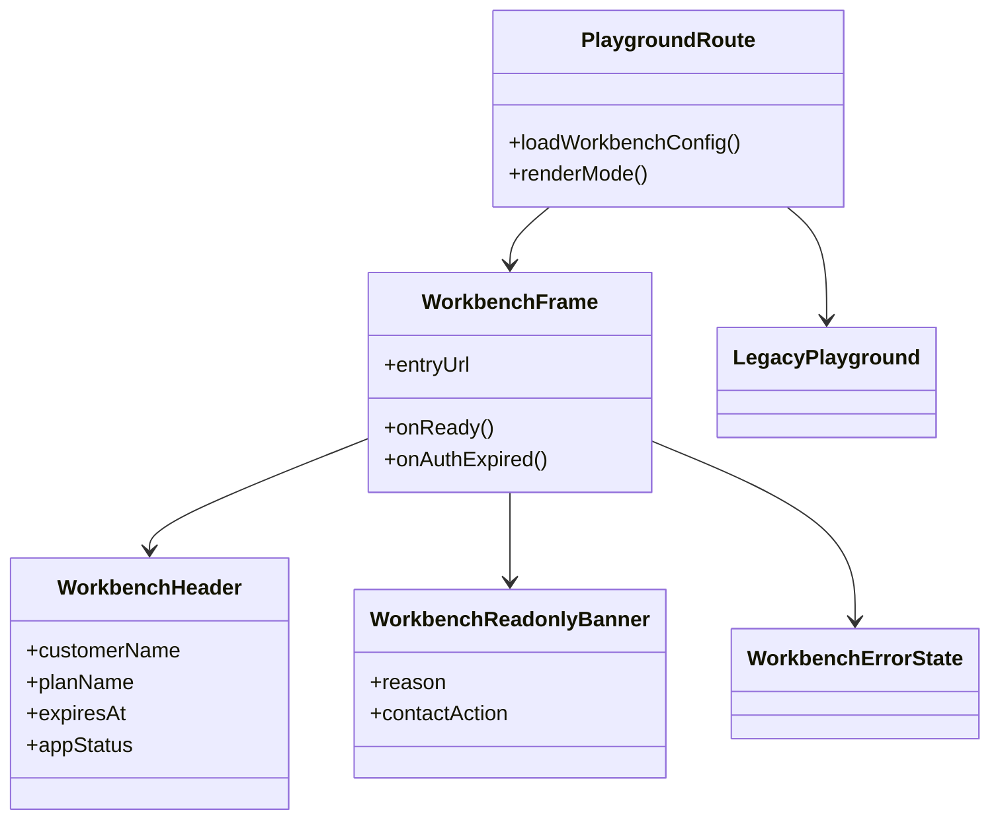

### 6.3 页面决策流程

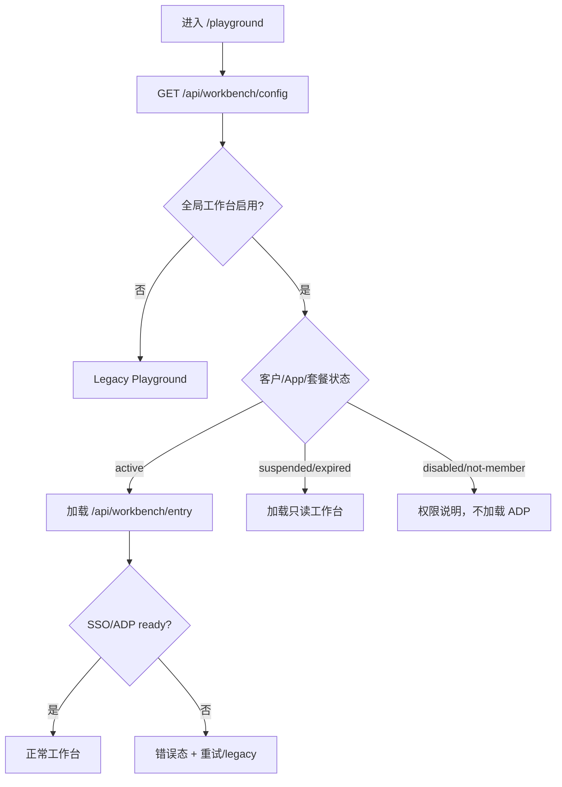

### 6.4 桌面端线框

```text
┌──────────────────────────────────────────────────────────────────────────────────────────┐
│ Nexus Reach 智能工作台   客户：张悦公司   套餐：专业版   有效期至 2026-09-01   [用户 ▾] │
├──────────────────────┬─────────────────────────────────────────────┬─────────────────────┤
│ ＋ 新建任务           │ 会话标题                         [工作区] [⋯] │ Agent 配置           │
│ 搜索会话...           │─────────────────────────────────────────────│ 模型                  │
│                      │ 用户：整理附件并生成执行计划                 │ [允许模型       ▾]   │
│ 今天                 │                                             │                     │
│ ● 市场调研            │ Agent 思考                                  │ 指令                  │
│   合同分析            │ ├─ 读取文件 ✓                               │ [可编辑文本区域]       │
│                      │ ├─ 联网搜索 2/3 ✓                           │                     │
│ 昨天                 │ └─ 生成报告中…                              │ Skills / Tools        │
│   数据清洗            │                                             │ ☑ 搜索 ☑ 文件解析     │
│                      │ Agent：这是执行结果……                       │                     │
│                      │ [报告.md] [数据.xlsx]                        │ 本套餐限制            │
│                      │─────────────────────────────────────────────│ 并发 1｜最长 15 分钟  │
│                      │ [+附件] 输入消息或任务…              [发送] │ 搜索 3 次/Turn        │
├──────────────────────┴─────────────────────────────────────────────┴─────────────────────┤
│ 状态：运行 42 秒｜任务 wrk_...｜用量仅作使用统计，不按本次任务扣费                       │
└──────────────────────────────────────────────────────────────────────────────────────────┘
```

### 6.5 移动端线框

```text
┌─────────────────────────────┐
│ ☰ 智能工作台  专业版  [用户]│
├─────────────────────────────┤
│ 会话标题                    │
│                             │
│ 用户消息                    │
│ Agent 任务过程              │
│ ├─ 搜索 ✓                   │
│ └─ 生成中…                  │
│                             │
│ Agent 最终回复              │
│ [报告.md]                   │
├─────────────────────────────┤
│ [+] 输入任务…       [发送]  │
│ 最长15分钟｜搜索最多3次     │
└─────────────────────────────┘

会话、Agent 配置、工作区和套餐信息使用抽屉，不在窄屏同时展开。
```

### 6.6 前端进入时序

```mermaid
sequenceDiagram
  actor U as User
  participant P as Playground page
  participant N as new-api identity bridge
  participant C as claw-control
  participant W as ADP workbench
  U->>P: GET /playground
  P->>N: POST /api/workbench/session-ticket (new-api Web Session)
  N->>C: HMAC POST /api/internal/workbench/entry-tickets/issue
  C-->>N: signed response + opaque entry ticket
  N-->>P: opaque entry ticket + expires_at
  P->>C: GET /api/workbench/entry?ticket=opaque-entry-ticket
  C->>N: identity-status(user, version)
  N-->>C: signed enabled/current version
  C->>C: burn entry ticket; resolve member/app/plan; create control session
  alt active or readonly
    C-->>P: 302 /workbench/auth/sso?ticket=opaque-adp-ticket
    P->>W: load same-origin workbench
    W->>C: consume opaque ADP SSO ticket
    C-->>W: signed customer/subject/role/app profile
    W-->>P: ready; config/plan from claw-control session
  else disabled/not entitled
    C-->>P: 403 access explanation
  end
```

### 6.7 前端代码落点

- 新增 `web/default/src/features/workbench/`，包含 frame、套餐状态、只读横幅和错误态。
- 少量修改 `web/default/src/routes/_authenticated/playground/index.tsx` 做入口切换。
- 旧 Playground 主组件不重写。
- 所有新增文案进入 `web/default/src/i18n/locales/{lang}.json` 并按项目 i18n 规则同步。

## 7. 模块四：new-api 身份桥接、claw-control 映射、SSO 与持续鉴权

### 7.1 身份与会话类图

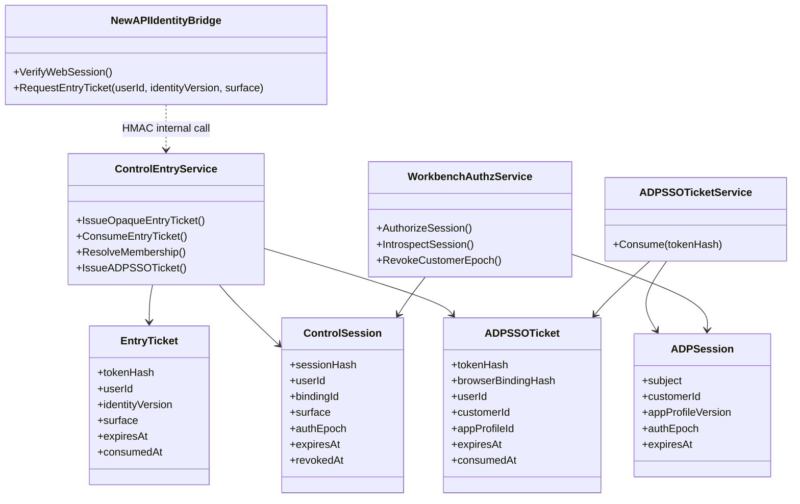

### 7.2 SSO 流程

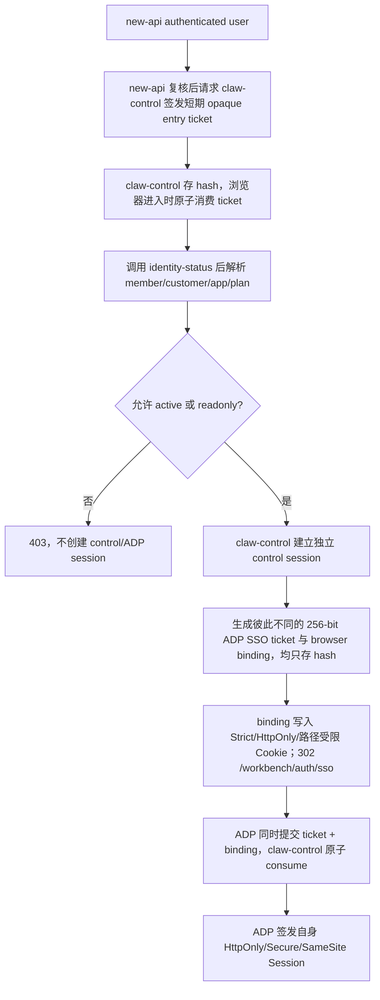

### 7.3 SSO 与撤销时序

```mermaid
sequenceDiagram
  actor U as User
  participant B as Browser
  participant N as new-api identity bridge
  participant C as claw-control
  participant A as ADP backend
  participant R as Redis revocation
  U->>B: Open workbench
  B->>N: request opaque entry ticket with new-api Web Session
  N-->>B: opaque one-time entry ticket
  B->>C: consume entry ticket and enter
  C->>N: identity-status
  N-->>C: signed current status/version
  C-->>B: control session + route-scoped binding Cookie + redirect ADP SSO ticket
  B->>A: GET /auth/sso?ticket=... + HttpOnly binding Cookie
  A->>C: consume ADP ticket + binding with service auth
  C-->>A: signed claims + auth_epoch
  A-->>B: ADP Session + delete binding Cookie + redirect without ticket
  Note over C,R: admin disable/customer change
  C->>R: publish customer/session epoch revoked
  A->>R: receive revocation
  A-->>B: stop new actions; active stream stops delivery
```

### 7.4 安全要求

- new-api 不自行构造可被浏览器解码的身份断言；它只用独立 `WORKBENCH_CONTROL_HMAC_SECRET` 调用 claw-control。claw-control 生成 256-bit 随机 opaque entry ticket，仅保存 SHA-256、可信 user/version/surface 和短 TTL，并原子单次消费。普通入口随后再生成彼此不同的 control session、ADP SSO ticket 与 browser binding；四个凭据不得同值、不得混表，binding 只保存 hash。URL 中的 entry/SSO ticket 成功后立即清除，binding Cookie 在 ADP SSO 成功或失败后均删除。new-api→control HMAC、control→new-api identity-status HMAC、ADP→control HMAC 必须是三个不同的 Secret。
- `/entry`、`/auth/sso` access log 必须跳过或脱敏 query。
- claw-control 使用独立的 256-bit 随机 control session；数据库只保存 hash，浏览器 Cookie 名为 `claw_control_session`，设置 HttpOnly、Secure、SameSite=Strict、`Path=/` 和短 TTL。它不得复用 new-api Session/JWT、ADP Session、ADP SSO ticket 或 browser binding。管理面使用不同的 `claw_admin_session` Cookie、独立 Path 和双提交 CSRF token。
- ADP Cookie 设置 HttpOnly、Secure、SameSite=Strict、限定 Path、短 TTL。
- `forward_auth` 只鉴权建连，不能关闭已建立 SSE；ADP 每 30 秒 introspect，并订阅 Redis 撤销事件。
- 所有内部 API 使用 mTLS 或 HMAC，签名覆盖 method、path、body hash、timestamp、nonce 和服务身份。

### 7.5 new-api 用户与工作台用户的唯一映射

这是整个系统的身份根。new-api `users.id` 是唯一身份真值；ADP `account` 只是由 SSO 创建的影子账号，不是第二套客户账号系统。

```mermaid
classDiagram
  class NewAPIUser {
    +id PK
    +status
    +username mutable
  }
  class ClawCustomerMember {
    +customerId
    +userId
    +membershipSlot
    +status
  }
  class ClawIdentityBinding {
    +bindingId
    +customerId
    +newApiUserId
    +canonicalSubject
    +adpAccountId
    +status
    +authEpoch
  }
  class ADPShadowAccount {
    +accountId
    +externalSubject
    +displayName
    +loginDisabled=true
  }
  class AgentBinding {
    +identityBindingId
    +appProfileId
    +agentId
  }

  NewAPIUser "1" ..> "0..many historical" ClawCustomerMember : scalar id only, no cross-DB FK
  ClawCustomerMember "1" --> "1" ClawIdentityBinding
  ClawIdentityBinding "1" --> "1" ADPShadowAccount
  ClawIdentityBinding "1" --> "many apps" AgentBinding
```

实际基数为：一个活动 new-api 用户可以拥有多个客户 membership，但每个 `(customer_id,new_api_user_id)` 最多一个成员关系、一个活动 IdentityBinding 和一个仅属于该客户的 ADP 影子账号。保留每个客户作用域内的 `0..many historical` binding 用于审计迁移历史，旧 binding 必须禁用；任何 shadow account、Agent、Conversation、Workspace 或文件均不得跨客户复用。

### 7.6 首次创建影子账号流程

```mermaid
flowchart TD
  A["claw-control 原子消费有效 opaque entry ticket"] --> B["回调 new-api identity-status 后解析活动 customer member"]
  B --> C["按 customer_id + user_id 查 identity binding"]
  C --> D{"存在 ACTIVE binding?"}
  D -- 是 --> E["ticket 绑定既有 binding_id/subject"]
  D -- 否 --> F["claw-control 事务创建 PROVISIONING binding"]
  F --> G["生成不可变 canonical subject"]
  G --> H["ticket 绑定 binding_id/subject/customer/app"]
  H --> I["ADP 向 claw-control 原子消费第二段 SSO ticket"]
  I --> J["按 external_subject 幂等 upsert shadow account"]
  J --> K["ADP 签名回调 identities/confirm"]
  K --> L["claw-control 校验 binding/subject/customer 后写 ACTIVE + adp_account_id"]
  L --> E
```

### 7.7 身份建立时序

```mermaid
sequenceDiagram
  actor U as new-api User
  participant N as new-api identity bridge
  participant C as claw-control IdentityService
  participant CD as claw-control DB
  participant A as ADP SSO backend
  participant AD as ADP PostgreSQL
  U->>N: request opaque entry ticket with new-api Web Session
  N->>C: HMAC issue(userId, identityVersion, surface)
  C-->>N: signed response + opaque entry ticket
  N-->>U: opaque ticket + expires_at
  U->>C: consume opaque entry ticket
  C->>N: identity-status(userId, identityVersion)
  N-->>C: signed enabled/current version
  C->>CD: resolve member; create/get binding + canonical subject
  C-->>U: control session + browser-bound ADP SSO ticket redirect
  U->>A: /auth/sso?ticket=...
  A->>C: consume ADP ticket + HttpOnly browser binding with service auth
  C-->>A: signed immutable identity claims
  A->>AD: upsert account by UNIQUE external_subject
  AD-->>A: stable ADP account UUID
  A->>C: confirm(bindingId, subject, ADP account UUID)
  C->>CD: activate binding if tuple matches
  A-->>U: ADP session without independent credentials
```

### 7.8 身份同步、禁用与迁移规则

- ADP 不开放账号注册、密码登录、OAuth 登录或 API key 登录；`AUTO_CREATE_ACCOUNT=false`。只有由有效 new-api 入口派生、且 ADP 向 claw-control 同时提交正确 SSO ticket 与 browser binding 并成功原子消费后，才能触发内部 shadow-account upsert。
- ADP 账号不得保存 new-api 密码、Token quota、价格分组或 API key。它只保存不可变 external subject、内部 UUID和必要显示信息。
- 用户名、邮箱、头像只做可选展示同步；ownership 永远使用 `binding_id/account_id/canonical_subject`，不能用用户名。
- new-api 用户被禁用时，new-api identity-status 立即返回 disabled/新 identity version；claw-control 的下一次 authz/introspection 立即拒绝并推进本地撤销，不能依赖修改 new-api 用户流程写 Claw hook。即使 ADP 禁用 outbox 暂时失败，claw-control authz 仍拒绝所有新请求。
- 客户成员关系被移除时，旧 shadow account 和资源保留为禁用/只读审计对象，不重新分配给新客户。
- 用户从客户 A 迁移到 B 时，为 B 创建新的 canonical subject 和 ADP shadow account；禁止让同一 ADP account 横跨两个客户 App。
- new-api 的 `root/admin/user` 角色不直接映射为 ADP 管理员。ADP 普通会话只得到 workbench-user 权限；平台超级管理员通过独立 new-api admin session-ticket endpoint 产生受信任 `surface=admin` 的 opaque entry ticket，建立独立 claw-control 管理会话后才能调用管理 API。
- P1 若允许一个用户同时属于多个客户，new-api 入口断言仍只证明用户身份；claw-control 消费断言并建立受限 control session 后，返回该用户可选 membership，由 claw-control 自己签发一次性选择 nonce、复核选择并升级 session。ADP 不能接受浏览器自由传 customer_id，new-api 也不需要读取 control DB 才能签发断言。
- 所有映射创建、确认、禁用、迁移和冲突都进入管理员审计，且保存 actor、source user、customer、binding、前后状态和 request_id。

## 8. 模块五：每用户 Agent 与配置

### 8.1 类图

```mermaid
classDiagram
  class CustomerAppContext {
    +customerId
    +appId
    +templateAgentId
    +configVersion
  }
  class AgentBinding {
    +customerId
    +appProfileId
    +userId
    +agentId
    +status
    +configVersion
  }
  class AgentProvisioningService {
    +EnsureAgent(subject, appContext)
    +RepairBinding()
    +DisableBindingsForApp()
  }
  class AgentConfigService {
    +GetEffectiveConfig()
    +PatchAllowedConfig()
  }
  class TencentAgentClient {
    +CopyAgentFromApp()
    +DescribeAgentDetail()
    +ModifyAgent()
  }

  AgentProvisioningService --> CustomerAppContext
  AgentProvisioningService --> AgentBinding
  AgentProvisioningService --> TencentAgentClient
  AgentConfigService --> AgentBinding
  AgentConfigService --> TencentAgentClient
```

### 8.2 ensure-agent 流程

```mermaid
flowchart TD
  A["用户首次进入客户 App"] --> B["查询 customer+appProfile+user binding"]
  B --> C{"活动 binding 存在?"}
  C -- 是 --> D["验证 app/profile/status 一致并返回"]
  C -- 否 --> E["数据库 advisory/row lock 唯一键"]
  E --> F["再次查询"]
  F --> G{"仍不存在?"}
  G -- 否 --> D
  G -- 是 --> H["CopyAgentFromApp(AppId, Kind=1)"]
  H --> I["写 ADP binding + outbox 镜像 claw-control ownership"]
  I --> D
```

### 8.3 首次进入时序

```mermaid
sequenceDiagram
  actor U as User
  participant A as ADP backend
  participant C as claw-control AppContext
  participant D as ADP DB
  participant T as Tencent ADP
  U->>A: first authenticated page/API
  A->>C: resolve app context(binding, subject)
  C-->>A: customer AppId/template/limits
  A->>D: find agent binding
  alt missing
    A->>D: lock unique customer+app+account
    A->>T: CopyAgentFromApp(AppId, Kind=1)
    T-->>A: AgentId + RequestId
    A->>D: insert binding + resource outbox
  end
  A-->>U: effective Agent summary
```

### 8.4 Agent 配置规则

- 客户不能提交 AppId 或任意 AgentId；服务端从绑定覆盖。
- 模型、Skill、Plugin、Tool 只能从套餐 capability 和管理员 allowlist 交集选择。
- `ModifyAgent` 使用最窄 UpdateMask。只有被选入 UpdateMask 的集合字段需要提交完整目标集合；若前端给的是元素级 patch，服务端才先读取并合并该集合。不覆盖未选中的 AgentSpec 字段。
- 官方未承诺 active Turn 期间修改配置只影响后续 Turn。在腾讯明确并实测其并发语义前，只要该 Agent 存在 active Turn，配置修改就返回 409 或进入串行队列，待所有 active Turn 终止后再提交。
- 客户 AppId 迁移不会把旧 AgentId 直接带到新 App；必须重新复制，并保留旧资源只读映射。

## 9. 模块六：Conversation、Turn、SSE 与历史

### 9.1 类图

```mermaid
classDiagram
  class Conversation {
    +conversationId
    +customerId
    +appProfileId
    +accountId
    +agentId
    +workspaceId
  }
  class Turn {
    +turnId
    +conversationId
    +status
    +requestId
    +traceId
    +startedAt
    +endedAt
  }
  class TurnEvent {
    +cursor
    +turnId
    +type
    +payloadHash
  }
  class BackgroundTurnService {
    +Start()
    +ConsumeProviderSSE()
    +PublishLocalEvent()
    +RecoverUnknown()
  }
  class UsageTelemetry {
    +elapsed
    +tokenStats
    +procedures
    +tools
  }

  Conversation "1" --> "many" Turn
  Turn "1" --> "many" TurnEvent
  Turn --> UsageTelemetry
  BackgroundTurnService --> Turn
```

### 9.2 创建 Turn 流程

```mermaid
flowchart TD
  A["用户提交消息/附件"] --> B["校验 Session、customer、App、plan"]
  B --> C{"App ACTIVE 且 plan ACTIVE?"}
  C -- 否 --> D["403/只读，不调用腾讯"]
  C -- 是 --> E["检查客户/用户并发、时长、轮数、工具和文件限制"]
  E --> F["校验 Conversation/Agent 所有权"]
  F --> G["持久化 deterministic Turn + SUBMITTING"]
  G --> H["只调用一次腾讯 /adp/v2/chat"]
  H --> I["收到 ack/首事件，写 RUNNING"]
  I --> J["后台 task 消费 SSE，浏览器订阅本地事件"]
  J --> K["保存关键事件、历史、基础用量"]
  K --> L["终态 completed/failed/provider_unknown"]
```

实现门禁：客户/用户并发、最大运行时长和文件大小可由本地 PostgreSQL lease、超时器和逐块读取可靠强制执行；只有在腾讯官方请求字段或可验证响应字段能够提供同等强约束时，才允许开放 `max_output_tokens`、`max_reasoning_rounds`、`web_search_per_turn`、tools/connectors。当前 `/adp/v2/chat` 已知契约无法证明这些上限，因此首版对应的新 Turn/能力必须返回 503 并 fail-closed，不能仅在前端隐藏、事后统计或把 Boolean 搜索开关伪装成次数限制。权威实现说明见 ADP fork 的 `server/WORKBENCH_PROVIDER_LIMITS.md`。

### 9.3 SSE 与断线时序

```mermaid
sequenceDiagram
  actor U as User
  participant UI as ADP UI
  participant A as ADP backend
  participant DB as ADP DB
  participant T as Tencent chat SSE
  U->>UI: Send task
  UI->>A: POST turn(message, conversation)
  A->>A: authz + ownership + plan/limit checks
  A->>DB: persist SUBMITTING + attempt id
  A->>T: POST /adp/v2/chat with injected IDs
  T-->>A: ack/first event
  A->>DB: RUNNING + provider IDs
  loop provider events
    T-->>A: response/message/procedure events
    A->>DB: persist checkpoint + telemetry
    A-->>UI: local SSE event
  end
  alt browser disconnects
    UI--xA: subscriber closed
    A->>A: background task continues while process lives
  end
  T-->>A: completed/error
  A->>DB: terminal event/history/telemetry
```

### 9.4 Turn 状态与恢复

| 状态 | 说明 | 客户显示 |
|---|---|---|
| `submitting` | 网络调用前已落库 | 正在提交 |
| `running` | 上游已接受 | 运行中 |
| `completed` | 可信终态成功 | 已完成 |
| `failed_before_accept` | 上游未接受 | 提交失败 |
| `failed_after_accept` | 上游执行后失败 | 执行失败 |
| `cancel_requested` | 仅本地取消意图 | 正在停止/停止订阅 |
| `cancel_confirmed` | 官方证据确认停止 | 已停止 |
| `provider_unknown` | 进程崩溃/终态不可恢复 | 状态待确认 |

浏览器断开不终止后台任务。若 ADP 进程重启且腾讯没有可恢复 SSE 或查询运行中任务的官方能力，旧连接进入 `provider_unknown`；不能自动重发同一任务，否则可能产生重复执行和成本。

### 9.5 用量遥测

用量只用于客户使用统计、限额分析和人工成本核查，不产生逐 Turn 金额：

- 保存 RequestId、TraceId、RecordId、ConversationId、App profile 和时间范围。
- 保存完整 `response.completed` 原始 JSON 到受控 evidence store；Token/Procedure/Elapsed 字段视为可选，派生记录必须保存 JSON path、source 和原始 evidence hash。
- 可观察 `Response.Procedures[].StatInfos[]` 和 `Procedure.Workflow.RunNodes[].StatInfos[]`，但官方 Procedure 结构没有稳定 ProcedureId。只有真实存在的 `WorkflowRunId + NodeId` 或经实测确认的上游 usage id 才能作为精确调用键；普通 Procedure 最多按原始数组路径/index 保存，不能用 `model + start_time + token` 散列冒充强去重。
- 顶层 `Response.StatInfo` 与 Procedure/RunNode 明细的聚合关系未由官方保证；不能把顶层和明细直接相加。没有稳定映射时保留原始值并标记 `dedupe_confidence=unknown`，仅供人工核查。
- 不强制假设 TotalTokens = InputTokens + OutputTokens。
- `FirstTokenCost` 和 `TotalCost` 按官方定义保存为首 Token 耗时和模型总耗时，绝不解释为金额。
- 缓存字段缺失保存 `unknown`，不伪造 0。
- 原始事件进入受控 evidence store，不进入普通日志。

当前实现由 ADP fork 在浏览器投影前捕获原始 `response.completed` 对象，以独立 32 字节密钥执行 `A256KW + A256GCM` JWE 加密，写入 `workbench_turn_evidence`；安全派生值逐 JSON path 写入 `workbench_turn_usage_datum`。证据 SHA-256、source、App profile/config version 与身份/客户/App/Turn 一起绑定。相同 Turn 的相同 hash 幂等，不同 hash 拒绝；缺少加密密钥、落库失败或流结束时没有可审计完成证据，Turn 均不得进入 `completed`。浏览器安全投影仍进入有界 Turn replay store，原始对象不写 access/application log。详细运维语义见 ADP fork 的 `server/WORKBENCH_USAGE_TELEMETRY.md`。

## 10. 模块七：Workspace、文件、工具与连接器

### 10.1 资源类图

```mermaid
classDiagram
  class WorkbenchAccount {
    +accountId
    +identityBindingId
  }
  class Conversation {
    +conversationId
    +workspaceId
  }
  class Workspace {
    +workspaceId
    +customerId
    +objectPrefix
  }
  class FileObject {
    +fileId
    +ownerAccountId
    +conversationId
    +objectKey
    +scanStatus
  }
  class ConnectorCredential {
    +credentialId
    +ownerAccountId
    +connectorType
    +encryptedSecret
  }
  class CapabilityPolicy {
    +filesEnabled
    +searchLimit
    +connectors
    +sandboxEnabled
  }

  WorkbenchAccount "1" --> "many" Conversation
  Conversation "1" --> "1" Workspace
  Workspace "1" --> "many" FileObject
  WorkbenchAccount "1" --> "many" ConnectorCredential
  CapabilityPolicy --> Workspace
```

### 10.2 文件处理流程

```mermaid
flowchart TD
  A["用户上传文件"] --> B["验证 Session、客户/App/Conversation 所有权"]
  B --> C["检查套餐文件能力、大小、类型、数量和存储上限"]
  C --> D["服务端生成随机对象键，写 quarantine"]
  D --> E["MIME/扩展名/哈希/病毒与恶意内容扫描"]
  E --> F{"扫描通过?"}
  F -- 否 --> G["隔离/删除 + 安全审计"]
  F -- 是 --> H["复制到私有 COS owned prefix"]
  H --> I["绑定 customer/account/conversation/workspace"]
  I --> J["生成腾讯任务可用的服务端引用"]
  K["下载请求"] --> L["再次验证 owner 和套餐只读权限"]
  L --> M["短时签名 URL 或后端流式代理"]
```

### 10.3 文件与连接器时序

```mermaid
sequenceDiagram
  actor U as User
  participant UI as Workbench UI
  participant A as ADP backend
  participant S as Scanner/private COS
  participant O as Connector OAuth
  participant V as Credential vault
  U->>UI: upload file
  UI->>A: file + owned conversation
  A->>S: quarantine, validate, scan
  S-->>A: safe object metadata
  A-->>UI: authorized file descriptor
  opt connect external provider
    U->>UI: connect
    UI->>A: start OAuth
    A->>O: PKCE/state/canonical callback
    O-->>A: code
    A->>V: encrypt credential by identity binding
    A-->>UI: connected metadata only
  end
```

### 10.3.1 Provider Workspace 的落地约束

腾讯 ADP `2026-05-20` 的 `DescribeConversation` 会返回
`ConversationWorkspace.WorkspaceId`；该字段只作为服务端 provider locator，不能
直接成为浏览器授权依据。官方契约参见[数据结构](https://cloud.tencent.com/document/api/1759/132545)
和[API 概览](https://cloud.tencent.com/document/product/1759/132555)。实现必须遵循：

官方字段类型仅承诺 `String`，当前示例虽为 UUID，也不得把 UUID 外形当成
授权或兼容性前提；实现只做非空、长度和控制字符校验，再将其视为不透明值。

1. 先验证本地 Conversation 的完整 binding/customer/App/profile/config/Agent/Type=5
   所有权，再接受上游 WorkspaceId。
2. 上游 WorkspaceId 使用独立、可轮换的 JWE key 加密落库；同一 Conversation
   只能绑定一次，后续返回不同 locator 必须报 502，不能静默换绑。
3. 浏览器只能取得本地 `ww_*` 句柄。`POST /adp/ListDir` 和
   `GET /file/download` 每次重新校验完整作用域，再由服务端解密并获取短期
   Workspace credential。
4. 目录只允许规范化 `/workdir` 路径、depth=1、最多 1000 项和 1 MiB 响应；
   下载大小取套餐文件上限与进程绝对上限中的较小值。禁止重定向，credential
   domain 必须为 HTTPS，临时 token、header、provider WorkspaceId 和 COS URL
   均不得返回浏览器或写日志。
   域名必须匹配人工核验的 DNS 后缀、URL path 只能为空或 `/`；请求前解析全部
   A/AAAA 记录并拒绝任一非公网地址，再把已验证地址集钉在本次连接上，同时保留
   原 host 做 TLS SNI/证书校验，防止 DNS rebinding。credential header 只接受
   官方 `X-File-Ticket`。文件按 64 KiB 分块转发并累计执行大小上限，整个响应期
   持有 customer/member 并发租约；成功、失败、超限和断连都必须关闭上游并释放
   租约，禁止把完整文件缓存在 ADP 进程内。
5. 官方说明 Agent 产出文件可从 `message.done` 的 `Contents[].File.FileUrl`
   获取；本系统不把该 URL 直接交给客户，而应由服务端代理/归档。官方说明参见
   [从零搭建一个 Claw 模式应用](https://cloud.tencent.com/document/product/1759/133869)。
6. legacy `FetchFile`/WebOffice 预览会把签名 COS URL 暴露给浏览器，因此
   Workbench 模式继续关闭。首版提供安全目录与下载；富文档预览必须另做同源
   renderer 和威胁模型，不能通过恢复 locator 透传来实现。
7. 私有 COS 文件 locator 与 Provider Workspace locator 必须分别使用独立的
   32 字节 JWE 密钥和 `kid`；二者都不得复用服务 HMAC、Session、用量证据、
   COS 或 App 凭据。旧密钥只能通过容器 Secret 注入的 previous-key map 保留，
   轮换完成并重加密/清理旧记录后再移除。`.env` 只保存非敏感 key id 和经过
   真实 `CreateWorkspaceCredential` 响应核验的主机后缀 allowlist。

### 10.4 文件与 OAuth 安全

- COS key 由服务端生成：`tenant/<customer>/account/<account>/conversation/<conversation>/<uuid>`。
- 原文件名只作为安全展示元数据，不参与路径。
- provider 临时 URL 必须匹配官方域名 allowlist，服务端下载到 quarantine 后再扫描归档。
- 下载必须重新校验 customer、identity binding、Conversation 和文件 owner，不能只凭 URL。
- 扫描服务不可用时 fail-closed；没有扫描器就不开放文件能力。
- 使用者 OAuth 凭证按 `(identity_binding_id, connector)` 隔离，KMS/封装密钥加密；不迁移明文到 Agent。
- developer credential 默认关闭，因为它会把同一个服务账号数据暴露给整个客户 App。
- App 禁用或成员移除后撤销对应 OAuth session；长期 refresh token 根据客户数据保留策略删除。

#### 10.4.1 OAuth、Skill 与 Connector 的公开合同边界

截至 2026-08-10，腾讯公开 ADP `2026-05-20` API 能证明 `ModifyAgent` 可更新
`SkillList`、`ToolList` 和 `PluginList`；`DescribePluginSummaryList`、`DescribePlugin`
与 `DescribeAgentDetail` 可用于目录、完整配置和修改后读回校验。公开合同仍不能证明
存在终端用户 OAuth `Start/Exchange/Refresh/Revoke` Action、外部 Token reference、
CAS 或空数组物理解绑语义。因此实现按风险分层：

1. ADP fork 提供本地 OAuth 2.1 authorization-code + PKCE 生命周期。state/nonce
   只保存摘要，PKCE verifier 与 Token 分别使用独立 JWE key ring 加密；Token 按
   identity/customer/App/profile/config/provider/connector 完整作用域隔离。
2. authorization/token/revocation URL 必须来自服务端只读 allowlist，限定 HTTPS
   443 和精确 host；请求前解析全部 A/AAAA，任一非公网地址即拒绝，并把本次连接
   固定到已验证地址，禁止 redirect，限制总时长与响应大小。
3. OAuth client secret 只从容器只读 Secret 目录按不透明 ref 读取；目录和文件
   symlink、路径穿越、宽权限、超长/NUL 内容均拒绝。浏览器只获得 authorization
   URL 与连接状态，永远不能获得 client secret、access/refresh/id token、JWE、
   provider 直连地址或内部 scope 标识。
4. Skill 变更先取得当前 Agent 完整 `SkillList`，与服务端 catalog、客户套餐和用户
   授权取交集，使用 `UpdateMask.Paths=["SkillList"]` 提交完整目标，再读回精确
   核对；并发或读回不一致返回冲突/上游合同错误，不能假定成功。
5. Plugin、Tool、Connector 目录取服务端 allowlist、套餐 capability 与腾讯 Summary/
   Detail 的严格交集。只允许 `AuthType=0`、平台托管 `AuthType=1`、CAM `AuthType=2`，
   且 `ToolAccessMode=1`、`AuthConfigStatus=2`、完整配置可读回的只读资源。绑定持用户
   Agent 行锁，pre-read 完整集合，一次同时提交完整 `PluginList`/`ToolList`，再 post-read
   精确校验；停用只设置 `IsDisabled=true`，不声称物理解绑。任何响应丢失或不一致进入
   `provider_unknown`，每个 Turn 前重新读回验证。
6. `AuthType=3 + OAuthConsent=1` 使用者 OAuth、把本地 OAuth Token 注入 ADP、
   `ToolAccessMode=2` 写/删除工具、配置或鉴权状态不完整、以及未经真实验证的物理清空
   继续返回 `execution_blocked_contract`。不能从控制台抓包或把 Token 塞进 prompt、
   Header/Query/custom variable 来绕过合同。
7. App/成员禁用、身份 epoch 变化或套餐失效会使后续 OAuth/Skill/Integration 变更立即
   fail-closed；撤销会先停用本地 credential，再尽力调用已配置的官方 revocation
   endpoint。远端撤销未知必须保留明确状态和审计，不能重新启用旧 Token。

上述只读绑定合同依据为腾讯官方
[DescribePluginSummaryList](https://cloud.tencent.com/document/product/1759/132499)、
[DescribePlugin](https://cloud.tencent.com/document/product/1759/132500)、
[DescribeAgentDetail](https://cloud.tencent.com/document/api/1759/132544)、
[ModifyAgent](https://cloud.tencent.com/document/api/1759/132543)与
[动态修改 Agent 配置](https://cloud.tencent.com/document/product/1759/133870)。

### 10.5 高风险能力开关

| 能力 | 首发默认 | 开放条件 |
|---|---:|---|
| 文件上传/下载 | 可开启 | 私有 COS、扫描、ownership E2E 通过 |
| 联网搜索 | 按套餐 | 次数/域名/超时/成本保护通过 |
| 使用者 OAuth | 按套餐 | 仅本地安全连接状态；每用户隔离、撤销、Secret scan 通过，Connector 上游执行仍受公开合同阻塞 |
| 开发者授权连接器 | 关闭 | 客户明确接受共享服务账号数据 |
| 定时任务 | 关闭 | 离线身份、重复执行、限额、暂停通过 |
| 托管沙箱 | 关闭 | 独立 `sandbox` capability、非 root、网络/资源/文件边界和真实 AGSX 验收通过；不能复用通用 `tools` capability |
| 代码执行/互动终端 | 关闭 | 本地已实现 `run_code` 隔离 worker 与同源 PTY 网关；必须分别通过真实腾讯目标地域验收后才打开独立开关 |
| 任意 URL 抓取 | 关闭 | SSRF、DNS rebinding、私网/元数据阻断通过 |

### 10.6 独立托管沙箱（P2）

代码执行不进入 new-api 进程，也不能复用 ADP 主容器的文件系统或 Shell。首版采用
腾讯云 Agent Runtime/AGSX 托管沙箱作为独立 provider，代码全部位于 ADP fork
的 `workbench_sandbox` 模块，默认 `WORKBENCH_SANDBOX_ENABLED=false`。公开控制面
合同为 `POST https://ags.tencentcloudapi.com/`、Version `2025-09-20`，使用
TC3/CAM 服务端认证；允许的 Action 只有 `StartSandboxInstance`、
`DescribeSandboxInstanceList`、`PauseSandboxInstance`、`ResumeSandboxInstance`
和 `StopSandboxInstance`。数据面以服务端只读挂载的 `ark_...` API key 调用腾讯
官方声明兼容的 `AsyncSandbox.connect`、`run_code`、`commands.run`、
`files.read/write` 和公开 PTY SDK 方法；SDK 内部连接细节不是本项目合同，本项目不自行调用或硬编码
`AcquireSandboxInstanceToken`、`UpdateSandboxInstance`、run-code/Shell wire path。

官方合同依据：[AGS API 概览与限频](https://cloud.tencent.com/document/product/1814/124833)、
[实例生命周期](https://cloud.tencent.com/document/product/1814/132337)、
[E2B SDK 代码沙箱](https://cloud.tencent.com/document/product/1814/129691)和
[代码执行](https://cloud.tencent.com/document/product/1814/132408)、
[Shell 与进程管理](https://cloud.tencent.com/document/product/1814/132409)、
[终端连接](https://cloud.tencent.com/document/product/1814/132411)和
[文件系统](https://cloud.tencent.com/document/product/1814/132410)。文档中个别指南出现
`CreateSandboxInstance`，实现必须以公开 API/SDK 的 `StartSandboxInstance` 为准。

```mermaid
sequenceDiagram
  actor U as User
  participant UI as Workbench UI
  participant A as ADP sandbox API
  participant D as ADP PostgreSQL
  participant C as AGSX control plane
  participant E as E2B-compatible data plane
  U->>UI: run code / shell / file operation
  UI->>A: owned conversation + operation
  A->>A: revalidate identity/App/plan/epoch and limits
  A->>D: acquire customer/user capacity lock + conversation lease
  alt no reusable RUNNING instance
    A->>C: StartSandboxInstance(ClientToken, SANDBOX, TOKEN)
    C-->>A: InstanceId (STARTING)
    A->>D: persist scoped instance mapping, never token
  end
  A->>C: DescribeSandboxInstanceList when client refreshes lifecycle
  C-->>A: current status
  A->>E: AsyncSandbox.connect with mounted ark_ key; execute/read/write
  E-->>A: bounded stream/result
  A-->>UI: redacted stdout/stderr/exit/file descriptor
  A->>D: release lease and write secret-free audit
```

隔离和状态规则：

1. 每个 `(customer_id, new_api_user_id, application_id, conversation_id)` 使用独立实例映射；数据库
   唯一约束、行租约和 `ClientToken` 摘要共同保证 Blue/Green 竞争时只创建一次。
   `ClientToken` 由服务端 HMAC 作用域生成，明文不持久化。
2. 数据库只保存完整 owner/App 快照、provider、InstanceId、状态、期限和租约；Access Token、
   TrafficToken、AGS API Key、CAM AK/SK、实例直连 URL 不落库、不回浏览器、不进日志。
3. 首版固定 `NetworkMode=SANDBOX`、`AuthMode=TOKEN`、非持久实例；`PUBLIC`、`VPC`
   和共享可写挂载保持关闭。依赖应预装进受控 Tool 镜像，不能为方便安装依赖而临时
   开公网。
4. `StartSandboxInstance.ClientToken` 用于启动幂等；创建响应不是执行可用信号，客户端
   必须通过 owner-scoped query 刷新状态，只有本地状态为 `RUNNING` 才允许执行。
   停止/暂停/恢复没有公开幂等 token，重试前必须查状态；`STOPPED`
   是终态，只能新建，不能伪恢复。
5. 代码、Shell、文件读写分别受套餐与进程双重的运行时长、命令时长、输出字节、
   文件字节、并发和词法路径根边界限制；超限立即截断/取消并审计。文件 API 禁止
   `..`、绝对路径、反斜线和控制字符，但用户同时拥有 sandbox 内 Shell，远端
   文件系统的符号链接解析仍以托管 sandbox 本身为隔离边界，不能宣称本地已证明
   provider 的 realpath 语义；provider 未公开的单文件/QPS 上限也不能被当成无限。
6. 429/限流使用带抖动指数退避；启动超时先 Describe 再决定是否重试，避免重复实例。
   请求断开、取消、App/成员禁用或 epoch 变化会停止继续输出并释放本地租约；远端终态
   未知必须标记 `provider_unknown`，不能无条件重提有副作用命令。
7. 交互终端只调用官方 E2B SDK 的 `pty.create/send_stdin/resize/kill`，浏览器不接触
   腾讯直连协议。服务端先签发 30 秒一次性票据并只存 SHA-256；同源 WebSocket 的
   pre-handshake middleware 从 subprotocol 原子消费票据，固定 `user=user`、
   `cwd=/workspace`。二进制输出与 JSON input/resize/close 均受帧、速率、总字节、
   时长和数据库并发硬限制；静默连接持续复核授权并心跳。正常关闭只杀 PTY；断线、
   撤权、超限或清理歧义会杀 PTY 后停止 sandbox。终端不自动重连、不恢复或回放。
   因腾讯公开页面未逐项承诺目标地域 envd 对全部 E2B PTY 方法的兼容性，独立开关
   `WORKBENCH_SANDBOX_PTY_ENABLED` 在真实 acceptance 通过前保持 false。
8. 沙箱用量只进入内部观测和腾讯费用人工核查，不生成逐命令、逐分钟或逐文件客户
   账单；客户应收继续使用不可变固定套餐周期快照。

生产启用仍需要部署者提供 region、AGSX ToolId/ToolName、E2B domain、AGS API Key、
最小权限 CAM 凭据和真实配额，并完成代码/Shell/文件、跨客户 IDOR、Blue/Green
抢占、429、超时、取消、Token 过期、输出截断与资源回收 E2E。在这些外部输入齐备前，
适配器和 UI 必须保持关闭。

## 11. 模块八：固定月度套餐、周期与客户账单

### 11.1 计费原则

1. 客户应收金额只来自套餐周期快照，不来自每个 Turn 的 Token、运行时长或工具调用。
2. P0 支付模式为 `offline_manual`：超级管理员确认收款后激活套餐周期。
3. P1 可增加 `wallet_monthly`：每个周期只对指定 `billing_user_id` 发起一次幂等固定金额扣款。
4. 已出具账单不因腾讯实际用量变化而自动补扣或退款；调整只能由超级管理员创建单独贷项/补充账单并记录原因。
5. 套餐限制是成本保护，不是逐项计价公式。

### 11.2 类图

```mermaid
classDiagram
  class ClawPlan {
    +planCode
    +version
    +name
    +monthlyPriceCny
    +capabilitiesJson
    +limitsJson
    +status
  }
  class CustomerPlanPeriod {
    +periodId
    +customerId
    +planVersion
    +startAt
    +endAt
    +amountCny
    +paymentMode
    +paymentStatus
    +status
  }
  class CustomerInvoice {
    +invoiceId
    +periodId
    +invoiceNumber
    +amountCny
    +status
    +issuedAt
  }
  class FixedPlanService {
    +CreatePeriod()
    +ActivateAfterPayment()
    +SuspendPastDue()
    +ExpirePeriod()
    +IssueInvoice()
  }
  class MonthlyWalletCharger {
    +ChargeOnce(idempotencyKey)
  }

  ClawPlan "1" --> "many" CustomerPlanPeriod
  CustomerPlanPeriod "1" --> "1" CustomerInvoice
  FixedPlanService --> ClawPlan
  FixedPlanService --> CustomerPlanPeriod
  MonthlyWalletCharger ..> CustomerPlanPeriod : P1 optional
```

### 11.3 套餐开通流程

```mermaid
flowchart TD
  A["管理员选择客户和套餐版本"] --> B["设置 start inclusive / end exclusive"]
  B --> C["冻结名称、人民币金额、能力和限制快照"]
  C --> D{"payment mode"}
  D -- offline_manual --> E["记录待付款"]
  E --> F["管理员确认收款凭据"]
  D -- wallet_monthly P1 --> G["按 period idempotency key 固定扣款一次"]
  G --> H{"扣款成功?"}
  H -- 否 --> I["past_due，不激活"]
  H -- 是 --> J["paid"]
  F --> J
  J --> K["ACTIVE period + customer App 可启用"]
  K --> L["生成固定月费客户账单"]
```

### 11.4 月度周期时序

```mermaid
sequenceDiagram
  actor SA as Super admin
  participant UI as claw-control Admin UI
  participant P as claw-control FixedPlanService
  participant DB as claw-control DB
  participant APP as claw-control CustomerAppService
  SA->>UI: 创建客户月度套餐周期
  UI->>P: planVersion/start/end/payment evidence
  P->>DB: transaction freeze period snapshot
  SA->>UI: 确认已收款
  UI->>P: activate(period,rowVersion)
  P->>DB: paid + active + invoice
  P->>APP: allow app enable/resume
  APP-->>UI: app/plan effective status
  Note over P,DB: 到 endAt 后 scheduler CAS 标记 expired
  P->>APP: suspend new turns; preserve readonly history
```

### 11.5 周期状态

| 状态 | 说明 | App 行为 |
|---|---|---|
| `draft` | 尚未确认 | 不能启用 |
| `pending_payment` | 待人工收款或钱包扣款 | 不能启用 |
| `active` | 当前时间落在 `[start_at,end_at)` 且已付款 | 可启用/运行 |
| `past_due` | 应付未付 | 自动暂停新 Turn |
| `expired` | 周期结束 | 只读历史 |
| `canceled` | 管理员提供原因并以行版本乐观锁取消 | 若无其他已付款的有效周期，立即暂停活动 App；不自动退款或作废账单 |

时间统一持久化 UTC，管理 UI 以 Asia/Shanghai 展示；套餐结束使用 end-exclusive，避免相邻月份重叠。

### 11.6 固定金额与可选钱包扣款

```text
customer_invoice_amount_cny = frozen_plan_monthly_price_cny + manual_adjustment_cny

P0:
  payment_mode = offline_manual
  new-api wallet delta = 0

P1 optional:
  fixed_quota = round(amount_cny / frozen_cny_per_usd × frozen_quota_per_unit)
  idempotency_key = claw_plan:<customer_id>:<period_start>
```

P1 钱包模式仍然是每周期一次的固定月费，不是逐 Turn 计费。由于 claw-control 不得直接读写 new-api 数据库，这一模式只有在 new-api 当时已经提供稳定、受支持的幂等固定扣款扩展接口，或项目负责人批准单独 ADR 和最小计费桥接时才能启用；否则继续使用 `offline_manual`。任何实现都必须读取 `pkg/billingexpr/expr.md`、遵守 quota 安全规则，并且不能引入 Turn ledger、用量 line item、预授权、按量退款或 T+1 客户调账。

### 11.7 客户账单展示

```text
Claw 智能工作台专业版
服务周期：2026-08-01 00:00:00 ～ 2026-09-01 00:00:00（北京时间）
固定套餐费：¥999.00
付款状态：已支付
应用状态：已启用

说明：任务次数、Token、搜索和运行时间为使用统计，不按本次任务另行收费。
```

客户账单不显示腾讯成本、上游优惠、平台毛利或不可靠的分摊金额。

## 12. 模块九：腾讯用量人工核查与内部成本

### 12.1 定位

该模块是管理与成本模块，不是客户计费引擎。首版不调用腾讯账单 API 自动修改任何客户金额。

管理员可以从 ADP 控制台、腾讯费用中心或下载的账单文件中查询后登记：

- 账单/用量周期。
- AppId 或资源标识（如果腾讯页面提供）。
- 运行、Token、搜索、存储等摘要。
- 实际成本人民币。
- 查询时间、管理员、截图/文件证据、备注。
- 分配置信度和数据来源。

### 12.2 类图

```mermaid
classDiagram
  class UsageAuditRecord {
    +auditId
    +customerId
    +appProfileId
    +periodStart
    +periodEnd
    +source
    +allocationConfidence
    +upstreamCostCny
    +usageJson
    +evidenceRef
    +reviewedBy
  }
  class UsageAuditService {
    +CreateDraft()
    +AttachEvidence()
    +Review()
    +LockPeriod()
  }
  class EvidenceStore {
    +PutEncryptedFile()
    +GetAuthorized()
    +Hash()
  }
  class MarginReportService {
    +CalculatePlanRevenue()
    +CalculateAuditedCost()
    +ShowConfidence()
  }
  class CustomerInvoice {
    +fixedAmountCny
  }

  UsageAuditService --> UsageAuditRecord
  UsageAuditService --> EvidenceStore
  MarginReportService --> UsageAuditRecord
  MarginReportService --> CustomerInvoice
```

### 12.3 人工核查流程

```mermaid
flowchart TD
  A["管理员选择客户/App/周期"] --> B["在腾讯后台查询用量或费用中心账单"]
  B --> C["录入成本、用量摘要并上传证据"]
  C --> D{"是否能明确按 AppId/资源关联?"}
  D -- 是 --> E["allocation_confidence=app_exact"]
  D -- 部分 --> F["estimated_allocation + 写分摊方法"]
  D -- 否 --> G["account_only，不归入客户精确成本"]
  E --> H["第二人/管理员复核并锁定"]
  F --> H
  G --> H
  H --> I["收入/成本/毛利估算报表"]
  I --> J["只形成内部报告，不改客户账单"]
```

### 12.4 核查时序

```mermaid
sequenceDiagram
  actor SA as Super admin
  participant TC as Tencent console/Fee Center
  participant UI as claw-control Admin UI
  participant S as claw-control UsageAuditService
  participant E as EvidenceStore
  participant DB as claw-control DB
  SA->>TC: 查询指定周期和 App/资源
  TC-->>SA: usage/cost/bill display or file
  SA->>UI: 录入摘要、成本、置信度、备注
  UI->>S: create draft
  S->>E: encrypted evidence + SHA-256
  S->>DB: save immutable source metadata
  SA->>UI: review and lock
  UI->>S: approve(rowVersion)
  S->>DB: reviewed/locked + admin audit
  S-->>UI: margin estimate with confidence label
```

### 12.5 置信度与使用规则

| 值 | 证据 | 报表用途 |
|---|---|---|
| `app_exact` | 腾讯明确按该 AppId/等价唯一资源展示 | 可作为该客户精确上游成本 |
| `estimated_allocation` | 账号汇总按本地使用比例分摊 | 只能显示“估算”，不能用于追补客户费用 |
| `account_only` | 只有平台账号总额 | 平台总成本，不分配到单客户 |
| `unverified` | 缺证据/待复核 | 不进入正式毛利汇总 |

费用中心的查询 RequestId、账单 BillId、ResourceId 和证据文件 hash 分开存储。不能把账单查询 RequestId 当作 ADP Turn RequestId。

### 12.6 P1 可选自动导入

只有完成真实账号验证后才考虑只读导入：

1. `DescribeBillSummaryByProduct` 找到实际 BusinessCode/ProductCode。
2. `DescribeBillDetail` / `DescribeCostDetail` 拉取成本。
3. `DescribeBillAdjustInfo` 发现补结算、重结算或调账。
4. 原始结果先进入 draft，仍需管理员复核。
5. 导入永远不修改客户固定月费账单。

### 12.7 P1 费用中心只读导入实现约束

P1 已按“异步草稿、账号级、默认关闭”实现。它只调用腾讯云中国站固定地址
`POST https://billing.tencentcloudapi.com/`，使用 `TC3-HMAC-SHA256`、服务名
`billing` 和版本 `2018-07-09`；地址不能通过环境变量改成任意上游。官方依据为
[DescribeBillDetail](https://cloud.tencent.com/document/api/555/19182)、
[DescribeBillAdjustInfo](https://cloud.tencent.com/document/api/555/112039) 和
[云 API 3.0 TC3 签名](https://cloud.tencent.com/document/product/1278/46712)。

```mermaid
sequenceDiagram
  actor SA as Super admin
  participant UI as claw-control Admin UI
  participant DB as claw-control DB
  participant W as Billing import worker
  participant B as billing.tencentcloudapi.com
  participant E as Encrypted EvidenceStore
  participant U as UsageAuditService
  SA->>UI: month + confirmed BusinessCode
  UI->>DB: create idempotent pending ImportRun
  W->>DB: CAS run lease + account-wide provider coordinator lease
  loop bounded pages, at most 5 requests/second
    W->>B: DescribeBillDetail(Offset, Limit<=300, Month, BusinessCode, PayerUin)
    B-->>W: DetailSet + Context + bill-query RequestId
  end
  W->>B: DescribeBillAdjustInfo(Month, PayerUin)
  B-->>W: adjustments + adjust-query RequestId
  W->>W: exact Decimal sum of ComponentSet.RealCost
  W->>E: scan, encrypt, hash complete raw response envelope
  W->>U: account-scoped unverified draft + evidence
  U->>DB: create draft only; no Customer/App/period attribution
  W->>DB: draft_created + safe projection
```

金额计算不使用 `float`：

```text
raw_cost_cny   = Σ page.DetailSet[*].ComponentSet[*].RealCost（十进制定点）
draft_cost_cny = max(raw_cost_cny, 0)
```

保留供应商小数精度，不自动四舍五入。任何负组件、负净额或
`DescribeBillAdjustInfo` 返回的调账/补结算/重结算都会设置
`manual_review_required=true`；负净额只能归零，绝不能形成负收费或退款。
调账响应只作为复核信号和加密证据，首版不自动改写汇总金额。

账单月份采用北京时间自然月，写入核查草稿时转换为 UTC 的半开区间：
`[YYYY-MM-01 00:00:00+08:00, next-month 00:00:00+08:00)`。导入范围键为
`SHA-256(PayerUin + month + BusinessCode)`，相同作用域重复创建返回同一个
ImportRun；`UsageAudit.import_source_key` 再提供一次唯一约束，保证崩溃重试
不会创建重复核查草稿。

管理员接口为：

- `POST /api/admin/workbench/tencent-billing-imports`：只接收 `month` 与 `business_code`，返回 `202`。
- `GET /api/admin/workbench/tencent-billing-imports`：列出安全投影。
- `GET /api/admin/workbench/tencent-billing-imports/{import_id}`：查询单次任务。
- `POST /api/admin/workbench/tencent-billing-imports/{import_id}/retry`：仅失败任务可人工重试。

持久状态是 `pending -> running -> draft_created|failed`。Worker 使用
`row_version + status + lease_token` 条件更新抢占任务；MySQL/PostgreSQL 同时
使用 `FOR UPDATE`，SQLite 依靠条件更新。独立的
`claw_tencent_billing_import_coordinators` 账号级 lease 会在每次上游响应后续租，
因此 Blue/Green 不仅不会重复处理同一任务，也不会同时处理两个费用任务而把
账号级 5 QPS 限制乘以副本数。过期 lease 可恢复，网络/限流/5xx 使用有界退避，永久
错误或超过最大尝试次数进入 `failed`。数据库和 API 只保存规范化错误码，
不保存腾讯错误 Message、响应正文或凭据。

SecretId、SecretKey 和 PayerUin 仅来自服务端运行环境。SecretId/SecretKey
由部署机 `secrets/billing/` 只读注入，永不写入数据库、日志、证据元数据或
API 响应；PayerUin 在持久范围中只保存 SHA-256。完整供应商响应只进入通过
ClamAV 后使用独立 AES-256-GCM 主密钥加密的 account-scoped evidence。
费用中心查询 RequestId 单独列为 `bill_query_request_ids` 和
`adjust_query_request_ids`，明确不得当作 ADP Turn/Conversation RequestId。

自动产物始终满足：`customer_id=NULL`、`customer_app_id=NULL`、
`plan_period_id=NULL`、`allocation_confidence=unverified`、`status=draft`。
管理员必须在现有人工核查流程中审阅证据并决定 `account_only` 或另行人工
分摊；导入服务没有发票依赖，也没有任何 invoice/quota/new-api 余额写路径。

## 13. 模块十：超级管理员控制台

### 13.1 管理信息架构

```mermaid
flowchart LR
  Admin["Claw 客户应用"] --> Customers["客户与成员"]
  Admin --> Apps["ADP App 配置"]
  Admin --> Plans["套餐目录与周期"]
  Admin --> Usage["腾讯用量人工核查"]
  Admin --> Access["能力与限制"]
  Admin --> Audit["启停/密钥/配置审计"]
  Admin --> Health["验证状态与运行健康"]
```

### 13.2 服务类图

```mermaid
classDiagram
  class WorkbenchAdminController {
    +ManageCustomers()
    +ManageApps()
    +ManagePlans()
    +ManageUsageAudits()
  }
  class CustomerAdminService
  class AppAdminService
  class PlanAdminService
  class UsageAuditService
  class SecretManager
  class AdminAuditService

  WorkbenchAdminController --> CustomerAdminService
  WorkbenchAdminController --> AppAdminService
  WorkbenchAdminController --> PlanAdminService
  WorkbenchAdminController --> UsageAuditService
  AppAdminService --> SecretManager
  CustomerAdminService --> AdminAuditService
  AppAdminService --> AdminAuditService
  PlanAdminService --> AdminAuditService
  UsageAuditService --> AdminAuditService
```

### 13.3 管理操作流程

```mermaid
flowchart TD
  A["超级管理员打开客户详情"] --> B["查看成员/App/套餐/用量/健康"]
  B --> C{"选择操作"}
  C -- 配置 App --> D["保存 draft/新 config version"]
  D --> E["验证腾讯资源"]
  C -- 开通套餐 --> F["创建 period + 确认付款"]
  C -- 启用 --> G["要求 VERIFIED App + ACTIVE period"]
  C -- 暂停/禁用 --> H["写状态、auth_epoch++、撤销缓存/会话"]
  C -- 登记用量 --> I["录入证据并复核"]
  E --> J["审计 before/after/result/RequestId"]
  F --> J
  G --> J
  H --> J
  I --> J
```

### 13.4 启停时序

```mermaid
sequenceDiagram
  actor SA as Super admin
  participant UI as claw-control Admin UI
  participant S as claw-control AppAdminService
  participant DB as claw-control DB
  participant R as Redis
  participant A as ADP backend
  SA->>UI: Disable customer App
  UI->>S: POST disable(reason,rowVersion)
  S->>DB: transaction status=DISABLED, auth_epoch++, audit, outbox
  S->>R: invalidate app/customer auth cache + publish revoke
  R-->>A: revocation event
  A->>A: reject new API; stop delivery to active subscribers
  S-->>UI: effective status/version
  Note over A: provider task may continue only for history/terminal preservation
```

### 13.5 页面字段和操作

客户列表列：

- 客户编码/名称、成员数。
- App 显示名、AppId 后四位、验证状态。
- 套餐、金额、周期、付款状态。
- `ACTIVE/SUSPENDED/DISABLED/EXPIRED`。
- 最近任务时间、最近腾讯用量核查时间、成本置信度。
- 操作：详情、验证、启用、暂停、禁用、续期、登记用量、审计。

App 编辑抽屉：

- provider environment、Region、SpaceId、AppId、模板 AgentId。
- credential profile 引用。
- AppKey 只允许写入/轮换；保存后只显示已配置与指纹，不回显明文。
- 最大客户/用户并发、运行时长、推理轮数、输出 Token、工具/文件限制。
- capability allowlist。
- 配置 version、最后验证时间、官方 RequestId、失败原因。

敏感操作要求重新认证；P1 可对 AppId 迁移、禁用和 Secret 轮换增加双人审批。

## 14. 模块十一：安全代理、权限与滥用防护

### 14.1 策略类图

```mermaid
classDiagram
  class ActionGateway {
    +Handle(action, principal, request)
  }
  class ActionPolicyRegistry {
    +Get(action, environment)
  }
  class OwnershipService {
    +AssertCustomerApp()
    +AssertAgent()
    +AssertConversation()
    +AssertFile()
  }
  class TrustedFieldInjector {
    +InjectAppContext()
    +InjectCanonicalIdentity()
  }
  class ResponseProjector {
    +RemoveSecrets()
    +FilterOwnedResources()
  }
  class LimitService {
    +CheckConcurrency()
    +CheckTurnLimits()
    +CheckCapability()
  }
  class SecurityAuditService

  ActionGateway --> ActionPolicyRegistry
  ActionGateway --> OwnershipService
  ActionGateway --> TrustedFieldInjector
  ActionGateway --> ResponseProjector
  ActionGateway --> LimitService
  ActionGateway --> SecurityAuditService
```

### 14.2 安全请求流程

```mermaid
flowchart TD
  A["ADP UI 请求 typed endpoint"] --> B["验证 ADP Session、control auth_epoch 与 new-api identity status"]
  B --> C["从 identity binding 解析 customer/App"]
  C --> D{"Action/capability allowlisted?"}
  D -- 否 --> E["403 + security audit"]
  D -- 是 --> F["严格 schema、长度、枚举和数量校验"]
  F --> G["Agent/Conversation/File ownership"]
  G --> H["覆盖 AppId/AppKey/SpaceId/UserId/AgentId/Region"]
  H --> I["并发、运行和工具限制"]
  I --> J["服务端签名调用腾讯"]
  J --> K["裁剪 Secret、内部字段和非本人资源"]
  K --> L["审计并返回"]
```

### 14.3 安全调用时序

```mermaid
sequenceDiagram
  actor U as Workbench user
  participant UI as ADP UI
  participant G as ActionGateway
  participant O as OwnershipService
  participant C as AppContextResolver
  participant T as Tencent ADP
  participant A as SecurityAudit
  U->>UI: operate resource
  UI->>G: typed endpoint + resource alias
  G->>C: resolve signed customer app context
  C-->>G: active/readonly status + server-only IDs/secrets
  G->>O: assert resource belongs to binding/app/customer
  O-->>G: owned context
  G->>G: schema + limits + trusted field override
  G->>T: signed minimal request
  T-->>G: response + RequestId
  G->>G: response projection/redaction
  G->>A: actor/resource/action/result
  G-->>UI: safe response
```

### 14.4 身份与角色边界

- new-api User 是唯一登录身份；ADP 影子账号没有密码/OAuth/API key 登录能力。
- new-api 系统 `admin` 角色不自动成为客户管理员；客户角色和平台超级管理员权限分别判断。
- 普通客户 owner/admin 只能管理被套餐允许的个人/客户功能，不能修改 SpaceId/AppId/AppKey、套餐金额、付款状态或应用启停。
- 只有平台超级管理员可调用 `/api/admin/workbench/apps/*` 和 `/usage-audits/*`。
- 前端隐藏按钮不构成权限控制；每个后端 Action 都重新授权。

### 14.5 Action 基线矩阵

| Phase | Action/接口 | 客户可提交 | 服务端强制 | 主要控制 |
|---|---|---|---|---|
| P0 | `DescribeApp` | 无 | AppId 从客户配置 | 不返回 AppKey/SecretInfo |
| P0 | `CopyAgentFromApp` | 无 | customer AppId、Kind=1 | 每 identity binding/App 仅一个 |
| P0 | `DescribeAgentDetail` | 无或本人别名 | AgentId 从绑定 | 响应裁剪 |
| P0 | `ModifyAgent` | allowlisted patch/version | AgentId、最窄 UpdateMask | active Turn 时拒绝/排队 |
| P0 | `CreateConversation` | 标题等展示字段 | AppId/AppKey/UserId/AgentId/Type=5 | 套餐和 ownership |
| P0 | `DescribeConversation*` | owned ID、分页 | AppKey/UserId/Type=5（仅限该 Action 确实接收 Type 时） | 仅本人、页大小限制 |
| P0 | `/adp/v2/chat` | prompt、已授权附件 | AppKey/VisitorId/AgentId/ConversationId | 并发、时长、轮数、工具限制 |
| P1 | `DescribeModelList` | 搜索/分页 | SpaceId、ModelScene=18 | 套餐+管理员 allowlist |
| P1 | Skill/Plugin/Tool 查询与绑定 | allowlisted ids | Space/App/Agent/owner | 删除 Secret/AuthConfig |
| P1 backend | Storage credential actions | 无 | owned Workspace/App | 凭证不返回浏览器 |
| P2 | Channel/Timer/AppTrigger | 安全字段 | customer/App/offline identity | 独立 capability 和限额 |

所有未列 Action 默认拒绝。中国腾讯云、国际站和独立站分别维护固定 Service/Version/Region policy，浏览器不能传这些字段。

### 14.6 重点威胁

| 威胁 | 控制 |
|---|---|
| 用户 A 访问客户 B | Session→identity binding→customer→App 全链路校验 |
| 伪造 AppId/AgentId | 忽略客户值，服务端解析并覆盖 |
| ADP 独立登录绕过 | 关闭密码/OAuth/自动注册，只允许内部 SSO |
| AppKey/AK/SK 泄漏 | Secret store、永不回显、日志/错误脱敏、轮换审计 |
| 禁用后旧 Session 继续 | auth_epoch、Redis revocation、周期 introspection |
| SSE/任务成本失控 | 客户/用户并发、最大时长/轮数/Token/工具次数 |
| SSRF/DNS rebinding | 固定出口、解析后复查、阻断私网/链路本地/元数据 |
| 文件越权/恶意文件 | owned prefix、扫描、服务端下载鉴权 |
| XSS/恶意 Widget | sanitizer、CSP、危险内容沙箱 iframe |
| 管理员误改 AppId | config version、验证、迁移流程、审计/可选双人审批 |

## 15. 模块十二：部署、路由、可观测性与恢复

### 15.1 部署组件类图

```mermaid
classDiagram
  class CaddyEdge {
    +ForwardAuth()
    +RouteByPath()
    +FlushSSE()
  }
  class NewAPIBlue {
    +EntryTicketClient
    +IdentityStatus
    +AdminIdentityStatus
  }
  class NewAPIGreen {
    +EntryTicketClient
    +IdentityStatus
    +AdminIdentityStatus
  }
  class ClawControlBlue {
    +CustomerPlanAppControl
    +Authz
    +ExpiryWorker
  }
  class ClawControlGreen {
    +CustomerPlanAppControl
    +Authz
    +ExpiryWorker
  }
  class ADPWorkbench {
    +ShadowIdentity
    +AgentConversation
    +BackgroundTurn
  }
  class MainDB
  class ControlDB
  class ADPPostgreSQL
  class Redis
  class PrivateCOS
  class Scanner

  CaddyEdge --> NewAPIBlue
  CaddyEdge --> NewAPIGreen
  CaddyEdge --> ClawControlBlue
  CaddyEdge --> ClawControlGreen
  CaddyEdge --> ADPWorkbench
  NewAPIBlue --> MainDB
  NewAPIGreen --> MainDB
  ClawControlBlue --> ControlDB
  ClawControlGreen --> ControlDB
  ClawControlBlue --> Redis
  ClawControlGreen --> Redis
  ClawControlBlue ..> NewAPIBlue : signed identity-status
  ClawControlGreen ..> NewAPIGreen : signed identity-status
  ADPWorkbench --> ADPPostgreSQL
  ADPWorkbench --> Redis
  ADPWorkbench --> PrivateCOS
  ADPWorkbench --> Scanner
```

### 15.2 请求路由流程

```mermaid
flowchart TD
  R["Incoming request"] --> W{"/workbench/* ?"}
  W -- 是 --> A["forward_auth claw-control"]
  A --> B{"authenticated + customer app access?"}
  B -- 否 --> C["401/403"]
  B -- 是 --> D["strip /workbench prefix"]
  D --> E["reverse_proxy ADP; SSE immediate flush"]
  W -- 否 --> F{"existing material/API special route?"}
  F -- 是 --> G["keep existing precedence"]
  F -- 否 --> H["new-api catch-all"]
```

### 15.3 蓝绿发布时序

```mermaid
sequenceDiagram
  participant O as Operator
  participant T as Tencent
  participant D as ADP stack
  participant B as new-api Blue
  participant G as new-api Green
  participant CB as claw-control Blue
  participant CG as claw-control Green
  participant C as Caddy
  O->>T: create/verify customer test App
  O->>D: migrate ADP DB + deploy hardened fork
  O->>B: deploy minimal identity bridge
  O->>G: deploy same identity bridge
  O->>CB: migrate control DB + deploy customer/app/plan/authz
  O->>CG: deploy same control service version
  O->>C: add /workbench route with flag off
  O->>D: run identity/isolation/SSE/file E2E
  O->>CB: enable internal test customer
  O->>CG: verify same config/worker lease behavior
  O->>B: consume opaque entry ticket + verify identity-status bridge
  O->>G: verify same bridge behavior
  O->>C: expand traffic
```

### 15.4 Caddy 关键语义

```caddyfile
# Existing material/API special routes remain above or are regression-tested.
# Keep the user/admin session-ticket and admin step-up-ticket POST endpoints
# on the normal new-api catch-all.
@clawControlPublic path /api/workbench/entry /api/workbench/config /api/workbench/plan
handle @clawControlPublic {
    reverse_proxy claw-control-active:8080
}

@clawControlAdmin {
    path /api/admin/workbench/*
    not path /api/admin/workbench/session-ticket /api/admin/workbench/step-up-ticket
}
handle @clawControlAdmin {
    request_header -Authorization
    request_header -X-Claw-Actor
    reverse_proxy claw-control-active:8080
}

@clawInternal path /api/internal/workbench/*
handle @clawInternal {
    respond 404
}

handle /workbench {
    redir /workbench/ 308
}

@workbench path /workbench/*
handle @workbench {
    request_header -X-Workbench-Principal
    request_header -X-Workbench-Customer
    request_header -X-Workbench-Auth-Timestamp
    request_header -X-Workbench-Auth-Signature

    forward_auth claw-control-active:8080 {
        # Browser-cookie check only. ADP separately HMAC-calls the internal
        # authz/app-context endpoints and verifies their signed responses.
        uri /api/workbench/config
        header_up X-Original-Method {method}
        header_up X-Original-URI {uri}
    }

    uri strip_prefix /workbench
    reverse_proxy adp-chat-client:8000 {
        flush_interval -1
        # forward_auth can read the browser cookie, but ADP must not receive the control credential.
        header_up Cookie "(^|;\\s*)claw_[^=;\\s]+=[^;]*" ""
        header_up Cookie "^;\\s*" ""
        header_up Cookie ";\\s*;" ";"
        header_up X-Forwarded-Prefix /workbench
        header_up X-Forwarded-Proto {scheme}
        header_up X-Forwarded-Host {host}
    }
}
```

生产部署前按当前 Caddy 版本验证语法。`claw-control-active` 是独立服务的 Blue/Green 活动 upstream；它验证自己的 `claw_control_session`，并以短 TTL 调用 new-api `identity-status`，不读取 new-api Cookie/JWT/数据库。上述 claw-control public/admin 路由和 `/workbench/*` 必须位于 new-api catch-all 前；普通/管理员 session-ticket 与管理员 step-up-ticket POST 均落到 new-api，`/api/internal/workbench/**` 只允许服务网络直连、不得通过公网 Caddy 暴露。部署后必须回归所有现有素材/API 特殊路由。权威可执行配置始终以 `deploy/claw-workbench/caddy/Caddyfile.public.snippet` 为准。

### 15.5 指标与告警

| 指标 | 类型 | 含义 |
|---|---|---|
| `workbench_customer_apps{status}` | gauge | 各状态客户 App 数量 |
| `workbench_app_verify_total{result}` | counter | App 验证成功/失败 |
| `workbench_identity_bind_total{result}` | counter | 影子账号映射结果 |
| `workbench_agent_provision_seconds` | histogram | 用户 Agent 复制耗时 |
| `workbench_active_sse` | gauge | 活跃 SSE 数 |
| `workbench_turns_total{status}` | counter | completed/failed/cancel/provider_unknown |
| `workbench_first_event_seconds` | histogram | 首事件 P50/P95/P99 |
| `workbench_turn_duration_seconds` | histogram | Turn 时长 |
| `workbench_limit_denied_total{limit}` | counter | 并发/时长/工具等限制拒绝 |
| `workbench_plan_expiring_total{days}` | gauge | 即将到期套餐 |
| `workbench_usage_audit_stale_days` | gauge | 腾讯用量核查距今天数 |
| `workbench_upstream_cost_cny{confidence}` | gauge | 人工登记成本，管理员可见 |
| `workbench_estimated_margin_cny{confidence}` | gauge | 固定收入减人工成本估算 |
| `workbench_action_denied_total{action}` | counter | 越权/未知 Action |

指标标签不允许 user_id、ConversationId、AppId 全值等高基数字段。单请求排查通过受权限保护的日志按 turn_id/request_id 查询。

### 15.6 故障恢复与回滚

- claw-control Blue/Green 套餐到期 worker 使用 control DB 的 CAS/lease，避免多实例重复处理；new-api Blue/Green 不运行 Claw 套餐或 outbox worker。
- App/成员/套餐状态事务内写 cache invalidation outbox；Redis 失败时新权限签发 fail-closed。
- ADP Turn event/outbox 由 ADP PostgreSQL 持久化；浏览器断线不会删除任务。
- 回滚首先关闭全局工作台或客户 App，停止新 ticket，再切 `/playground` 到 legacy。
- 不执行 `docker compose down -v`；ADP PostgreSQL、私有 COS 和证据文件独立备份。
- migration 使用 expand/contract，至少跨一个版本保留旧列。
- App Secret 轮换失败回到上一已验证 version，不回滚数据库到包含旧明文的备份。

## 16. API 详细契约

### 16.1 new-api 最小身份桥接与 claw-control 客户 API

#### `POST /api/workbench/session-ticket`（new-api core）

- 只读取当前 new-api Web Session、`users.id`、启用状态、身份版本和经服务端验证的 `surface=workbench|admin`；不查询客户、App、套餐或 claw-control DB。
- 完成用户状态复核后，以 `WORKBENCH_CONTROL_HMAC_SECRET` 调用 claw-control `POST /api/internal/workbench/entry-tickets/issue`，只发送 `new_api_user_id`、`identity_version`、服务端固定 `surface` 和服务端计算的 `is_super_admin`；浏览器不能提交或覆盖这些字段。
- claw-control 返回经过响应 HMAC 认证的 256-bit 随机 opaque entry ticket 和 Unix 秒 `expires_at`；new-api 必须先验证响应状态、路径、时间、请求 nonce 和原始响应体签名再解析。new-api 不保存 ticket、不共享 JWT 私钥、浏览器 Cookie 或 API Key。
- 普通入口固定 `surface=workbench`；管理员使用独立 `POST /api/admin/workbench/session-ticket`，必须由 new-api Web Session、RootAuth 和数据库当前角色三重确认，固定 `surface=admin`。
- 该 POST 只接受 Web Session、拒绝 Access Token，并强制同源 `Origin/Referer` 校验；响应 `Cache-Control: no-store`。

#### `POST /api/internal/workbench/identity-status`（new-api core internal）

- 仅接受 claw-control 的 mTLS/HMAC 服务身份，按 user id 返回 `exists/enabled/identity_version/is_super_admin` 最小字段和响应签名。
- 不返回用户名、邮箱等个人信息、密码、Session、API Key、group、quota、余额或模型权限，也不接受 customer/app/plan 写操作。
- claw-control 每次请求生成新的 256-bit CSPRNG nonce，以 64 位小写十六进制放入 `X-Workbench-Nonce`。v1 请求 canonical 固定为 `version\ntimestamp\nnonce\nmethod\npath\nsha256(body)`；new-api 对缺失、格式错误或被篡改的 nonce fail-closed。
- new-api 必须把同一 nonce 原样回显到 `X-Workbench-Response-Nonce`，并用 `version\nstatus\npath\nresponse_timestamp\nrequest_nonce\nsha256(body)` 签名响应；claw-control 在解析响应体前校验版本、时间窗、nonce 精确匹配和响应 HMAC。该端点只读且幂等，不在 new-api 新增 nonce 业务表；每请求唯一 nonce 与响应绑定用于拒绝把旧响应复用到另一请求。
- nonce canonical 变更保持 `X-Workbench-Contract-Version: 1`，new-api 与 claw-control 必须同批发布；混合旧/新实现会按 fail-closed 返回不可用，不得由代理补头或降级为旧 canonical。

#### `POST /api/internal/workbench/admin-identity-status`（new-api core internal）

- 请求必须同时携带 `user_id` 与预期 `identity_version`，并使用与普通 status 相同的独立 v1 HMAC 请求/响应认证。
- new-api 重新读取数据库；仅当用户存在、启用、身份版本匹配且当前角色仍为 root 时返回 `is_super_admin=true`。claw-control 的每个敏感管理员操作都必须据此 fail-closed。

#### `GET /api/workbench/config`

由 claw-control 基于已建立的 control session 读取 identity binding，不能接受 query/body 中的 user_id 或 customer_id。初次进入必须先经过 opaque entry ticket；claw-control 不读取 new-api Cookie。

```json
{
  "success": true,
  "data": {
    "customer_code": "customer-zhangyue",
    "customer_display_name": "张悦公司",
    "role": "owner",
    "access_mode": "active",
    "app_display_name": "张悦 Claw 工作台",
    "app_status": "active",
    "limits": {
      "customer_concurrency": 10,
      "user_concurrency": 1,
      "max_runtime_seconds": 900,
      "max_reasoning_rounds": 20,
      "max_output_tokens": 8192,
      "web_search_per_turn": 3,
      "max_file_bytes": 52428800
    },
    "capabilities": ["chat", "files", "web_search"]
  }
}
```

响应不能包含真实 AppId、SpaceId、AppKey、credential profile、Secret 指纹或腾讯内部错误详情。

#### `GET /api/workbench/entry`

- 需要 claw-control 自己签发且仅保存 SHA-256 的有效、未过期 opaque entry ticket；claw-control 原子烧毁 ticket，再调用 new-api identity-status 复核状态和 identity version。失败时 ticket 仍保持已消费，客户端必须重新从 new-api 申请。
- 在 claw-control DB 解析 user→membership→identity binding→customer→app→plan，并建立独立 control session；响应写入 `claw_control_session` 安全 Cookie，数据库只保存 token hash。
- `active` 签发读写 ADP SSO ticket；`suspended/expired` 仅在产品策略允许只读历史时签发 readonly ticket；`disabled` 返回 403。
- `surface=workbench` 时写入只存 hash 的 `claw_control_session` Cookie，并另签发不同的 ADP SSO ticket 与一次性随机 browser binding。SSO ticket 行只保存 binding 的 SHA-256；binding 明文仅通过 `claw_sso_binding` Cookie 交给浏览器，该 Cookie 必须为 HttpOnly、Secure、SameSite=Strict、`Path=/workbench/auth/sso`。随后 302 到 `/workbench/auth/sso?ticket=<opaque-adp-ticket>`。ADP 必须同时提交 ticket 与 binding，claw-control 在同一事务中锁行、恒定时间比较 binding hash 并单次消费。`surface=admin` 时只写入独立 `claw_admin_session` 与 CSRF cookie 后跳转管理台。响应必须 `Cache-Control: no-store`、`Referrer-Policy: no-referrer`。entry ticket、control/admin session、ADP SSO ticket 与 browser binding 是不同凭据。

#### `GET /api/workbench/plan`

返回套餐名称、固定月费账单摘要、有效期、付款状态、能力和限制。不返回腾讯成本或用量分摊置信度。

### 16.2 超级管理员 API

所有接口要求通过 `surface=admin` opaque entry ticket 建立的 claw-control 管理 session、CSRF 防护、敏感操作重新认证和审计。claw-control 每次敏感操作都用专用 new-api `admin-identity-status` 复核超级管理员状态；不读取或共享 new-api 管理 Cookie/JWT。列表 API 使用游标/分页和最大页大小。

| Method | Endpoint | 用途 |
|---|---|---|
| GET | `/api/workbench/entry` | 共用 entry 消费入口；按受信任 `surface=admin` 建立独立管理 session |
| POST | `/api/admin/workbench/customers` | 创建客户 |
| GET | `/api/admin/workbench/customers` | 查询客户 |
| GET/PATCH | `/api/admin/workbench/customers/{id}` | 详情/更新公开信息 |
| POST | `/api/admin/workbench/customers/{id}/members` | 添加成员 |
| PATCH/DELETE | `/api/admin/workbench/customers/{id}/members/{user_id}` | 改角色/禁用成员 |
| PUT | `/api/admin/workbench/customers/{id}/app` | 保存 App draft/新配置版本；AppKey 轮换也必须由此创建新 config，再在线验证并完成审批后切换，不提供绕过版本/验证的弱轮换路由 |
| POST | `/api/admin/workbench/customers/{id}/app/verify` | 由 claw-control 在线调用受信 provider verifier，校验 AppMode、发布状态和模板 Agent；不接受管理员直接写入 verification record |
| POST | `/api/admin/workbench/customers/{id}/app/enable` | 启用 |
| POST | `/api/admin/workbench/customers/{id}/app/suspend` | 暂停新 Turn |
| POST | `/api/admin/workbench/customers/{id}/app/disable` | 紧急禁用 |
| POST | `/api/admin/workbench/plan-catalog` | 创建不可变套餐版本 |
| POST | `/api/admin/workbench/customers/{id}/plan-periods` | 创建客户套餐周期 |
| POST | `/api/admin/workbench/plan-periods/{period_id}/confirm-payment` | 确认人工收款 |
| POST | `/api/admin/workbench/plan-periods/{period_id}/cancel` | 取消套餐周期；要求 expected_version 和原因 |
| POST | `/api/admin/workbench/invoices/{invoice_id}/void` | 作废已取消周期的账单；要求原因 |
| POST | `/api/admin/workbench/usage-audits` | 创建用量核查草稿 |
| POST | `/api/admin/workbench/usage-audits/{id}/review` | 复核并锁定 |
| POST | `/api/admin/workbench/usage-audits/{id}/revisions` | 原子创建已锁定修订，保留原证据 |
| GET | `/api/admin/workbench/audits` | 管理操作审计 |

#### 保存客户 App

```json
{
  "expected_version": 3,
  "provider_environment": "china_tencent_cloud",
  "region": "ap-guangzhou",
  "space_id": "space-...",
  "app_id": "app-...",
  "app_key": "<write-only ADP AppKey>",
  "template_agent_id": "agent-...",
  "credential_profile_id": 1,
  "display_name": "张悦 Claw 工作台",
  "limits": {
    "customer_concurrency": 10,
    "user_concurrency": 1,
    "max_runtime_seconds": 900,
    "max_reasoning_rounds": 20,
    "max_output_tokens": 8192,
    "web_search_per_turn": 3,
    "max_file_bytes": 52428800
  },
  "capabilities": ["chat", "files", "web_search"]
}
```

响应：

```json
{
  "customer_app_id": 12,
  "config_version": 4,
  "status": "draft",
  "app_id_masked": "app-***9f21",
  "verified_at": null
}
```

`app_key` 是只写字段：首次创建必须填写；更新既有 App 时留空表示保留当前密钥，填写新值表示创建新的加密版本。claw-control 在同一数据库事务中使用 AES-256-GCM 保存密文，响应、审计、日志和前端状态均不得包含明文、内部 vault 引用或 fingerprint。旧 `env://` 引用只作为服务端升级兼容路径存在，不出现在管理界面。`expected_version` 防止两个管理员相互覆盖。

#### 验证与启用

```json
POST /api/admin/workbench/customers/42/app/verify
{
  "expected_version": 7,
  "config_version": 4
}
```

```json
{
  "id": 91,
  "verification_id": "verify_01...",
  "customer_app_id": 12,
  "app_config_version_id": 37,
  "result": "verified",
  "app_mode": 4,
  "release_status": "published",
  "template_agent_status": "available",
  "dynamic_agent_config": true,
  "provider_request_ids_json": "[\"...\"]",
  "sanitized_response_hash": "sha256:...",
  "verified_by": "admin:1",
  "verified_at": "2026-08-11T08:00:00Z",
  "created_at": "2026-08-11T08:00:00Z"
}
```

`expected_version` 绑定稳定 App 行的 CAS 版本，`config_version` 绑定待验证的不可变配置版本；服务端只验证两者精确匹配的 pending config，并以 HTTP 201 返回持久化后的 `AppVerification` 安全投影。管理员不能提交 AppMode、发布状态、Agent 状态、provider request ID、响应哈希或验证结果；这些字段全部来自受信 provider verifier。当前实现为兼容数据库投影，provider request ID 以 `provider_request_ids_json` 字符串返回，调用方解析前必须按 JSON 数组校验。响应不含 AppKey、Secret 引用或解析后的凭据。启用接口再次检查最新 verification、活动套餐和时间边界，不能只相信前端按钮状态。

#### 创建固定套餐周期

```json
{
  "plan_version_id": 8,
  "period_start": "2026-08-01T00:00:00+08:00",
  "period_end": "2026-09-01T00:00:00+08:00",
  "payment_mode": "offline_manual",
  "note": "合同 2026-08"
}
```

确认付款时上传/引用受控付款证据；返回固定 `amount_cny`、invoice number、周期状态。客户端不能覆盖套餐版本中的金额和能力快照。

取消周期时提交 `expected_version` 与必填 `reason`。若被取消的是唯一有效的已付款周期，claw-control 在同一事务中暂停活动 App、递增 App auth epoch、写入 outbox 与管理审计；已经生成的付款证据和固定账单保持原状，取消不隐含退款或账单作废。

账单作废是后续、显式的会计动作，只允许关联周期已经是 `canceled` 的已付款账单，并要求必填原因。它把账单标记为 `void`、记录 `void_at` 和管理审计，不修改原金额/付款证据，也不自动生成退款。

#### 人工用量登记

```json
{
  "customer_id": 42,
  "customer_app_id": 12,
  "period_start": "2026-08-01T00:00:00+08:00",
  "period_end": "2026-09-01T00:00:00+08:00",
  "source": "tencent_console_manual",
  "allocation_confidence": "app_exact",
  "resource_identifier": "customer-provider-app-id",
  "upstream_cost_cny": "318.42",
  "usage": {
    "runtime_minutes": "1234",
    "input_tokens": "12000000",
    "output_tokens": "2300000",
    "web_search_calls": "456"
  },
  "note": "控制台按 AppId 筛选"
}
```

锁定记录不能原地编辑。发现成本或归因错误时，修订接口要求原记录 `expected_version`、完整替代成本/用量/归因、新证据及必填原因；同一事务中创建新的 `locked` 记录、把原记录标记为 `superseded`、写入不可变 revision link 和管理审计。毛利只汇总 `locked` 记录，因此不会把原记录与替代记录重复计入。

草稿创建不绑定证据；复核锁定时必须提交已上传的 `evidence_ref` 与 SHA-256，并可为费用中心产生的 account-scoped `unverified` 草稿补充 `customer_id`、`customer_app_id` 和可选 `plan_period_id` 归因。服务端校验 decimal string 非负、周期合法、证据 owner 和文件扫描状态。`app_exact` 必须要求证据明确显示 AppId 或等价资源，不能由管理员无说明强行选择。

### 16.3 内部身份与 App 上下文 API

#### `POST /api/internal/workbench/tickets/consume`

```json
{
  "ticket": "opaque-one-time-value",
  "browser_binding": "opaque-browser-bound-value"
}
```

服务身份、timestamp 和 nonce 位于 v2 HMAC headers，不接受 JSON 中的服务身份或 callback origin。成功返回签名 claims：binding_id、canonical subject、customer_id、role、app_profile_id/version、access_mode、auth_epoch、expires_at。这里消费的是 claw-control 在 entry 成功后另行签发的 ADP SSO ticket，不是 entry ticket 或 control session。只有 ticket hash 与同一行的 browser binding hash 同时匹配才会设置 `consumed_at`；错误或缺失 binding 必须 fail-closed 且不得误消费 ticket。ADP 在成功和失败响应中都清除 `Path=/workbench/auth/sso` 的 binding Cookie。

#### `POST /api/internal/workbench/identities/confirm`

```json
{
  "binding_id": "wid_01...",
  "canonical_subject": "napi:prod:customer:42:user:123",
  "adp_account_id": "1de7...",
  "adp_account_version": 1
}
```

claw-control 要求 tuple 与待确认 binding 完全一致；同 payload 幂等，相同 binding 指向不同 ADP account 返回 409 并告警。

#### `POST /api/internal/workbench/app-context`

请求由 ADP 服务身份签名：

```json
{
  "binding_id": "wid_01...",
  "canonical_subject": "napi:prod:customer:42:user:123",
  "auth_epoch": 7,
  "requested_app_profile_id": 12,
  "requested_config_version": 4,
  "purpose": "interactive"
}
```

`purpose` 是闭集：浏览器交互使用 `interactive`，定时任务执行使用 `scheduled_task`，OAuth 回调/凭据刷新使用 `integration_refresh`。后两者只允许 `active` 模式，并分别要求有效套餐同时包含 `scheduled_tasks` 或 `oauth`；`interactive` 可在 `active`/`readonly` 下解析上下文，以便只读历史仍可正常展示。所有字段必须精确提供，不支持按“当前默认 App”模糊解析。claw-control 在释放任何密钥前还必须实时复核 new-api 用户状态和 identity version。

响应只发给 ADP backend：

```json
{
  "customer_id": 42,
  "application_id": "app-...",
  "app_profile_id": 12,
  "config_version": 4,
  "auth_epoch": 7,
  "vendor": "Tencent",
  "service_vendor": "ChinaTencentCloud",
  "provider_environment": "china_tencent_cloud",
  "region": "ap-guangzhou",
  "space_id": "space-...",
  "app_id": "app-...",
  "app_key": "server-only-secret",
  "template_agent_id": "agent-...",
  "secret_id": "server-only",
  "secret_key": "server-only",
  "capabilities": ["chat", "files", "web_search"],
  "limits": {},
  "expires_at": 1786150300
}
```

该 endpoint 必须在 internal network；响应禁日志、禁 APM body capture、`Cache-Control: no-store`。响应签名位于 HMAC 响应头，不进入 JSON body。ADP 只在内存/短 TTL 加密缓存中保存 Secret，并以 application_id/config_version/auth_epoch 作为缓存键。

#### `POST /api/internal/workbench/authz`

Caddy/ADP 在 JSON body 中传待授权的原始 method/URI；claw-control 读取并校验自己的 opaque `claw_control_session`，再校验 membership、binding、customer、app、plan 和 access_mode，并按短 TTL 向 new-api 核心复核用户状态。返回签名 identity headers，不接受浏览器已有同名头，也不把 control session 转发给 ADP 作为其登录凭据。

#### `POST /api/internal/workbench/resources/bind`

ADP 在创建 shadow account、Agent、Conversation 后通过 outbox 镜像资源链。payload 包含 binding_id、resource_type/id、parent、provider app、source event/version；相同事件幂等。claw-control 只把它用于审计和反向 ownership 校验，不让 ADP 改 customer/user。

## 17. 数据模型与事务设计

### 17.1 Claw 控制面 ER 图

```mermaid
erDiagram
  CLAW_CUSTOMER ||--o{ CLAW_CUSTOMER_MEMBER : contains
  CLAW_CUSTOMER_MEMBER ||--|| CLAW_IDENTITY_BINDING : maps
  CLAW_IDENTITY_BINDING ||--o{ CLAW_RESOURCE_BINDING : owns
  CLAW_IDENTITY_BINDING ||--o{ CLAW_CONTROL_SESSION : authorizes
  CLAW_IDENTITY_BINDING ||--o{ CLAW_SSO_TICKET : bootstraps_adp
  CLAW_CUSTOMER ||--|| CLAW_CUSTOMER_APP : has_primary
  CLAW_CUSTOMER_APP ||--o{ CLAW_APP_CONFIG_VERSION : versions
  CLAW_CREDENTIAL_PROFILE ||--o{ CLAW_APP_CONFIG_VERSION : authenticates
  CLAW_APP_CONFIG_VERSION ||--o{ CLAW_APP_VERIFICATION : verifies
  CLAW_PLAN ||--o{ CLAW_PLAN_VERSION : versions
  CLAW_PLAN_VERSION ||--o{ CLAW_PLAN_PERIOD : snapshots
  CLAW_CUSTOMER ||--o{ CLAW_PLAN_PERIOD : subscribes
  CLAW_PLAN_PERIOD ||--|| CLAW_CUSTOMER_INVOICE : bills
  CLAW_CUSTOMER ||--o{ CLAW_USAGE_AUDIT : audits_cost
  CLAW_CUSTOMER_APP ||--o{ CLAW_USAGE_AUDIT : attributes
  CLAW_CUSTOMER ||--o{ CLAW_ADMIN_AUDIT : audited
  CLAW_CUSTOMER ||--o{ CLAW_CONTROL_OUTBOX : delivers

  EXTERNAL_NEW_API_IDENTITY {
    bigint new_api_user_id "scalar reference, no FK"
    bigint identity_version "verified through signed API"
  }

  CLAW_IDENTITY_BINDING {
    bigint id PK
    bigint customer_id
    bigint new_api_user_id
    varchar canonical_subject UK
    varchar adp_account_id
    varchar status
    bigint auth_epoch
  }
  CLAW_CUSTOMER_APP {
    bigint id PK
    bigint customer_id
    varchar slot
    varchar provider_environment
    varchar app_id
    bigint current_config_version_id
    varchar status
    bigint auth_epoch
  }
  CLAW_APP_CONFIG_VERSION {
    bigint id PK
    bigint customer_app_id
    bigint config_version
    varchar space_id
    varchar template_agent_id
    varchar app_key_vault_ref
  }
  CLAW_PLAN_PERIOD {
    bigint id PK
    bigint customer_id
    bigint plan_version_id
    text amount_cny
    timestamp start_at
    timestamp end_at
    varchar payment_mode
    varchar payment_status
    varchar status
  }
  CLAW_USAGE_AUDIT {
    bigint id PK
    bigint customer_id
    bigint app_profile_id
    text upstream_cost_cny
    varchar allocation_confidence
    varchar evidence_ref
    varchar status
  }
```

`EXTERNAL_NEW_API_IDENTITY` 只是文档中的外部标识，不是 claw-control 数据库表；control 表中的 `new_api_user_id`/`identity_version` 是经签名接口验证的标量快照，不建立跨库外键。

### 17.2 必需表与索引

#### `claw_customers`

- `id`、`customer_code UNIQUE`、display_name、status、billing_user_id、row_version、created/updated/archived_at。
- customer_code 创建后不可修改；display_name 可改。

#### `claw_customer_members`

- customer_id、user_id、role、status、membership_slot、auth_epoch、created/disabled_at。
- `UNIQUE(user_id, membership_slot)`；P0 固定 `membership_slot=primary`。
- `UNIQUE(customer_id,user_id)` 防重复成员。

#### `claw_identity_bindings`

- binding public id、customer_id、new_api_user_id、canonical_subject、adp_account_id、status、auth_epoch、confirmed_at、disabled_at、row_version。
- `UNIQUE(canonical_subject)`、`UNIQUE(customer_id,new_api_user_id)`。
- ADP account id 确认后不可被不同值覆盖；迁移创建新 binding，不原地改 customer。

#### `claw_credential_profiles`

- provider_environment、name、SecretId/SecretKey secret refs、fingerprints、status、version、rotated_at。
- 数据库只存 Secret reference 或密文；密钥主密钥不在数据库。

#### `claw_customer_apps`

- 稳定的客户 App slot：customer_id、slot、provider_environment、app_id、display_name、current_config_version_id、status、auth_epoch、verified_at/enabled_at/suspended_at/disabled_at/archived_at、row_version。
- `UNIQUE(customer_id,slot)`、`UNIQUE(provider_environment,app_id)`；P0 slot 固定 primary。AppId 首次验证后不可在该行原地修改。

#### `claw_app_config_versions`

- customer_app_id、config_version、region、space_id、template_agent_id、credential_profile_id、内部 app_key_vault_ref/fingerprint；后两者不进入管理 API 安全投影。
- limits_json/capabilities_json 使用 TEXT，通过 claw-control 自有 `jsonx` wrapper；业务代码不直接调用 `encoding/json`，独立服务不反向依赖 new-api 运行时包。
- 每一版创建后不可修改 Secret/资源字段；验证通过后由稳定 App 行原子切换 `current_config_version_id`。
- `UNIQUE(customer_app_id,config_version)`；provider AppId 的跨客户唯一性由稳定 App 行保证。
- 在途任务保存实际 config version id；旧版本在最长 Turn+grace 之后才能吊销 Secret 引用并进入 retired。

#### `claw_app_verifications`

- verification public id、customer_app_id、app_config_version_id、result、app_mode、release status、agent status、provider request ids、sanitized response hash、verified_by/at、error code/message。
- 不保存 AppKey 或完整官方 SecretInfo。

#### `claw_plans` 与 `claw_plan_versions`

- plan code/name 和不可变版本。
- 版本保存 monthly_price_cny、currency=CNY、capabilities_json、limits_json、valid_from/to、published_by/at。
- 已被 period 引用的版本不可修改或物理删除。

#### `claw_plan_periods`

- customer_id、plan_version_id、start_at/end_at、amount_cny、payment_mode/status、period status、snapshot_json、payment_evidence_ref、activated/expired_at、row_version。
- `UNIQUE(customer_id,start_at,end_at)`；服务层在事务内检查周期不重叠。
- amount 使用 decimal string/TEXT，不用浮点。

#### `claw_customer_invoices`

- invoice number UNIQUE、period_id UNIQUE、固定套餐行、manual adjustment、amount_cny、status、issued/paid/void_at、evidence refs。
- P0 是客户费用清单，不替代税务发票系统；正式开票按公司财务流程对接。

#### `claw_usage_audits`

- customer/app/period、source、allocation_confidence、upstream_cost_cny、usage_json、evidence_ref/hash、status、created/reviewed/locked_by/at、row_version。
- 锁定后修订创建 revision 记录，不覆盖原证据。

#### `claw_usage_audit_revisions`

- revision public id、original_audit_id UNIQUE、replacement_audit_id UNIQUE、必填 reason、created_by、applied_at。
- 修订只允许对当前有效的 `locked` 记录执行；同一事务中创建新的 `locked` 记录、把原记录标记为 `superseded` 并写入本表，因此修订链可追溯且毛利不会重复汇总。

#### 其他表

- `claw_entry_tickets`：opaque entry ticket 的 token hash、external user id、identity version、可信 surface、issued/expired/consumed_at；只用于防重放，不保存原始 ticket、new-api Cookie/JWT。
- `claw_control_sessions`：opaque session hash、external user id、binding/customer、surface、auth_epoch、CSRF state、created/last_seen/expires/revoked_at；客户面和管理面权限必须分离。
- `claw_sso_tickets`：第三段 ADP SSO ticket 的 token hash、一次性 browser binding hash、external user/customer/binding/app、access_mode、TTL、consumed_at；不保存 binding 明文，不与 entry ticket 或 control session 混表复用。旧票据没有 binding hash 时必须 fail-closed。
- `claw_resource_bindings`：binding→app→agent→conversation/file 父子镜像；resource id 唯一。
- `claw_admin_audits`：actor、action、resource、before/after hash、结果、reason、request_id、IP/UA。
- `claw_control_outbox`：CACHE_INVALIDATE、SESSION_REVOKE、ADP_IDENTITY_DISABLE、PLAN_EXPIRE_NOTIFY 等副作用。
- P1 `claw_plan_charges`：固定月费钱包扣款的 idempotency key 和结果；P0 不启用。

### 17.3 ADP PostgreSQL 数据模型

```mermaid
erDiagram
  ACCOUNT ||--|| IDENTITY_BINDING : represents
  IDENTITY_BINDING ||--o{ AGENT_BINDING : owns
  AGENT_BINDING ||--o{ WORKBENCH_CONVERSATION : serves
  WORKBENCH_CONVERSATION ||--o{ WORKBENCH_TURN : contains
  WORKBENCH_CONVERSATION ||--|| WORKSPACE : binds
  WORKSPACE ||--o{ FILE_OBJECT : stores
  WORKBENCH_TURN ||--o{ WORKBENCH_TURN_EVENT : streams
  ACCOUNT ||--o{ CONNECTOR_CREDENTIAL : owns
  WORKBENCH_TURN ||--o{ CONTROL_OUTBOX : reports

  IDENTITY_BINDING {
    uuid id PK
    varchar external_subject UK
    bigint new_api_binding_id UK
    bigint customer_id
    uuid account_id
    varchar status
    bigint auth_epoch
  }
  AGENT_BINDING {
    uuid id PK
    uuid identity_binding_id
    bigint app_profile_id
    bigint app_config_version
    varchar application_id
    varchar agent_id
    varchar status
  }
  WORKBENCH_CONVERSATION {
    uuid id PK
    varchar conversation_id UK
    bigint customer_id
    bigint app_profile_id
    uuid identity_binding_id
    varchar agent_id
    varchar workspace_id
  }
  WORKBENCH_TURN {
    varchar turn_id PK
    uuid conversation_id
    varchar status
    text telemetry_json
    varchar evidence_hash
  }
```

ADP ACCOUNT 的密码 hash/API key/OAuth login 字段必须为空或禁用；只能由可信 SSO 路径创建/激活。若上游 schema 强制某些字段，使用不可登录随机值并在所有认证 router 层禁用对应登录方式。

### 17.4 事务与副作用

```mermaid
sequenceDiagram
  participant S as claw-control ControlService
  participant DB as claw-control DB transaction
  participant O as Control outbox
  participant R as Redis
  participant A as ADP internal API
  S->>DB: lock customer/app/plan or identity row
  S->>DB: validate expected version + transition
  S->>O: insert idempotent side effects
  DB-->>S: commit source of truth
  S->>R: invalidate auth/config cache
  S->>A: revoke/disable notification if needed
  alt side effect failed
    S->>O: keep pending for leased worker
  end
```

状态和 outbox 在同一个 claw-control DB 事务写入。Redis、ADP 通知和审计导出属于提交后副作用。权限放宽动作必须 fail-closed：缓存未确认失效时不签发新 ticket/app context；权限收窄动作以 DB/authz 为最终保障。

### 17.5 跨数据库要求

- claw-control 使用独立数据库；若选择 Go/GORM 实现，其迁移和查询仍须支持 SQLite、MySQL 5.7.8+、PostgreSQL 9.6+，便于与当前项目运维体系一致。
- 使用 GORM，并在 claw-control 内部实现自己的 dialect-aware `lockForUpdate` 等价 helper：MySQL/PostgreSQL 发出 `FOR UPDATE`，SQLite 使用串行事务/条件更新。不得直接导入或调用 new-api `model` 包中的未导出 helper，也不用数据库专属 ENUM、partial index 或 JSON 类型。
- 状态存短字符串但在代码集中定义和验证。
- JSON snapshot 存 TEXT。claw-control 自有 `jsonx` wrapper；如果其 Go module 暂时位于当前仓库并受本仓库规则约束，wrapper 可在边界层委托 `common.Marshal/Unmarshal`，业务包不直接调用 `encoding/json`。独立仓库部署时不得为了复用 JSON helper 反向依赖 new-api 运行时模块。
- decimal 金额存字符串/TEXT，服务层使用 decimal；禁止 float 参与账单金额。
- SQLite 依靠串行事务/条件更新实现等价安全语义。
- ADP PostgreSQL 独立迁移和备份；按当前 fork schema验证 `uuid-ossp` 或迁移至 pgcrypto。

## 18. 代码组织与上游合并冲突控制

### 18.1 强制上游兼容约束

以下不是建议，而是首版实现、代码评审和上线验收门禁：

1. `claw-control` 必须作为独立扩展服务部署，拥有独立数据库和后台任务；“new-api 负责控制面”表示产品责任归属，不表示把整套控制面写入 new-api 核心进程。
2. new-api 核心只允许增加工作台入口、一次性签名票据、用户状态复核和必要的路由接线。不得让 `claw-control`/ADP 共享 new-api 数据库账号、JWT 私钥、浏览器 Cookie 或 API Key。
3. 以 `docs/adp-claw-implementation-baseline.md` 记录的 **new-api feature-start commit** 为计量基准，并单独记录当时的 upstream merge-base 供重放审计；首版累计修改的 new-api upstream 既有源码文件不得超过 10 个，直接修改总量原则上不得超过 100 行。new-api 侧至少 90% 的 Claw 功能代码必须位于新增文件或独立 `claw-control` 服务。ADP fork 必须修改的现有文件按第 18.5 节独立记录补丁清单、变更行数和 upstream 重放结果，不计入 new-api 的 10 文件/100 行/90% 指标。新增测试、文档和独立部署 overlay 不计为“既有源码文件”，但不能借此覆盖或复制任一 upstream 核心代码。
4. 禁止修改 `relay/**`、渠道类型/模型映射、普通 Chat/Responses/Anthropic 和视频计费、价格分组、quota、预扣费/结算/退款、API Key 认证、现有使用日志语义以及 `/v1/**` 公共模型接口。
5. 禁止给 new-api `users` 表增加 Claw 字段，禁止在用户登录、注册、禁用、删除等核心路径插入 Claw 同步钩子。撤销依靠短期票据、短期工作台 session、身份版本和按需状态复核完成。
6. `/playground` 切换必须由功能开关控制，`/playground/legacy` 必须保留；关闭功能开关不需要数据库回滚，也不能影响原有 API 流量。
7. 新增 HTTP 路径统一使用 `/api/workbench/**`、`/api/admin/workbench/**`、`/api/internal/workbench/**` 和 `/workbench/**`；环境变量统一使用 `CLAW_`/`WORKBENCH_` 前缀，数据库对象统一使用 `claw_` 前缀，避免未来命名碰撞。
8. 不为接入功能对既有源码执行批量格式化、目录搬迁、公共接口重命名或无关重构。若 upstream 已提供扩展挂载点，必须优先使用；没有挂载点时只增加最小注册代码。
9. 任一门禁需要突破时，必须先形成架构决策记录，列出原因、涉及文件、替代方案、预计 upstream 冲突和回退方法，经项目负责人明确批准后才能实施。
10. 默认门禁下 `wallet_monthly` 保持关闭。若 P1 的稳定扩展接口/ADR 条件成立，该能力单独立项、单独 diff 审计，只能做“每套餐周期一次”的固定扣款；仍不得修改 relay、Turn、Token/工具计价、预授权、终态结算、退款或使用日志语义。
11. 组件所有权不可反转：new-api 只拥有登录身份真值、入口票据和只读状态复核；`claw-control` 独占 Customer、Membership、App 密钥、套餐、发票、治理、成本导入和管理审计；ADP fork 独占影子账号、Agent、Conversation、Turn、Workspace、文件及提供方调用。任何组件不得为了“少部署一个服务”而把另一组件的业务表、后台任务或密钥迁回 new-api。
12. 跨组件只允许通过版本化、最小化的 HTTP 契约和不透明标识通信；不得建立跨库查询、共享 ORM model、共享数据库账号、共享 Redis key 空间、共享会话 Cookie 或从浏览器传递可信 customer/App/Agent 作用域。新增契约必须具备超时、鉴权、重放防护、fail-closed 行为和独立契约测试。契约版本必须由固定请求头或 envelope `schema_version` 显式表达；组件独立升级时至少兼容当前版和前一版，新增字段只能是可选字段，字段删除或改义必须先完成双端发布和弃用窗口。禁止通过共享 Go/Python DTO 源码包来伪造“兼容”，避免把独立组件重新耦合为同仓同步发布。
13. upstream 合并便利性优先于局部代码复用：发现 upstream 已有相似 helper 时，可以在新增桥接文件中调用稳定公开接口，但不得为了复用而修改公共 relay、计费、用户生命周期或日志语义。若只能通过侵入核心才能实现，功能保持关闭，并先提交 ADR 和影响评估，不得以临时补丁绕过门禁。
14. 职责边界必须由双仓库机械门禁验证，而不能只依赖代码评审。new-api 门禁使用封闭路径 allowlist，并检查 Claw 源码对 new-api model/relay/quota/API Key/计费核心的依赖；ADP fork 门禁固定记录 `186084bfddc42cc369c722cced95842dd83c305f` 基线、既有文件补丁清单和行数，并阻止 new-api 核心依赖、前端 Secret/locator 字段、服务端响应或日志泄露及硬编码凭据。正常 CI 不设置任何豁免变量，因此默认永远不能通过 ADR 绕过失败；本地或受保护的人工例外必须同时显式设置开关和指定 ADR，且 ADR 必须包含 `Status: approved`、批准者、批准日期、覆盖全部失败代码的 `Constraint-IDs`、实质性影响和回退说明。详细规则和命令见 `docs/adp-claw-boundary-gates.md`。
15. BYOK 的首次配置例外必须保持最窄：只有客户 Primary App 在尚无任何 current config 时，才允许单管理员完成首次 credential bootstrap。新增附加 App 的首个 config 必须复用 Primary App 当前的同一 `credential_profile_id`（AppKey 仍按 App 独立），不得借“首次配置”引入另一套 AK/SK。后续 credential profile 变更必须走 `app_credential_change` 双人审批并绑定源/目标 profile、App/config 版本和 Secret fingerprint；AppId 迁移继续走独立审批。当前若没有 selector-scoped 附加 App 配置更新 API，则保持“附加 App 只能继承 Primary credential”的更严格限制，禁止通过删除重建、请求头 actor 或 bootstrap token 绕过。
16. Blue/Green 发布制品必须可复现：生产环境的 claw-control 与 ADP 两色分别使用不同的 registry digest，目标服务器只允许 pull，禁止现场 build；开发环境至少使用包含 12 位 release commit 的独立 tag。未接流量颜色保留上一版本；禁止两色共用 `latest`、`workbench` 或任何可被下一次 build 覆盖的 tag。验收报告必须直接读取部署机采集的受限、非 symlink 发布清单，绑定 new-api/claw-control/ADP revision、三者实际运行 image digest、配置 SHA-256、迁移 head、Caddy 版本、active color、provider region 和带时区采集时间；live E2E 的清单不得超过 30 分钟，50/100 SSE 报告必须复用同一 E2E run ID 和完全相同的发布清单。
17. 全量 live E2E 必须 fail-closed：P0/P1/P2 的 lifecycle、selector、OAuth、定时任务、沙箱、BYOK、费用导入、安全、回归和 DR/负载外部证据缺一不可。required phase 缺 fixture、缺授权或被 skip 均不得返回成功；配置必须在任何请求前统一执行严格运行时 schema、闭集 requirement matrix 与语义合同预检，未知字段、拼错断言、错误 actor/method/path、缺清理或标签冒充均立即终止。身份响应必须含 account/Agent/Application，direct-ADP 只接受已知合法路径的 401/403，404 不能作为鉴权证据。Secret 只能以受限运行时引用注入，报告不得包含请求体、Cookie、票据、selection token、provider locator 或 Secret/ref。主 E2E 报告必须由只存在于受保护验收签发环境的 OpenSSH Ed25519 私钥生成 detached signature，固定 signer identity `claw-workbench-e2e` 与 namespace `claw-workbench-e2e-v1`；负载进程只能持有只读 `allowed_signers` 公钥文件，禁止持有私钥或共享对称签名密钥。付费 50/100 SSE 负载必须先验证该非对称签名、严格 schema、逐项重算 summary 和闭集 requirement matrix，并把 target、完整发布清单和 E2E run ID 与负载报告完全绑定；每档负载还必须读取独立 `file:` 外部观测证据，精确绑定 run ID、发布清单、并发档位和覆盖整个测试的时窗，并同时包含 edge/new-api/claw-control/ADP 活跃连接、三服务内存峰值、持久化 Turn 事件增量与数据库延迟分布。外部观测进程必须从只读 Prometheus API 的真实 series 自行确定基线、时窗、请求计数和指标，不得接受调用者提交的汇总数值；其证据必须再由与主 E2E 不同的专用 OpenSSH Ed25519 私钥签名，固定 signer identity `claw-load-observer` 与 namespace `claw-load-external-evidence-v1`，负载进程仍只能持有两套互不相同的 pinned 公钥并解析其实际验签字节。任一签名、真实 series 或证据缺失、占位、陈旧、字段越界、算术不一致、窗口覆盖不足或与 runner 请求计数不一致均不得返回成功；不得用手写摘要文件跳过主验收或外部观测。
18. upstream 同步不得以“先把 Claw 代码合入核心、再处理冲突”为常规流程。每次同步必须保留一份纯 upstream 合并结果和一份 Claw 薄桥接重放结果，分别运行原项目回归与 Claw 边界/E2E 门禁；任何冲突解决都不得顺手扩大 allowlist、提高 10 文件/100 行阈值、降低 90% 新增比例或关闭禁止目录检查。阈值或边界的改变只允许通过项目负责人批准的 ADR，并必须记录冲突文件、采用原因、可逆迁移和功能关闭后的恢复证明。
19. 首发与灾备不得制造虚假就绪：部署脚本必须先启动并等待 ClamAV，所有顶层 Secret 必须为受限 owner/mode 的非 symlink 普通文件，两色读取同一版本化密钥；DR 保护路径必须与实际 Compose volume 名一致。只备份两套 PostgreSQL 与 Redis 取证快照时，报告必须标记 partial，不得宣称已覆盖 evidence、KMS key、COS 对象或 new-api 数据库，也不得据此宣称完整 RPO/RTO。
20. ADP 禁止新增 Customer、Membership、CustomerApp 配置真值、Plan、Payment、Invoice、客户应收或余额扣减表；可以保存的套餐数据只能是绑定 hash/version/epoch 的不可变执行快照，且不得用于续费、改套餐、出账单或判断最新付款状态。
21. claw-control 禁止保存 Conversation/Turn 正文、prompt、Turn event、客户 Workspace 文件 locator、用户 OAuth access/refresh token、Connector token 或定时任务执行状态。客户工作台文件归 ADP；付款凭证与成本核查证据归 claw-control，两类文件不得共用表、locator、下载接口或保留策略。
22. `claw_resource_bindings` 只能保存 opaque identifier、parent chain、scope/version 和状态；请求、模型与数据库门禁必须拒绝 prompt、消息正文、文件/provider locator、Token、OAuth 凭据、Secret 或 provider 完整响应。
23. ADP 的 `PlanSnapshotJson` 只能作为不可变执行投影。普通 Turn 与离线任务每次执行前仍必须按 identity/auth epoch、App/config version 和当前 authz fail-closed 重验；快照不得使已暂停、禁用、到期或降权的能力继续执行。
24. claw-control 独占客户/App/套餐的开通、暂停、禁用决策和 epoch 推进；ADP 只执行本地拒绝、撤销和停止新 Turn、SSE、定时任务、Connector 与 sandbox，不得自行重新启用客户、App、套餐或 membership。
25. 用户 OAuth/Connector 凭据独占存于 ADP；claw-control 只管理 capability、catalog entitlement 和限额，禁止接收、转存或导出终端用户 OAuth token。App provider Secret 则反向由 claw-control 独占引用、fingerprint、验证、轮换和解析，ADP 只能通过签名内部接口短期使用明文内存副本。
26. 任何组件都不得通过共享数据库、跨库查询、直接 SQL、共享 ORM、浏览器提交可信 scope 或后台脚本修改其他组件事实源。镜像和执行快照只允许单向同步，不得形成隐式双向复制。
27. 上述事实源边界必须进入机械门禁：ADP 持久化实体采用工作台表闭集并禁止控制面实体；`PlanSnapshot` 必须保持 snapshot/projection 语义并绑定版本；`resources/bind` 使用闭集 payload，AppContext 具备“不落库、不回显、不记录日志”的契约测试。新增持久化模型或字段若不能由职责表唯一归属，必须先经 ADR 批准。

职责边界同样属于门禁：

| 组件 | 允许拥有 | 明确禁止 |
|---|---|---|
| new-api 核心 | 登录身份真值、原有登录 Session、工作台入口、一次性票据、只读用户状态复核、legacy 回退 | Customer 选择、Membership、App context、资源镜像、Customer/App/套餐/发票/成本业务表；ADP Secret；Turn/文件状态；逐 Turn 工作台计费 |
| `claw-control` | Customer/Membership、App 配置与密钥、固定套餐/发票、治理、成本草稿、control/admin session、selection、资源标识镜像、付款/用量证据、控制面审计 | 直接读写 new-api 数据库；代理模型流量；保存 ADP 对话正文、OAuth/Connector token、客户 Workspace 文件或 provider locator；执行 Turn/定时任务；修改 new-api quota |
| ADP fork | 不可登录影子账号、browser session、Agent、Conversation、Turn、Workspace、客户文件、用户 OAuth/Connector、定时任务、sandbox、Provider 调用/续流和只读执行快照 | 决定 Customer/Membership/App/套餐/付款/发票真值；轮换 Secret 引用；读取 new-api 数据库/API Key；自行重新启用客户；向浏览器暴露 AppKey/COS locator |
| 部署边界 | Caddy 同域路由、独立服务身份、独立数据库/密钥/指标监听器 | 通过公网暴露 internal API/metrics；把服务间 Cookie 或密钥复用为用户凭据 |

每次准备合并或同步 upstream 时，都要输出以下可验收结果：

- new-api 与 ADP 各自的 upstream merge-base、当前分支和目标 upstream commit；
- new-api upstream 既有文件清单、文件数、直接修改行数和新增代码比例；
- ADP fork 既有文件补丁清单、直接修改行数及向目标 upstream 重放结果；
- 对禁止修改目录的 diff 检查结果；
- 功能开关关闭后的 new-api 回归结果；
- 实际冲突文件及解决说明。

### 18.2 物理代码组织

new-api 核心只保留最小身份桥接，以下路径为示意，开工时应优先适配当时 upstream 已有的扩展挂载点：

```text
controller/
  workbench_entry.go             # 新增：登录态换一次性票据
router/
  workbench-entry.go             # 新增：最小入口/内部状态路由
service/workbenchticket/
  control_client.go              # 新增：复核后以独立 HMAC 请求 control 签发 opaque entry ticket并验签响应
  status.go                      # 新增：只读用户状态复核
web/default/src/features/workbench-entry/
  index.tsx                      # 新增：功能开关、跳转和 legacy 回退
```

new-api 既有文件只允许出现少量接线：router 聚合注册、`/playground` 入口切换、必要的菜单/功能开关注册。不得在 `model/main.go` 注册 Claw 业务表，不得在 `model/system_task.go` 注册 Claw 套餐或 outbox worker；这些职责全部属于 `claw-control`。

`claw-control` 推荐使用独立 Go 服务和独立仓库；若暂时放在当前 fork，也必须使用独立目录、独立 Go module、独立数据库迁移和独立镜像：

```text
claw-control/
  cmd/server/
  internal/customer/
  internal/identity/             # opaque entry ticket consume、identity-status client、binding
  internal/session/              # control session、CSRF、ADP SSO ticket
  internal/app/
  internal/plan/
  internal/invoice/
  internal/usageaudit/
  internal/authz/
  internal/outbox/
  migrations/
  web/admin/
```

超级管理员 UI 优先由 `claw-control` 在同域路径下提供，new-api 只增加入口，不把完整管理页面复制进 `web/default`。这样仍保持统一站点和 new-api 身份体验，同时减少前端路由、状态管理和 i18n 热点冲突。

### 18.3 ADP fork 建议新增模块

```text
server/
  workbench_identity.py
  workbench_app_resolver.py
  customer_context.py
  agent_provisioning.py
  action_policy.py
  ownership.py
  background_turn.py
  control_outbox.py
  usage_telemetry.py
  health.py
client/
  same-origin base-path shell
  plan/status/limit presentation
  model/skill/tool policy integration
migrations/
  identity binding and shadow-account constraints
  agent/customer/app ownership
  conversation/turn/event checkpoints
  file metadata and control outbox
```

实施审计基线继续记录为 `TencentCloudADP/adp-chat-client@186084bfddc42cc369c722cced95842dd83c305f`；若开工时 upstream 已变化，先重做安全差异审计。

### 18.4 动态多 App 配置建议

当前 ADP 的静态 `APP_CONFIGS` 不适合作为大量客户 App 的唯一来源。建议：

1. `APP_CONFIGS` 只保留 legacy/bootstrap 测试 App，不存所有客户映射。
2. 新增 `workbench_app_resolver.py`，通过绑定的 app_profile_id/version 调用 claw-control internal app-context。
3. 所有现有需要 AppId/AppKey/SpaceId 的路径统一从 resolver 获取，禁止从浏览器或全局默认值读取。
4. resolver 使用短 TTL 内存/Redis 加密缓存；cache key 包含 config_version 和 auth_epoch。
5. Secret 不写 ADP PostgreSQL普通表，不进入异常堆栈、APM body 或浏览器 hydrate state。
6. claw-control App disable/rotate 后发布 Redis revocation；resolver 立即丢弃旧 cache。
7. new-api 身份只证明“当前是谁”，不携带可信 customer/App 选择。若同一用户有多个有效客户 membership，claw-control 在消费入口票据后建立 `selection_pending` 控制会话并跳转同源 `/playground/select`；页面只能读取裁剪后的候选项并回传两分钟有效、单次使用、绑定会话/身份版本/membership/App/config/epoch 的 opaque `selection_token`。`POST /api/workbench/selections/choose` 原子重验所有权和生命周期后才签发 ADP SSO 票据。Caddy 必须把两个 selection API 路由到 claw-control 并保留控制会话 Cookie，不能让它们落入 new-api catch-all。

### 18.5 必须加固的 ADP 文件

| 当前文件 | 当前风险/行为 | 目标修改 |
|---|---|---|
| `server/router/forward.py` | 用户可传 Action/Service/Version/Payload | Action policy registry、固定环境和可信字段覆盖 |
| `server/router/agent.py` | 客户可传 AgentId | customer app + identity binding 的 ensure-agent |
| `server/router/application.py` | App 列表/配置暴露风险 | 禁止普通用户枚举，只返回本人客户 App 摘要 |
| `server/util/auth_cookie.py` | Cookie/独立认证不足 | 关闭独立登录，安全 Cookie 和 auth epoch |
| `server/core/chat.py` | App/User/Agent 来源分散 | 统一 customer context + canonical subject |
| `server/router/chat.py` | 浏览器断开关闭上游 | background Turn task + local subscribers |
| `server/vendor/tcadp/tcadp.py` | 上游生命周期绑定请求 | 后台任务持有并明确重启 unknown 限制 |
| `client/.../useAgentStore.ts` | 客户状态可能成为身份真值 | 只消费 server effective binding/config |
| `client/.../layout/Index.vue` | Conversation IDs/Type 拼装 | 服务端 Type=5 和 ownership |
| `client/.../service/api.ts` | root path/通用 Action | `/workbench` base + typed safe endpoints |
| `client/.../ModelSelector.vue` | 全局/default_space 假设 | 当前客户真实 SpaceId + plan allowlist |
| `server/router/file*.py` | App/Workspace/Path 可控 | owned Conversation→Workspace、私有 COS、扫描 |

### 18.6 合并风险评估

| 区域 | 改动强度 | 上游合并风险 |
|---|---:|---:|
| new-api relay/channel/原计费 | 无 | 低 |
| new-api 身份票据/状态桥接 | 小，主要新增文件 | 低 |
| new-api router/功能开关注册 | 很小 | 低到中 |
| `/playground` 入口 | 小 | 中 |
| claw-control 客户/App/套餐/管理 UI | 高，但位于独立服务 | 对 new-api 无合并冲突 |
| ADP identity/app resolver/action security | 中到高 | 中到高 |
| Caddy/Compose | 中 | 低 |

最大的长期维护成本在 ADP fork，其次是独立 `claw-control` 服务，而不是 new-api。只要守住“new-api upstream 既有文件不超过 10 个、直接修改原则上不超过 100 行、relay/计费等禁止目录零修改、功能可关闭回退”，并独立维护第 18.5 节 ADP 补丁清单，new-api 后续同步 upstream 的冲突应主要集中在 router 和 `/playground` 入口；ADP 的较大补丁则必须单独做逐版本重放和回归。

## 19. 测试计划

### 19.1 单元与契约测试

| 类别 | 必测契约 |
|---|---|
| Customer | 同一 user 可有多个 customer-scoped membership；每个 `(customer_id,user_id)` 唯一，迁移保留旧 binding |
| Identity | ticket 单次消费、subject 不变、影子账号幂等、不同 account 冲突 409 |
| Role | new-api admin 不自动成为 ADP admin；普通用户不能调用平台 admin API |
| App | AppId 跨客户唯一、Secret 不回显、版本冲突、状态转换 |
| Verification | AppMode/release/template Agent/环境不匹配全部拒绝启用 |
| Plan | 周期不重叠、end-exclusive、金额/能力快照不可变、过期只读 |
| Invoice | 固定套餐行；腾讯用量变化不修改已出具账单 |
| Usage audit | decimal/周期/证据/置信度校验；account_only 不分客户 |
| Authz | user/member/customer/app/plan 任一禁用均立即拒绝 |
| Agent | 双并发 ensure 只生成一个 binding；跨 App Agent 拒绝 |
| Conversation | 跨客户/用户 IDOR、Type=5、分页上限 |
| Turn | 断线后台继续、重复提交保护、进程重启 unknown |
| Limits | 并发、时长、轮数、output token、搜索、文件上限 |
| Secrets | AppKey/AK/SK 不出现在响应、日志、审计 diff、bundle |
| Cross-DB | SQLite/MySQL/PostgreSQL migration、unique、CAS/lock 语义 |

### 19.2 身份关系 E2E

```mermaid
sequenceDiagram
  actor UA as new-api User A
  actor UB as new-api User B
  participant N as new-api
  participant C as claw-control
  participant W as ADP workbench
  participant T as Tencent ADP
  UA->>N: login and enter Customer A
  N-->>UA: opaque entry ticket bound to subject A only
  UA->>C: atomically consume entry ticket
  C->>W: ADP SSO ticket/claims for Customer A
  W->>T: ensure Agent A in App A
  UB->>N: login and enter Customer B
  N-->>UB: opaque entry ticket bound to subject B only
  UB->>C: atomically consume entry ticket
  C->>W: ADP SSO ticket/claims for Customer B
  W->>T: ensure Agent B in App B
  UA->>W: request Conversation/Agent/File of B
  W-->>UA: 403 without resource disclosure
  UB->>W: request Conversation/Agent/File of A
  W-->>UB: 403 without resource disclosure
  C->>W: disable Customer A auth epoch
  UA->>W: new action/active stream introspection
  W-->>UA: denied/revoked
```

至少覆盖：

1. 同客户两个用户：App 相同，shadow account、Agent、Conversation、文件不同。
2. 不同客户两个用户：App、shadow account、Agent、Conversation、文件全部不同。
3. 同一 new-api 用户从客户 A 迁移至 B：生成新 subject/shadow account；A 历史不能从 B 访问。
4. 用户名/邮箱修改：binding、Agent 和历史不变。
5. new-api 用户禁用、客户成员移除、App 暂停/禁用、套餐到期分别验证。
6. 直接访问 ADP 登录/注册/API：全部拒绝。

### 19.3 核心 E2E 顺序

1. 超级管理员创建客户和成员。
2. 配置独立 App draft；错误 AppKey/AppMode/Space/Agent 验证失败。
3. 正确验证但无套餐时不能启用。
4. 创建固定套餐周期、确认付款、生成账单、启用 App。
5. 用户首次 SSO 建 shadow account、Kind=1 Agent 和 ownership 镜像。
6. 创建 Conversation，执行最小文本 Turn，刷新/断线重连、历史一致。
7. 同客户第二个用户验证数据隔离。
8. 不同客户 App 验证全链路隔离。
9. 文件上传、扫描、任务产物、授权下载。
10. 模型/Skill/Tool/连接器 allowlist 和套餐限制。
11. 并发、时长、推理轮数、output token、搜索次数超限。
12. 托管沙箱按真实 Conversation 执行 config、create/query、受限 Shell、流式 Shell、workspace 文件读写、六种语言 code、PTY create/input/resize/Ctrl-C/exit、pause/resume/stop 全生命周期；验证 Workbench CSRF、同源 WebSocket、一次性票据、ownership、撤权、输出洪泛、Blue/Green 接管和 feature-off fail-closed，并保证中途断言失败后仍尝试 stop 清理。
13. 暂停：禁止新 Turn、允许只读历史；禁用：客户访问全部阻断。
14. AppKey 轮换和 config version；在途任务与新任务使用正确版本。
15. 套餐到期自动只读；续期开通恢复。
16. 人工登记 `app_exact/estimated/account_only`，毛利标签正确，客户账单不变。
17. Caddy IP/域名、SSE flush、现有模型/素材路由回归。

### 19.4 安全与故障测试

- IDOR、CSRF、XSS、SSO replay、伪造 forward-auth header。
- 验证 Caddy 允许 forward-auth 读取 `claw_control_session`，但反向代理到 ADP 前从 Cookie 头删除该 control credential，同时保留 ADP 自身 Session Cookie。
- 通用 Action fuzz、未知 Action、Service/Version/Region 注入。
- AppId/AppKey/SpaceId/AgentId/customer_id/user_id 字段注入。
- Secret scan：Git、镜像层、前端 bundle、日志、错误响应、APM。
- SSRF、DNS rebinding、云元数据地址、路径穿越、跨用户文件。
- Redis 故障时权限放宽 fail-closed；DB/ADP/Tencent 断网恢复。
- 双 Blue/Green expiry/outbox worker 只认领一次。
- 浏览器断开、ADP 进程崩溃、腾讯响应未知不重复提交。
- App disable 与 active SSE 撤销周期。
- 付款确认、账单作废、人工成本证据修订审计。

### 19.5 性能测试

- 50/100 并发 SSE，分别测首事件 P50/P95/P99、内存、连接数和事件持久化。
- App context cache 命中/失效和 Secret resolver 压力。
- 同一客户大量用户首次 ensure-agent 的唯一性和上游限流退避。
- Conversation/历史分页和文件并发。
- 管理列表在 1k/10k 客户、成员、周期和核查记录下的查询计划。

## 20. 发布阶段与 Definition of Done

### 20.1 P0：固定套餐白名单上线

- [ ] customer/member/identity binding 与影子账号单向映射。
- [ ] Agent Store 统一上架向导完成 server-owned App draft、可信验证预览和一次确认发布；不再要求每客户预建独立 App。
- [ ] Agent Store 商品/版本/provider deployment/audience、管理员验证上架和用户一次性 launch；AppMode 1/2/3/4 目录合同完整。
- [ ] `/agent-store` 替代新版 Playground 入口，`/playground` 兼容跳转且 `/playground/legacy` 永久可回退。
- [ ] AppKey/credential profile 安全保存、轮换和不回显。
- [ ] 固定套餐目录、周期、人工付款确认和客户账单。
- [ ] 同域顶层路由、SSO、持续 authz、legacy 回退。
- [ ] 动态 Claw 每用户唯一 Agent；所有模式的 Conversation/历史隔离，Workspace 仅按模式和独立能力门禁开放。
- [ ] Action allowlist、可信字段注入、响应裁剪。
- [ ] 并发/时长/轮数/Token/工具/文件限制。
- [ ] 人工腾讯用量/成本登记和证据审计。
- [ ] SQLite/MySQL/PostgreSQL 后端测试与 ADP PostgreSQL 备份。
- [ ] 身份、跨客户、禁用、断线、安全、路由 E2E 全部通过。
- [ ] new-api/ADP 双仓库边界门禁、10 文件/100 行/90% 新增比例、禁止目录 diff、功能关闭回归和 `/playground/legacy` 回退全部通过，并归档 feature-start、upstream merge-base、既有文件补丁及冲突报告。

### 20.2 P1：生产 GA

- [ ] 客户成员角色、套餐续期/到期通知和管理报表。
- [ ] 文件、使用者 OAuth、模型/Skill/Tool 完整权限。
- [ ] 可选固定月费 wallet_monthly 幂等扣款：仅在存在稳定、受支持的 new-api 固定扣款扩展接口，或已批准最小桥接 ADR 时启用；仍无逐 Turn 计费。
- [ ] 腾讯费用中心只读导入草稿和人工复核，不改客户账单。
- [ ] Secret 轮换、双人审批、审计导出、客户数据保留策略。
- [ ] 100 并发 SSE、备份恢复、蓝绿和灾备演练。
- [ ] 全部 i18n、可访问性和移动端验收。

### 20.3 P2：高级能力

- [ ] Agent Store 更细粒度 user/role/plan/time-window entitlement、附加套餐和可选每客户独立腾讯 Application 高级模式。
- [ ] 一个 new-api 用户多客户 membership：new-api 只证明身份，由 claw-control 列出授权 membership、签发选择 nonce 并安全切换上下文。
- [ ] 定时任务离线身份、重复执行和套餐限制。
- [ ] 独立代码执行/终端沙箱。
- [ ] 企业自带腾讯账号/BYOK credential profile。
- [ ] ADP 自身蓝绿、异地备份和跨地域灾备。

“完整替代 Playground”至少需要 P0+P1。未来若用户说“按本文完整实现所有功能”，默认范围为 P0+P1+P2，除非明确只要求固定套餐 GA。

## 21. 上线前必须验证的事实

1. 每个拟上架 Application 都已发布且运行中，AppId/AppKey/SpaceId 与 provider-derived AppMode 正确；未知模式不得上架。
2. AppMode 1/2/3、静态 Claw 和动态 Claw 分别完成真实 Conversation/V2 SSE/历史 E2E；未验收 profile 保持关闭。
3. 只有动态 Claw 调用 `CopyAgentFromApp`，并验证其限流、重试和并发幂等；其他模式必须证明零 CopyAgent 调用。
4. `Type=5` 在 CreateConversation 及所有接收 Type 的 Conversation 云 API 中保持一致；`POST /adp/v2/chat` 实测确认不发送 Type，并保持 ConversationId、AppKey、canonical VisitorId 和服务端可选 AgentId 的身份链一致。
5. App 禁用后腾讯是否仍允许已建立上游流继续；本地撤销必须独立有效。
6. 浏览器断开和 ADP 进程重启时的官方恢复/停止能力；没有时使用 provider_unknown。
7. AppKey 轮换对已有 Conversation 和活跃 Turn 的影响。
8. App 重新发布后既有 Kind=1 Agent 是否继承；默认按不继承并显式升级处理。
9. 腾讯控制台/费用中心能否按 AppId 或等价 ResourceId 查询使用量和费用。
10. 如果只能看到账号汇总，人工记录必须使用 account_only，不能伪造单客户成本。
11. 实际可设置的最大运行时长、推理轮数、output token、搜索和工具限制；不能控制的高成本能力首发关闭。
12. 使用者 OAuth 凭证与 UserId/AgentId/App 的真实绑定语义和撤销行为。
13. 私有 COS、扫描器、产物归档与下载所有权在真实生产路径通过。
14. active Turn 期间 `ModifyAgent` 的官方并发语义；确认前继续强制 409/排队，不声称“只影响后续 Turn”。
15. 新版 SSE 是否存在可跨重连稳定使用的 procedure/usage id，以及缓存 Token 的正式字段；确认前保存原始证据并标记 provisional/unknown。
16. 生产 Caddy 版本对 `forward_auth`、Cookie 正则删除和 SSE flush 配置的语法/行为；必须用真实 Cookie 组合和长连接回归。
17. P1 `wallet_monthly` 所需的 new-api 幂等固定扣款扩展接口是否已稳定存在；不存在且无获批 ADR 时只保留 `offline_manual`。

## 22. 配置与界面操作建议

### 22.1 平台基础配置

| 设置 | 建议 |
|---|---|
| `WORKBENCH_ENABLED` | 默认 false，验收后开启 |
| `/workbench` 固定路由 | 当前实现为固定同源路径，不存在 `WORKBENCH_PUBLIC_BASE_PATH` 环境变量；反向代理必须保持该前缀 |
| `WORKBENCH_CANONICAL_ORIGIN` | 生产 HTTPS 域名 |
| `WORKBENCH_CONTROL_URL` | new-api 访问 claw-control 内网地址；生产优先 HTTPS/mTLS |
| `WORKBENCH_CONTROL_HMAC_SECRET` / `WORKBENCH_CONTROL_SERVICE_NAME` | new-api→claw-control entry-ticket issue 的 v2 HMAC 凭据；不得复用 JWT/Session、identity-status 或 ADP 服务 Secret |
| new-api 的 `WORKBENCH_SERVICE_HMAC_SECRET` | claw-control→new-api identity-status 的独立 v1 HMAC 凭据；请求和响应都必须验签 |
| ADP 的 `WORKBENCH_SERVICE_HMAC_SECRET` | ADP→claw-control 内部 v2 请求的独立 HMAC 凭据；虽然变量同名，但必须按进程注入不同作用域且不得与 identity-status 凭据复用 |
| `CLAW_INTERNAL_HMAC_KEYS` | claw-control 按服务保存 new-api-core 与 adp-backend 的不同 v2 HMAC Secret |
| `CLAW_ENTRY_TICKET_TTL` | opaque entry ticket TTL，建议 60 秒；数据库只保存 SHA-256 |
| `CLAW_NEW_API_IDENTITY_STATUS_URL` | claw-control 访问 new-api 内网 `identity-status` 的固定 HTTPS 地址 |
| `CLAW_NEW_API_IDENTITY_STATUS_HMAC_SECRET` | claw-control→new-api identity-status 专用 HMAC；与 ADP 链路分离。当前部署使用内部 TLS + 独立 HMAC，不存在伪造的 `*_MTLS_*` 环境变量 |
| `CLAW_INTERNAL_HMAC_KEYS` + ADP `WORKBENCH_SERVICE_HMAC_SECRET` | ADP→claw-control ticket/app-context/resource/authz 内部 API 鉴权 |
| `CLAW_CONTROL_SESSION_TTL` | control session 短 TTL；数据库只保存 opaque token hash |
| `CLAW_PROVIDER_VAULT_MASTER_KEY` | AppKey 数据库密文的独立 AES-256-GCM 主密钥，由 Docker Secret 注入，不存数据库、不进入管理 API；管理界面仅提供只写 AppKey 输入框 |
| `env://WORKBENCH_PROVIDER_*` | 仅保留 AK/SK credential 与旧 AppKey 数据的服务端兼容解析；引用和 fingerprint 不向普通超级管理员界面投影 |
| `CLAW_EVIDENCE_MASTER_KEY` | claw-control 人工用量/付款证据对象的独立 AES-256-GCM 主密钥；与 provider Secret 不是同一概念 |
| ADP `WORKBENCH_USAGE_EVIDENCE_KEY` / `WORKBENCH_USAGE_EVIDENCE_KEY_ID` | Turn `response.completed` 原始 JSON 的独立 JWE 加密密钥及非敏感 key id；密钥由 `adp_usage_evidence_key` Docker secret 注入 |
| `AUTO_CREATE_ACCOUNT` | false |
| `SERVICE_API_URL` | canonical `/workbench` 外部地址 |
| `PGSQL_HOST/PORT/DB/USER/PASSWORD` | ADP 独立 PostgreSQL |
| `SECRET_KEY` | ADP Session Cookie 签名 |
| `SSE_IDLE_TIMEOUT` | 覆盖允许的最长 Turn |
| `IFRAME_ORIGINS` | 同域留空/严格限定 canonical origin |
| `WORKBENCH_FILE_COS_REGION/BUCKET/SECRET_ID/SECRET_KEY` | 私有 COS；独立最小权限凭据，不能误用 legacy `COS_REGION/COS_BUCKET` |

现有 `APP_CONFIGS` 只用于 bootstrap/legacy，不作为客户 App 动态配置真值。

### 22.2 超级管理员开通客户的操作顺序

1. 腾讯侧创建/准备 Application 并发布；只有动态 Claw 需要配置 Kind=0 模板 Agent 和动态修改开关。
2. 从 new-api 的超级管理员入口换取受信任 `surface=admin` 的 opaque entry ticket，进入同域 claw-control“Claw 客户应用 → 新建客户”，填写不可变客户编码和显示名称。
3. 添加 new-api 用户为客户成员；系统生成待 provisioning identity binding。
4. 在 **智能体商店 → 上架应用** 的同一向导中填写目录资料、环境、Region、SpaceId、AppId、只写 AppKey、条件化模板 Agent、platform credential、能力限制和客户使用范围。
5. 点击“验证配置”，确认 provider-derived AppMode、发布状态、条件化模板 Agent 和安全预览；随后点击一次“确认并上架”。服务端原子激活 App、启用 execution 并发布目录。
6. 创建固定月度套餐周期，确认人工收款并生成客户账单。
7. 配置能力和成本保护限制。
8. 无需再次点击“启用”；客户目录和 launch 时由系统实时检查 active customer/member/paid plan/audience 和 verified provider snapshot。
9. 使用客户成员账号执行首次 SSO/Agent/Conversation 最小 E2E。
10. 定期在腾讯后台查询用量，在“用量核查”登记成本、证据和置信度。

### 22.3 禁用客户的操作顺序

1. 普通欠费/合同暂停优先使用“暂停”：禁止新 Turn，保留只读历史。
2. 安全事件使用“禁用”：立即 auth_epoch++、撤销缓存和会话、客户端全部拒绝。
3. 填写必选 reason；保存 active Turn、受影响用户和管理员操作证据。
4. 不直接删除腾讯 App、Agent、Conversation 或 COS 文件。
5. 问题解决后重新验证 App、套餐和 Secret，再从 VERIFIED 恢复 ACTIVE。

## 23. 后续完整实现指令

未来开始开发时：

1. 先读取本文、根目录 AGENTS.md、前端 AGENTS.md；只有在稳定固定扣款扩展接口存在或最小桥接 ADR 已批准、并决定启用 P1 wallet_monthly 时，才允许修改计费并完整读取 `pkg/billingexpr/expr.md`。
2. 在首个功能 diff 前固定 new-api feature-start、upstream merge-base、ADP fork commit、数据库版本和当前蓝绿部署状态，并执行一次无功能改动的空基线门禁；每个实施里程碑和发布前都必须重跑双仓库边界门禁、10/100/90 指标和 feature-off upstream 回归，失败时不得继续叠加功能。
3. 先实现 customer/member/identity binding，并通过跨客户身份 E2E。
4. 再实现 App draft/Secret/验证/启停和动态 app resolver。
5. 实现固定套餐、周期、人工付款和账单；不引入逐 Turn 计费。
6. 实现 SSO、shadow account、ensure-agent、Conversation/SSE/history。
7. 实现 Action proxy、文件/工具/连接器和限额。
8. 实现人工用量核查、管理 UI、审计、指标和告警。
9. 实现 Caddy/Compose/蓝绿、备份和回滚。
10. 按第 19 节执行单元、集成、E2E、安全、性能和灾备测试。
11. P0 全通过后只开放内部白名单；P1 全通过后再扩大客户。

不允许为了快速上线省略：

- new-api User→customer membership→identity binding→ADP shadow account 的唯一映射。
- AppId/AppKey/SpaceId 的服务端解析与覆盖。
- App/Agent/Conversation/File 所有权校验。
- 套餐有效期与 App 启停的服务端门禁。
- 并发、时长、推理轮数、Token、工具和文件限制。
- Secret 不回显、撤销、审计和缓存失效。
- 通用 Action 代理加固。
- legacy 回退、Blue/Green 一致性和故障恢复。

## 24. 官方与代码参考

### 24.1 腾讯官方文档

- ADP API 概览：<https://cloud.tencent.com/document/product/1759/133868>
- 从零搭建 Claw 模式应用：<https://cloud.tencent.com/document/product/1759/133869>
- 动态修改 Agent 配置：<https://cloud.tencent.com/document/product/1759/133870>
- 新建会话 `CreateConversation`：<https://cloud.tencent.com/document/api/1759/132523>（同文档产品路径别名：<https://cloud.tencent.com/document/product/1759/132523>）
- 对话端 HTTP SSE：<https://cloud.tencent.com/document/product/1759/129202>
- 对话端 WebSocket：<https://cloud.tencent.com/document/product/1759/129365>
- API 数据结构（含 `ClawAgentConfig`/长期记忆配置）：<https://cloud.tencent.com/document/api/1759/132545>
- 应用设置与 Claw 长期记忆开关：<https://cloud.tencent.com/document/product/1759/104206>
- 智能工作台的长期记忆：<https://cloud.tencent.com/document/product/1759/134719>
- 长期记忆说明：<https://cloud.tencent.com/document/product/1759/122458>
- 计费概述（PU/模型/Claw 运行时长）：<https://cloud.tencent.com/document/product/1759/127342>
- 获取账单明细 `DescribeBillDetail`：<https://cloud.tencent.com/document/api/555/19182>
- 查询消耗明细 `DescribeCostDetail`：<https://cloud.tencent.com/document/api/555/41010>
- 费用中心 API 概览：<https://cloud.tencent.com/document/product/555/19170>
- 账单查看与出账说明：<https://cloud.tencent.com/document/product/555/96169>
- 获取账单异常调整：<https://cloud.tencent.com/document/api/555/112039>

### 24.2 当前仓库参考

- `model/user.go`、`model/token.go`：new-api 用户身份和状态。
- `middleware/auth.go`：Web Session/API 身份入口。
- `model/option.go` 与 setting 包：管理配置模式。
- `model/system_task.go`、`controller/system_task_handlers.go`：多实例 worker lease 模式。
- `service/log_info_generate.go`：审计/使用日志边界参考。
- `web/default/src/routes/_authenticated/playground/index.tsx`：Playground 入口。
- `web/default/src/i18n/`：新版前端国际化。

### 24.3 结论

技术架构的核心不是“在 new-api 里重做 ADP 逐请求计费”，而是把客户身份、独立 App、固定套餐和运行安全做成可靠控制面。new-api User 是唯一身份源；ADP shadow account 只承载工作台数据，不能独立认证。客户固定月费与腾讯上游成本分开管理，既降低实现复杂度，也避免把无法按客户精确拆分的腾讯账单误用于客户扣费。
