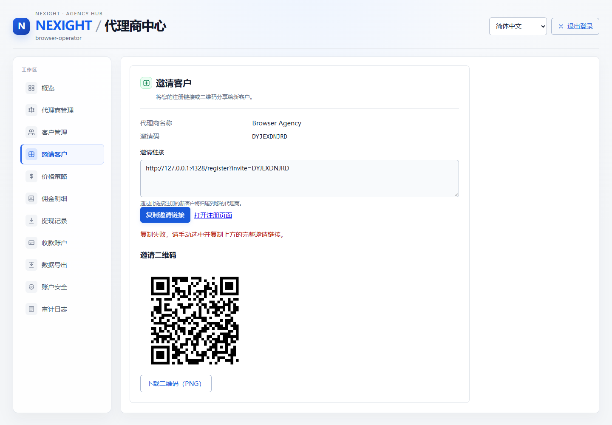
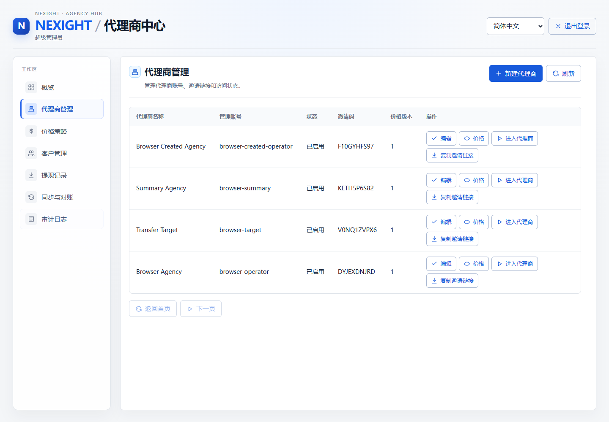
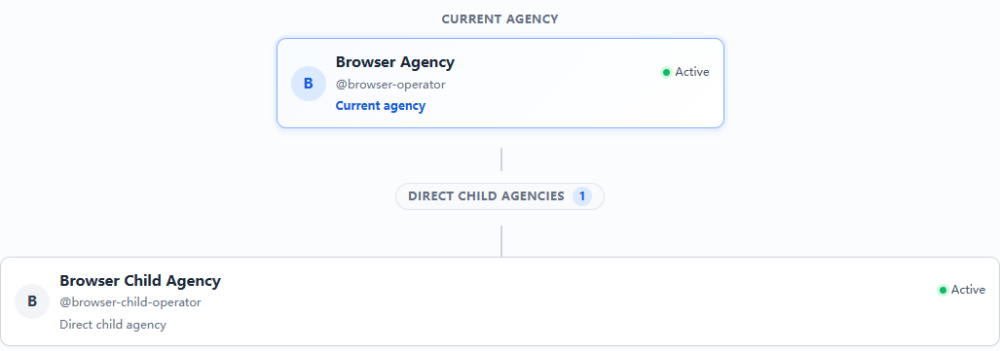
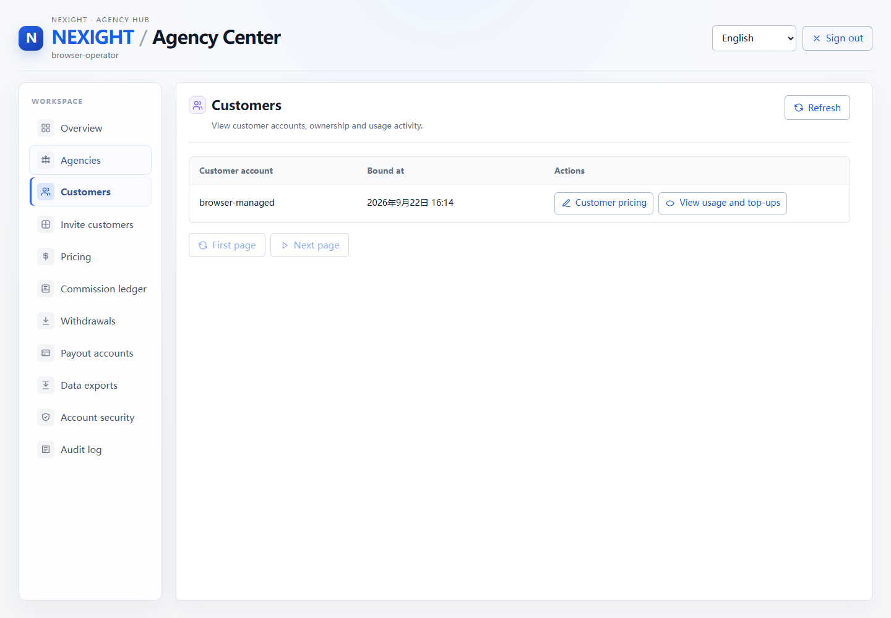
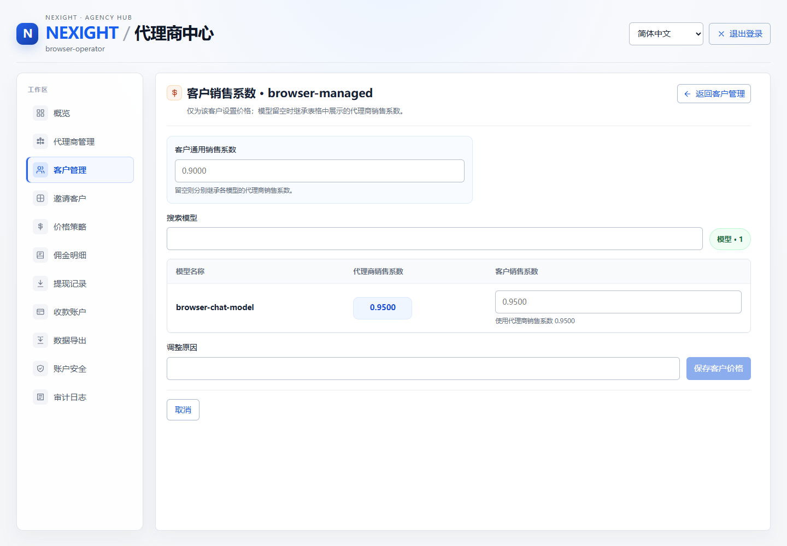
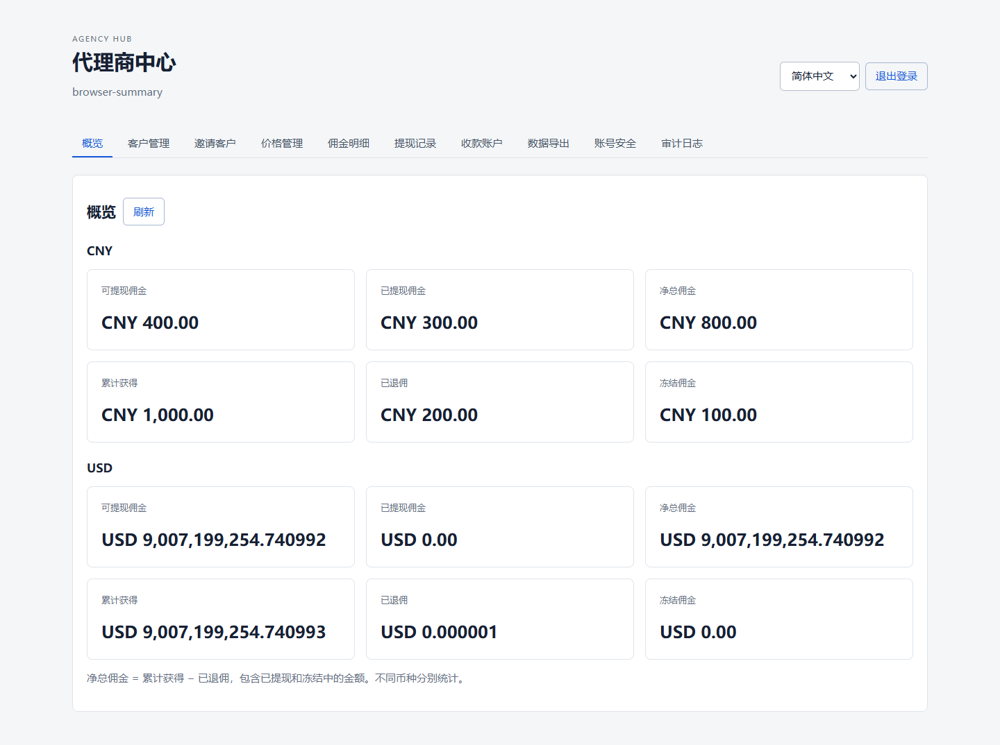
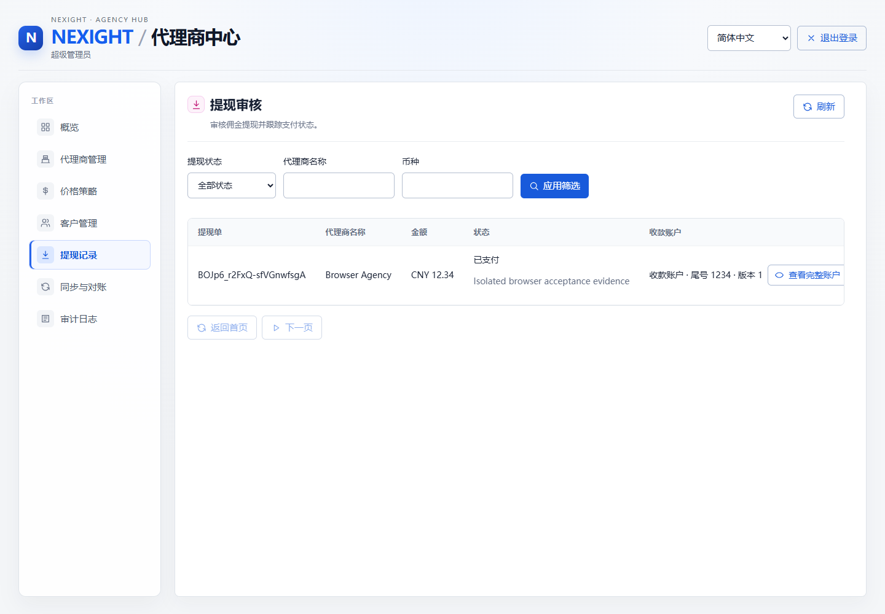

# 代理商中心用户操作手册

本手册面向超级管理员和普通代理商，说明代理商管理、层级关系、价格策略、客户管理及客户单独销售系数的日常操作。截图来自代理商中心实际浏览器验收构建；正式环境菜单文字以当前部署版本为准。

## 一、登录与角色

代理商中心入口为主站配置的 `/agency/` 地址。已登录主站的超级管理员可点击“使用主站登录状态继续”进入；普通代理商也可以使用代理商管理账号和密码登录。首次使用临时密码登录后，应按页面要求修改密码。

超级管理员可以创建和管理所有代理商；普通代理商只能查看自己的信息、直属下级、直接客户和本代理商有权限维护的价格。客户账号不会看到代理商的上级链路、成本系数或佣金信息。

## 二、超级管理员创建一级代理商

1. 进入代理商中心，打开“代理商管理”。
2. 点击“新建代理商”。
3. 填写“代理商名称”和“管理账号”。创建代理商时不需要填写价格，价格策略由平台全局策略继承。
4. 提交后保存页面显示的临时密码、邀请码和注册链接。临时密码只用于首次交付，建议通过安全渠道传给代理商并提醒其立即修改。
5. 新代理商登录后，可在“价格策略”中查看继承的模型价格，并按权限维护自己的销售系数、下一级代理商成本系数和客户级销售系数。

## 三、代理商管理与层级关系

普通代理商登录后，在左侧打开“代理商管理”。页面用于查看当前代理商资料、父级代理商、直属下级代理商及当前层级深度。直属下级只能由当前代理商创建，跨级修改和把自己或祖先设为下级会被系统拒绝。

创建下级代理商的步骤：

1. 点击“创建下级代理商”。
2. 填写下级代理商名称和管理账号；无需填写价格。
3. 点击创建，等待成功提示。弹窗关闭后，页面会显示本次创建的临时密码、邀请码和注册链接。
4. 使用复制按钮保存密码或邀请码时，看到“已复制”提示后再关闭页面。临时密码丢失时，使用有权限的密码重置操作重新生成。

创建下级代理商前，当前代理商必须已经为对应模型设置“下一级代理商成本系数”。如果没有设置，系统会提示先到“价格策略”补齐，避免在没有明确上缴成本的情况下继续扩展层级。

层级图中：

- 上方为父级链路；
- 中间高亮节点为当前代理商；
- 下方绿色区域为直属下级；
- 客户归属和下级代理商是两条独立业务线，拥有下级不影响当前代理商继续服务自己的客户。

下面是树状层级关系的实际验收截图。阅读时可将高亮节点理解为“当前代理商”，向下的分支是直属下级。

## 四、价格策略

打开“价格策略”后，按模型查看成本系数、下一级代理商成本系数和销售系数。创建代理商时价格继承直属上级的有效模型策略；创建后，代理商可以修改自己允许修改的销售价格和下一级成本，成本系数本身由上级策略继承。

价格校验遵循以下规则：

- 客户销售系数不能低于当前代理商成本系数加最低价差；
- 下一级代理商成本系数必须覆盖上级要求的成本边界；
- 销售系数不能超过平台设置的销售上限；
- 修改价格后需要按页面提示保存/发布，新价格只影响后续请求，历史消费按发生时的价格快照结算。

## 五、客户管理

打开“客户管理”可查看直接绑定到当前代理商的客户，包括客户账号、绑定时间、状态、用量与充值等信息。点击客户行的“客户价格”进入客户销售系数页面，不需要在狭窄弹窗中逐个切换模型。

## 六、为单个客户设置销售系数

客户销售系数页面会按模型以表格展示：模型名称、代理商销售系数、客户销售系数。

操作步骤：

1. 在“客户管理”找到目标客户。
2. 点击“客户价格”。
3. 在对应模型的“客户销售系数”输入框中填写系数并保存；留空表示该模型继承代理商销售系数。
4. 如果希望同一客户所有模型统一使用一个价格，可填写“客户通用销售系数”；指定模型的输入值优先于客户通用值。
5. 保存成功后返回客户管理。之后该客户的新请求按客户级价格快照计费，其他客户不受影响。

最终解析优先级为：客户指定模型销售系数 > 客户通用销售系数 > 当前代理商模型销售系数 > 当前代理商默认销售系数。任何一级都必须通过最低价差和销售上限校验。

截图展示了客户管理页面的中文导航、客户账号、绑定时间和“客户价格”入口；客户列表与客户价格页面使用同一套分页规范。

客户销售系数页面使用与代理商价格策略一致的模型表格布局；如果某个模型尚未设置客户覆盖值，输入框保持空白并显示继承说明。当前验收截图展示了同一代理商中心的中文导航和数据表格样式；打开客户价格后即可看到该模型表格。

## 七、佣金、下级差价与提现

代理商自己的客户产生的合规付费消费，以及下级代理商链路产生的成本差价，都会进入代理商佣金账本。普通代理商在“概览”查看可用佣金、累计佣金、已提现佣金和冻结金额；在“佣金明细”查看每一笔来源、客户/下级代理商、模型、金额和冲正状态。

提现流程：

1. 先在“收款账户”新增并确认收款账户。
2. 打开“提现”，选择收款账户并填写不超过可提现余额的金额。
3. 提交后在“提现记录”查看审核、支付中、已完成或异常状态。
4. 退款、拒付或冲正会沿原始链路反向记账，页面中的可提现余额以账本最终状态为准。

提现审核页面会显示提现单、代理商、金额、状态和收款账户，普通代理商可在“提现记录”查看自己的申请进度。

## 八、常见问题

**为什么不能创建下级代理商？**

通常是当前代理商尚未为对应模型设置下一级代理商成本系数，或新销售系数低于成本加最低价差。先到“价格策略”检查所有启用模型，再重试。

**客户销售系数留空会怎样？**

留空不是零，而是继承代理商对应模型的销售系数。若要明确设置为零，必须遵循页面是否允许零值的提示；通常销售价格仍需满足成本和最低价差。

**为什么历史消费不会跟着新价格变化？**

每次请求使用发生时的价格快照。修改并发布价格只影响后续请求，历史佣金和账单不会被回溯修改。

**临时密码找不到了怎么办？**

不要在聊天记录或截图中公开密码。由有权限的上级或超级管理员执行密码重置，再通过安全渠道一次性交付新的临时密码。

## 九、权限与安全提醒

不要把临时密码、收款账户完整信息、主站 Token 或导出的佣金明细发送到公共群组。退出共享电脑时务必退出代理商中心；发现账号异常、价格被篡改或提现状态不明时，先停止继续操作并联系超级管理员核查审计记录。
